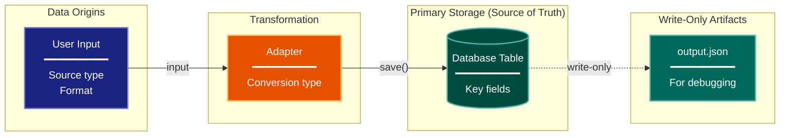

# Data Lineage Architecture Lens

**Cognitive Mode:** Data-Centric
**Primary Question:** "Where is the data?"
**Focus:** Information Flow, Transformations, Storage Locations, Format Conversions

## When to Use

- Need to understand how data flows through the system
- Documenting data transformations and conversions
- Identifying storage destinations and access patterns
- User invokes `/arch-lens-data-lineage` or `/make-arch-diag data`

## Critical Constraints

**NEVER:**
- Modify any source code files
- Focus on runtime behavior (that's process flow lens)
- Show static structure without data context

**ALWAYS:**
- Trace data from INPUT to STORAGE
- Show transformation stages and format changes
- Identify the single source of truth
- Distinguish read vs write operations
- BEFORE creating any diagram, LOAD the `/mermaid` skill using the Skill tool - this is MANDATORY

---

## Analysis Workflow

### Step 1: Launch Parallel Exploration Subagents

Spawn Explore subagents to investigate:

**Data Origins (Inputs)**
- Find user input handling
- Identify external data sources
- Look for: CLI args, API requests, file reads, imports, user input, data ingestion

**Transformation Stages**
- Find data conversion/transformation code
- Identify adapters and converters
- Look for: Adapter, Converter, transform, parse, serialize, from_*, to_*, mapping, conversion

**Format Changes**
- Find schema definitions and conversions
- Identify format boundaries (JSON, XML, protobuf, etc.)
- Look for: schema models, type definitions, serialization, deserialization, format conversion

**Storage Destinations**
- Find database operations
- Identify file outputs
- Look for: database operations, persistence, .save(), .create(), .write(), storage

**Access Patterns**
- Find data retrieval code
- Identify query patterns
- Look for: .get(), .query(), .find(), .load(), read operations, data access layer

### Step 2: Map Data Flow

Document the journey of key data entities:
- **Origin**: Where does it come from?
- **Transformations**: What changes happen?
- **Storage**: Where is it persisted?
- **Retrieval**: How is it accessed later?

**CRITICAL - Analyze Read/Write Direction:**
For EVERY storage location and data flow:
- **Read sources (inputs)**: Components that READ from this location
- **Write destinations (outputs)**: Components that WRITE to this location
- **Read-write (primary storage)**: Both read and written by the system
- **Write-only (artifacts)**: Written but NEVER read back by the system

Clearly distinguish:
- Primary storage (source of truth) - system reads AND writes
- Write-only artifacts (debugging, logging) - system writes but never reads back
- External inputs - system reads only

Use different arrow styles:
- Solid arrows for read/write primary storage
- Dashed arrows for write-only artifacts

### Step 3: Identify Conversion Boundaries

Find format changes:
- External format -> Internal format
- Internal format -> Database format
- Database format -> API response
- Note naming convention changes

### Step 4: Create the Diagram

Use flowchart with:

**Direction:** `LR` (left-to-right) for data flow, or `TB` for hierarchical

**Subgraphs for Stages:**
- Input/Origins
- Transformation/Processing
- Storage (primary)
- Artifacts (secondary/write-only)
- External Sync (if applicable)

**Node Styling:**
- `cli` class: Data origins, user input
- `handler` class: Transformation, adapters
- `stateNode` class: Database tables, primary storage
- `output` class: Write-only artifacts, files
- `integration` class: External sync, APIs

**Connection Types:**
- Solid arrows for primary data flow
- Dashed arrows for write-only/secondary
- Label with operation names

**Database Nodes:**
- Use cylinder shape: `[(Label)]`
- Show table relationships

### Step 5: Write Output

Write the diagram to: `temp/arch-lens-data-lineage/arch_diag_data_lineage_{YYYY-MM-DD}.md`

---

## Output Template

```markdown
# Data Lineage Diagram: {System Name}

**Lens:** Data Lineage (Data-Centric)
**Question:** Where is the data?
**Date:** {YYYY-MM-DD}
**Scope:** {What was analyzed}

## Data Flow Overview

| Stage | Format | Key Transformation |
|-------|--------|-------------------|
| Input | {format} | {description} |
| Processing | {format} | {description} |
| Storage | {format} | {description} |

## Lineage Diagram



**Color Legend:**
| Color | Category | Description |
|-------|----------|-------------|
| Dark Blue | Input | Data origins (user, external) |
| Orange | Transform | Format conversion and adapters |
| Teal | Storage | Primary storage (source of truth) |
| Dark Teal | Artifacts | Write-only outputs |
| Red | Sync | External sync services |

## Data Transformation Summary

| Stage | Format | Key Conversion |
|-------|--------|----------------|
| {stage} | {format} | {conversion} |

## Storage Destinations

| Entity | Primary Storage | Secondary | Access Pattern |
|--------|-----------------|-----------|----------------|
| {entity} | {location} | {artifact} | {how accessed} |

## Critical Design Principle

> **Source of Truth**: {e.g., "Database is single source of truth. File outputs are write-only."}
```

---

## Pre-Diagram Checklist

Before creating the diagram, verify:

- [ ] LOADED `/mermaid` skill using the Skill tool
- [ ] Using ONLY classDef styles from the mermaid skill (no invented colors)
- [ ] Diagram will include a color legend table

---

## Related Skills

- `/make-arch-diag` - Parent skill for lens selection
- `/mermaid` - MUST BE LOADED before creating diagram
- `/arch-lens-c4-container` - For container-level storage view
