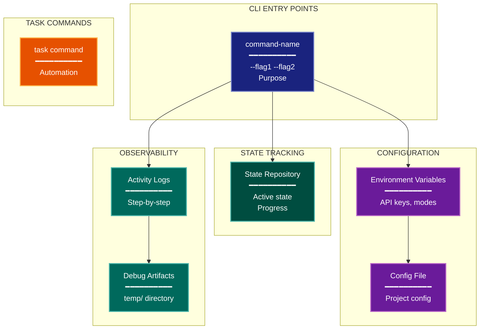

# Operational Architecture Lens

**Cognitive Mode:** Operational
**Primary Question:** "How is it run and monitored?"
**Focus:** CLI Workflows, Configuration, Observability, Task Commands

## When to Use

- Need to understand operator/admin perspective
- Documenting CLI commands and workflows
- Analyzing configuration and monitoring setup
- User invokes `/arch-lens-operational` or `/make-arch-diag operational`

## Critical Constraints

**NEVER:**
- Modify any source code files
- Include internal implementation details
- Show code-level patterns

**ALWAYS:**
- Focus on OPERATOR experience
- Show CLI commands and their purposes
- Document configuration hierarchy
- Include monitoring and logging outputs
- BEFORE creating any diagram, LOAD the `/mermaid` skill using the Skill tool - this is MANDATORY

---

## Analysis Workflow

### Step 1: Launch Parallel Exploration Subagents

Spawn Explore subagents to investigate:

**CLI Entry Points**
- Find all CLI commands
- Identify command groups and subcommands
- Look for: CLI frameworks (Click, argparse, Commander, etc.), entry points, main commands

**Configuration**
- Find configuration sources
- Identify environment variables
- Look for: config files (config.yaml, .env, settings.json, application.yml), environment variable usage, configuration libraries

**Task Automation**
- Find task runner definitions
- Identify automation scripts
- Look for: Taskfile.yml, Makefile, package.json scripts, Rakefile, scripts/ directory

**Logging & Monitoring**
- Find logging configuration
- Identify observability outputs
- Look for: logging configuration, log files, metrics, activity logs, temp/ output directories

**Status & Health**
- Find status/health commands
- Identify diagnostic outputs
- Look for: status, health, info, diagnose, check commands

**Reset & Recovery**
- Find reset/cleanup commands
- Identify recovery operations
- Look for: reset, clean, clear, purge, restore commands

### Step 2: Map Operator Workflows

Document common operator workflows:
- **Create**: How to start new work
- **Run**: How to execute
- **Monitor**: How to check status
- **Debug**: How to diagnose issues
- **Reset**: How to recover from errors

**CRITICAL - Analyze Read/Write Direction:**
For EVERY operational component:
- **Configuration**: READ from env/files (input to system)
- **State tracking**: Does the system READ and WRITE, or just WRITE?
- **Logs/monitoring**: Typically WRITE-only (system writes, humans read)
- **Status commands**: READ from state to display

Clearly categorize:
- **State (read/write)**: System reads back to make decisions
- **Artifacts (write-only)**: System writes for human inspection, never reads back
- **Config (read-only)**: System reads but doesn't modify

### Step 3: Document Configuration Hierarchy

Example pattern (adjust to actual system):
```
1. Environment Variables (highest priority)
2. Secret files (e.g., .secrets.toml, .env.local)
3. Project config (e.g., config.yaml, settings.json)
4. Defaults (lowest priority)
```

### Step 4: Create the Diagram

Use flowchart with:

**Direction:** `TB` for hierarchical command structure

**Subgraphs:**
- CLI Entry Points (commands)
- Configuration (sources)
- Registry/State (tracking)
- Monitoring (observability)
- Task Commands (automation)

**Node Styling:**
- `cli` class: CLI commands
- `phase` class: Configuration sources
- `stateNode` class: State tracking (database, registry)
- `output` class: Monitoring outputs
- `handler` class: Task automation commands

**Show Relationships:**
- Commands to configuration
- Commands to state tracking
- State to monitoring outputs

### Step 5: Write Output

Write the diagram to: `temp/arch-lens-operational/arch_diag_operational_{YYYY-MM-DD}.md`

---

## Output Template

```markdown
# Operational Diagram: {System Name}

**Lens:** Operational (Administration)
**Question:** How is it run and monitored?
**Date:** {YYYY-MM-DD}
**Scope:** {What was analyzed}

## CLI Commands Quick Reference

| Command | Purpose | Key Flags |
|---------|---------|-----------|
| {command} | {purpose} | {flags} |

## Operational Diagram



**Color Legend:**
| Color | Category | Description |
|-------|----------|-------------|
| Dark Blue | CLI | Command-line entry points |
| Purple | Config | Configuration hierarchy |
| Teal | Registry | State tracking |
| Dark Teal | Monitoring | Observability outputs |
| Orange | Tasks | Task automation |

## Configuration Hierarchy

| Priority | Source | Example |
|----------|--------|---------|
| 1 (highest) | Environment | `API_KEY=...` |
| 2 | Secret file | .env.local |
| 3 | Config file | config.yaml |
| 4 (lowest) | Defaults | Built-in |

## Operator Workflows

### Create New Work
```bash
{command example}
```

### Check Status
```bash
{command example}
```

### Reset/Recovery
```bash
{command example}
```
```

---

## Pre-Diagram Checklist

Before creating the diagram, verify:

- [ ] LOADED `/mermaid` skill using the Skill tool
- [ ] Using ONLY classDef styles from the mermaid skill (no invented colors)
- [ ] Diagram will include a color legend table

---

## Related Skills

- `/make-arch-diag` - Parent skill for lens selection
- `/mermaid` - MUST BE LOADED before creating diagram
- `/arch-lens-development` - For build tooling view
- `/arch-lens-deployment` - For infrastructure view
