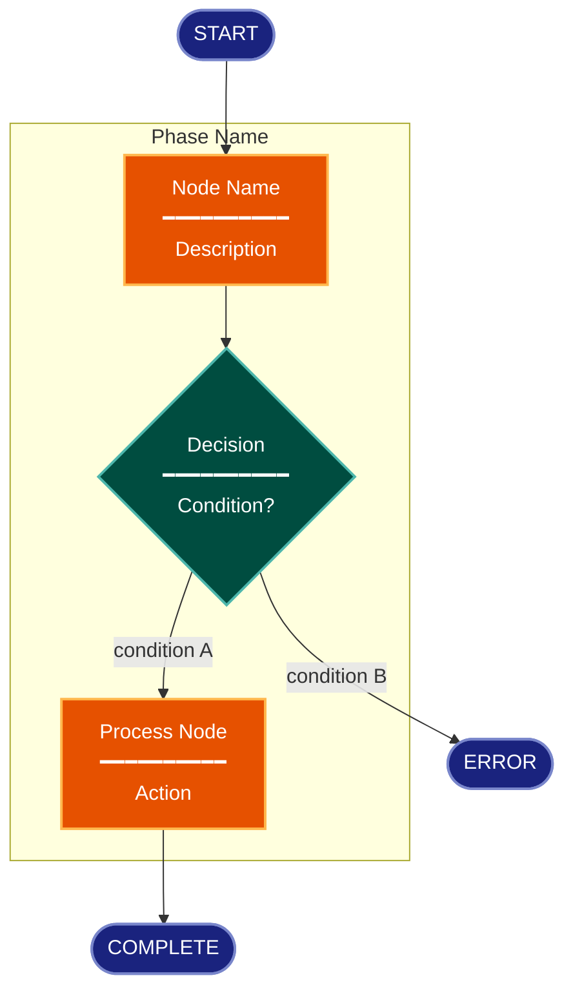

# Process Flow Architecture Lens

**Cognitive Mode:** Physiological
**Primary Question:** "How does it behave?"
**Focus:** Runtime Behavior, State Transitions, Decision Points, Control Flow

## When to Use

- Need to understand runtime execution paths
- Documenting state machines or workflows
- Analyzing decision points and branching logic
- User invokes `/arch-lens-process-flow` or `/make-arch-diag process`

## Critical Constraints

**NEVER:**
- Modify any source code files
- Include static structure details (that's C4 lens)
- Show data storage details (that's data lineage lens)

**ALWAYS:**
- Focus on BEHAVIOR and STATE TRANSITIONS
- Show decision points as diamonds
- Include loop mechanisms and retry logic
- BEFORE creating any diagram, LOAD the `/mermaid` skill using the Skill tool - this is MANDATORY

---

## Analysis Workflow

### Step 1: Launch Parallel Exploration Subagents

Spawn Explore subagents to investigate:

**State Machines & Workflows**
- Find state definitions and transitions
- Identify workflow orchestration
- Look for: state machine patterns, workflow graphs, FSM implementations, state enum/constants

**Entry Points & Triggers**
- Find how processes are started
- Identify triggers and events
- Look for: main(), run(), execute(), start(), __call__, async handlers

**Decision Points**
- Find conditional logic that affects flow
- Identify routing functions
- Look for: if/else chains, switch/case, route_*, should_*, can_*, is_*

**Loop Mechanisms**
- Find iteration and retry patterns
- Identify continuation conditions
- Look for: while, for, retry logic, max_iterations, loop constructs

**Terminal States**
- Find completion conditions
- Identify error termination
- Look for: return, raise/throw, complete, error, success, failure states

### Step 2: Map State Transitions

For each workflow/state machine discovered:
- **States/Nodes**: List all distinct states
- **Transitions**: Map state-to-state connections
- **Guards**: Conditions that determine transitions
- **Actions**: What happens during transitions

### Step 3: Identify Flow Patterns

Document key patterns:
- Linear sequences (A -> B -> C)
- Branches (decision points)
- Loops (with termination conditions)
- Error paths
- Parallel paths (if any)

**CRITICAL - Analyze Read/Write Direction:**
For EVERY node that interacts with state or storage:
- **Reads from**: What data does this node consume? From where?
- **Writes to**: What data does this node produce? To where?
- **State mutations**: Does it modify in-memory state, database, or files?

Label state interactions on edges:
- "reads" / "loads" / "queries" for input
- "writes" / "saves" / "updates" for output
- Distinguish primary storage (read/write) from write-only artifacts

### Step 4: Create the Diagram

Use flowchart with:

**Direction:** `TB` for hierarchical flow, `LR` for sequential processes

**Node Types:**
- `([Label])` - Rounded: Start/End terminals
- `{Label}` - Diamond: Decision points
- `[Label]` - Rectangle: Process nodes
- `[[Label]]` - Subroutine: Subgraph calls

**Subgraphs for Phases:**
- Group related states into phases
- Keep START/END outside subgraphs

**Node Styling:**
- `terminal` class: START, END, ERROR nodes
- `phase` class: Control flow, analysis nodes
- `handler` class: Processing, execution nodes
- `stateNode` class: Decision, routing nodes
- `detector` class: Validation gates, failure handling

**Edge Labels:**
- Show conditions on decision branches
- Include loop counts where relevant

### Step 5: Write Output

Write the diagram to: `temp/arch-lens-process-flow/arch_diag_process_flow_{YYYY-MM-DD}.md`

---

## Output Template

```markdown
# Process Flow Diagram: {Workflow Name}

**Lens:** Process Flow (Physiological)
**Question:** How does it behave?
**Date:** {YYYY-MM-DD}
**Scope:** {What was analyzed}

## Workflow Overview

| Phase | Nodes | Key Decision Points | Loop Mechanism |
|-------|-------|---------------------|----------------|
| {phase} | {count} | {decisions} | {loop info} |

## Flow Diagram



**Color Legend:**
| Color | Category | Description |
|-------|----------|-------------|
| Dark Blue | Terminal | Start, complete, and error states |
| Purple | Phase | Control flow and analysis nodes |
| Orange | Handler | Processing and execution nodes |
| Teal | State | Selection and routing decisions |
| Red | Detector | Validation gates and failure handling |

## State Machine Characteristics

| Aspect | Value | Notes |
|--------|-------|-------|
| Total Nodes | {count} | |
| Decision Points | {count} | |
| Loop Mechanism | {description} | {max iterations} |
| Error Paths | {count} | |

## Critical Routing Logic

- **Condition A**: {what triggers this path}
- **Condition B**: {what triggers this path}
```

---

## Pre-Diagram Checklist

Before creating the diagram, verify:

- [ ] LOADED `/mermaid` skill using the Skill tool
- [ ] Using ONLY classDef styles from the mermaid skill (no invented colors)
- [ ] Diagram will include a color legend table

---

## Related Skills

- `/make-arch-diag` - Parent skill for lens selection
- `/mermaid` - MUST BE LOADED before creating diagram
- `/arch-lens-concurrency` - For parallel execution details
- `/arch-lens-error-resilience` - For failure handling specifics
