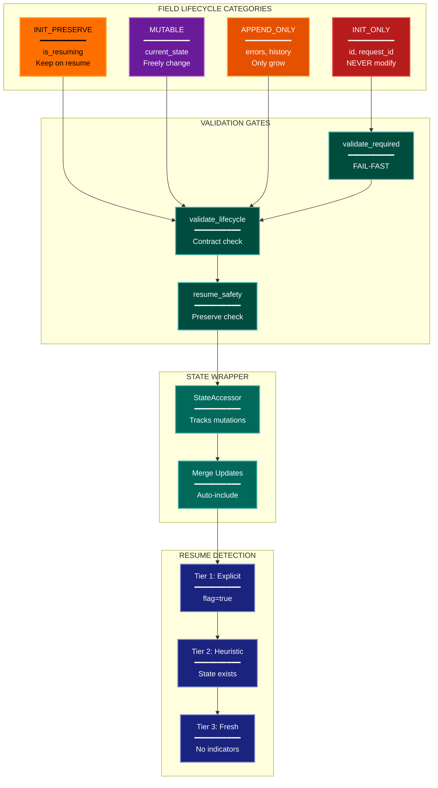

# State Lifecycle Architecture Lens

**Cognitive Mode:** Perspective (Quality Overlay)
**Primary Question:** "How is state corruption prevented?"
**Focus:** Field Contracts, Validation Gates, Resume Safety, State Mutation Control

## When to Use

- Need to understand state management architecture
- Documenting field lifecycle contracts
- Analyzing resume and checkpoint safety
- User invokes `/arch-lens-state-lifecycle` or `/make-arch-diag state`

## Critical Constraints

**NEVER:**
- Modify any source code files
- Show business logic details
- Focus on data content (focus on mutation rules)

**ALWAYS:**
- Focus on STATE MUTATION RULES
- Show field lifecycle categories
- Document validation gates
- Include resume detection strategy
- BEFORE creating any diagram, LOAD the `/mermaid` skill using the Skill tool - this is MANDATORY

---

## Analysis Workflow

### Step 1: Launch Parallel Exploration Subagents

Spawn Explore subagents to investigate:

**State Schema**
- Find state/context definitions
- Identify typed state fields
- Look for: State classes, Context objects, state schemas, typed dictionaries

**Field Categories**
- Find field mutation patterns
- Identify immutable vs mutable fields
- Look for: immutable fields, readonly, lifecycle annotations, const fields

**Validation Gates**
- Find state validation code
- Identify gate patterns
- Look for: validate_*, gate, check_*, guard, assert, state validators

**Resume Detection**
- Find resume/checkpoint code
- Identify resume detection strategy
- Look for: resume, checkpoint, restore, detect state, load checkpoint

**State Updates**
- Find state mutation code
- Identify update patterns
- Look for: update methods, setState, mutation functions, state setters

**Contract Enforcement**
- Find contract validation
- Identify violation detection
- Look for: contract checking, violation detection, enforcement mechanisms

### Step 2: Categorize Fields

| Category | Description | Fields |
|----------|-------------|--------|
| INIT_ONLY | Set once, never modify | {fields} |
| INIT_PRESERVE | Keep on resume | {fields} |
| MUTABLE | Can change freely | {fields} |
| APPEND_ONLY | Can only grow | {fields} |
| DERIVED | Computed, not stored | {fields} |

**CRITICAL - Analyze Read/Write Direction:**
For EVERY state field and storage location:
- **Read patterns**: Who READS this field? When?
- **Write patterns**: Who WRITES this field? When?
- **Read-after-write**: Is the written value ever READ back by the system?

Distinguish clearly:
- **State fields (read/write)**: System both writes AND reads back for decisions
- **Checkpoint storage (read/write)**: Written during execution, read on resume
- **Audit logs (write-only)**: System writes but never reads back for logic
- **Debug artifacts (write-only)**: Written for humans, not read by system

### Step 3: Map Validation Flow

Document:
- Gate order (which runs first)
- Failure modes
- Resume vs fresh start differences

### Step 4: Create the Diagram

Use flowchart with:

**Direction:** `TB` for contract enforcement flow

**Subgraphs:**
- Lifecycles (field categories)
- Validation Gates
- State Wrapper (mutation mechanism)
- Resume Detection
- Phase Jump Routing

**Node Styling:**
- `detector` class: INIT_ONLY fields (red - critical)
- `gap` class: INIT_PRESERVE fields (yellow - warning)
- `phase` class: MUTABLE fields (purple)
- `handler` class: APPEND_ONLY fields (orange)
- `stateNode` class: Validation gates
- `output` class: State wrapper/accessor
- `cli` class: Resume detection tiers

### Step 5: Write Output

Write the diagram to: `temp/arch-lens-state-lifecycle/arch_diag_state_lifecycle_{YYYY-MM-DD}.md`

---

## Output Template

```markdown
# State Lifecycle Diagram: {System Name}

**Lens:** State Lifecycle (Contract Overlay)
**Question:** How is state corruption prevented?
**Date:** {YYYY-MM-DD}
**Scope:** {What was analyzed}

## Field Lifecycle Categories

| Category | Description | Example Fields |
|----------|-------------|----------------|
| INIT_ONLY | Never modify after init | {fields} |
| INIT_PRESERVE | Keep on resume | {fields} |
| MUTABLE | Free to change | {fields} |
| APPEND_ONLY | Can only grow | {fields} |

## State Lifecycle Diagram



**Color Legend:**
| Color | Category | Description |
|-------|----------|-------------|
| Red | INIT_ONLY | Never modify (critical) |
| Yellow | INIT_PRESERVE | Preserved on resume |
| Purple | MUTABLE | Freely modifiable |
| Orange | APPEND_ONLY | Can only grow |
| Teal | Gates | Validation gates |
| Dark Teal | Wrapper | State mutation mechanism |
| Dark Blue | Detection | Resume detection tiers |

## State Lifecycle Contract Rules

| Lifecycle | Fresh Start | Resume | Violation Detection |
|-----------|-------------|--------|---------------------|
| INIT_ONLY | Cannot modify | Cannot modify | {detection} |
| INIT_PRESERVE | Can modify | Cannot modify | {detection} |
| MUTABLE | Can modify | Can modify | Never fails |
| APPEND_ONLY | Can append | Can append | {detection} |

## Resume Detection Strategy

| Tier | Check | Result |
|------|-------|--------|
| 1 | Explicit flag | {what happens} |
| 2 | Heuristic | {what happens} |
| 3 | Fresh start | {what happens} |
```

---

## Pre-Diagram Checklist

Before creating the diagram, verify:

- [ ] LOADED `/mermaid` skill using the Skill tool
- [ ] Using ONLY classDef styles from the mermaid skill (no invented colors)
- [ ] Diagram will include a color legend table

---

## Related Skills

- `/make-arch-diag` - Parent skill for lens selection
- `/mermaid` - MUST BE LOADED before creating diagram
- `/arch-lens-process-flow` - For state machine view
- `/arch-lens-error-resilience` - For validation failure handling
