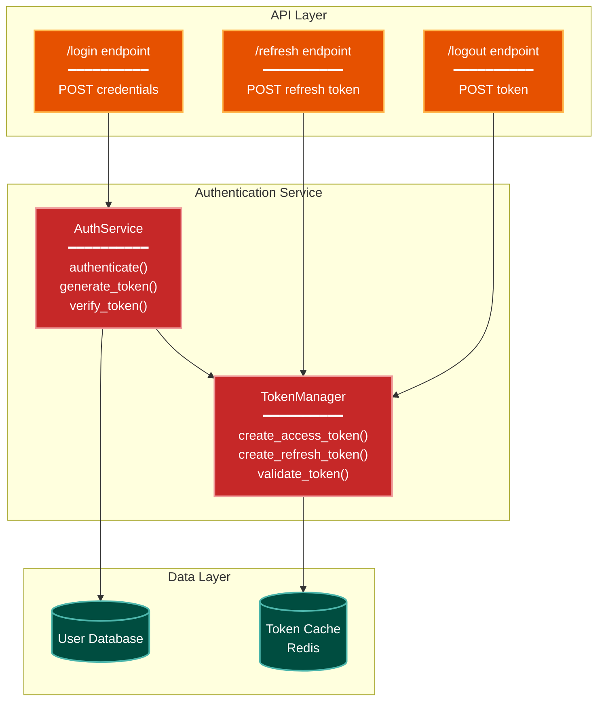
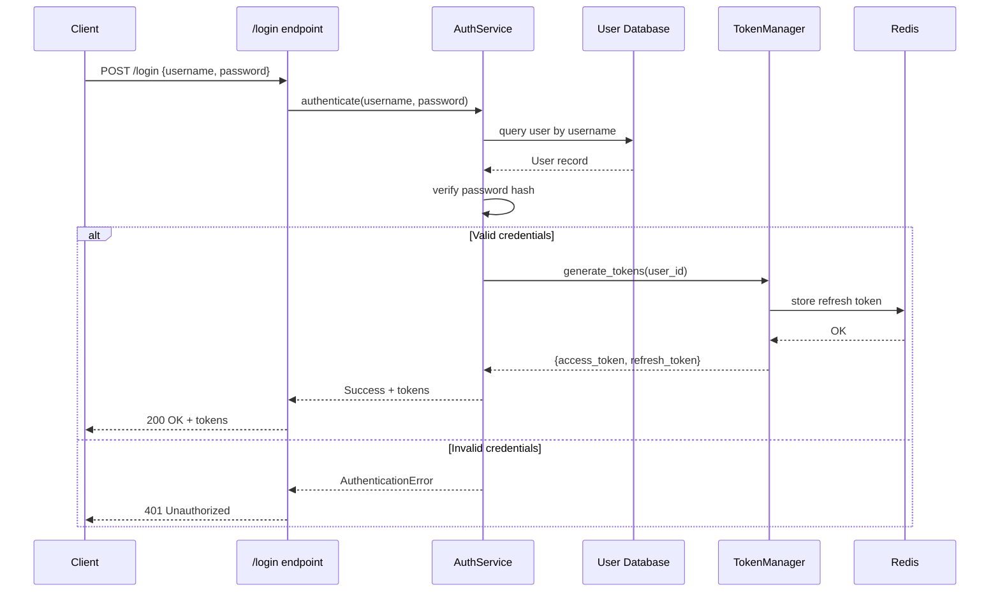
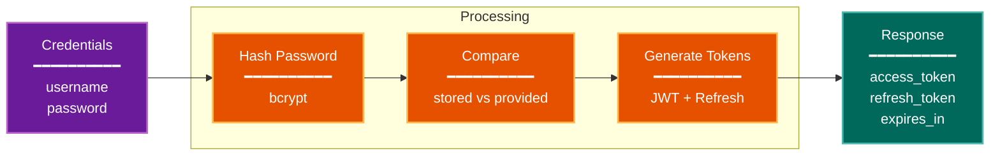

# Make-Arch-Diag: Architecture Diagram Generation

Creates comprehensive architecture diagrams for selected components or systems using mermaid syntax.

## When to Use

- Documenting a new feature or component
- Updating architecture documentation after changes
- Onboarding new team members
- Explaining complex system interactions
- Before making significant architectural changes

## Critical Constraints

**ALWAYS:**
- Ask user which component/system to diagram
- Use the `/mermaid` skill for diagram creation
- Include multiple views (data flow, component structure, sequence diagrams)
- Save diagrams to `temp/make-arch-diag/{component-name}/`
- Use consistent color coding across all diagrams

**NEVER:**
- Create diagrams without understanding the code
- Skip reading the actual implementation
- Use generic placeholder names
- Create diagrams that contradict the code

---

## Workflow

### Step 1: Component Selection

Ask the user which area they want diagrammed:

```
Which component or system would you like to diagram?

Examples:
- Authentication system
- Database layer
- API endpoints
- Message queue processing
- State management
- Specific feature (e.g., "user registration flow")

Please specify the component/system:
```

### Step 2: Scope Definition

Based on user input, determine:
- **Boundaries**: What's in scope vs out of scope
- **Level of Detail**: High-level architecture vs detailed implementation
- **Audience**: Developers, architects, stakeholders

### Step 3: Code Exploration

Investigate the codebase:
- Find entry points (main, CLI, API routes)
- Trace execution flows
- Identify components and their relationships
- Map data flows
- Document external dependencies

### Step 4: Diagram Types Selection

Choose appropriate diagram types:

**Component Diagram** (Always include)
- Shows major components and their relationships
- Good for: Understanding system structure

**Data Flow Diagram** (Include if data transformation is central)
- Shows how data moves through the system
- Good for: Understanding pipelines, ETL, processing

**Sequence Diagram** (Include if interactions are complex)
- Shows step-by-step execution flow
- Good for: Understanding request/response, async operations

**State Diagram** (Include if state management is central)
- Shows states and transitions
- Good for: Understanding lifecycle, workflows

**Deployment Diagram** (Include for infrastructure docs)
- Shows how system is deployed
- Good for: Understanding runtime environment

### Step 5: Create Diagrams

Use `/mermaid` skill to create each diagram:
- Follow standard color palette
- Include legends
- Add clear labels and descriptions
- Group related components in subgraphs

### Step 6: Write Architecture Description

Create `temp/make-arch-diag/{component}/architecture.md`:

```markdown
# {Component} Architecture

## Overview
[2-3 paragraph overview of the component]

## Diagrams

### Component Structure
[Embed component diagram]

### Data Flow
[Embed data flow diagram]

### Sequence Diagrams
[Embed sequence diagrams for key operations]

## Components

### Component 1: {Name}
- **Purpose**: [What it does]
- **Responsibilities**: [What it's responsible for]
- **Dependencies**: [What it depends on]
- **Interface**: [How others interact with it]

### Component 2: {Name}
[Repeat for each component]

## Key Flows

### Flow 1: {Operation}
1. [Step 1]
2. [Step 2]
3. [Step 3]

### Flow 2: {Operation}
[Repeat for each key operation]

## Design Decisions

### Decision 1: {Topic}
- **Context**: [Why this decision was needed]
- **Options Considered**: [Alternatives]
- **Chosen**: [What was chosen]
- **Rationale**: [Why]
- **Tradeoffs**: [Costs and benefits]

## Constraints and Invariants

- [Constraint 1]
- [Constraint 2]
- [Invariant 1]
- [Invariant 2]

## Extension Points

- [Where/how to extend functionality]

## Related Documentation

- [Links to other architecture docs]
- [Links to API documentation]
- [Links to design documents]
```

---

## Example: Authentication System

### Component Diagram



**Color Legend:**
| Color | Category | Description |
|-------|----------|-------------|
| Orange | Handler | API endpoints |
| Teal | State | Data storage |
| Red | Integration | Service components |

### Sequence Diagram: Login Flow



### Data Flow Diagram



**Color Legend:**
| Color | Category | Description |
|-------|----------|-------------|
| Purple | Phase | Input/stages |
| Orange | Handler | Processing steps |
| Dark Teal | Output | Final output |

---

## Diagram Best Practices

### 1. Component Diagrams
- Group related components in subgraphs
- Show only direct dependencies (avoid clutter)
- Use consistent colors for component types
- Label interfaces/contracts

### 2. Data Flow Diagrams
- Flow left-to-right or top-to-bottom
- Show transformations clearly
- Indicate data format at each stage
- Highlight validation points

### 3. Sequence Diagrams
- Include all actors/systems
- Show both success and error paths
- Annotate with actual function/method names
- Include timing constraints if relevant

### 4. State Diagrams
- Show all valid states
- Show all valid transitions
- Annotate transitions with trigger conditions
- Highlight error/terminal states

---

## Common Patterns to Diagram

### Layered Architecture
```
Presentation Layer → Business Logic Layer → Data Access Layer
```
Use component diagram with horizontal layers.

### Pipeline Architecture
```
Input → Stage 1 → Stage 2 → Stage 3 → Output
```
Use data flow diagram showing transformations.

### Event-Driven Architecture
```
Event Source → Event Bus → Handlers → Side Effects
```
Use sequence diagram showing event flow.

### Microservices Architecture
```
Service A ↔ API Gateway ↔ Service B ↔ Database
```
Use deployment diagram showing runtime structure.

---

## Tips

### Understand Before Diagramming
- Read the code, don't guess
- Trace actual execution paths
- Verify assumptions with code inspection

### Choose Right Level of Detail
- Executive overview: High-level components only
- Developer docs: Show classes/modules
- Implementation guide: Show methods/functions

### Keep It Current
- Update diagrams when code changes
- Include diagram generation date
- Link diagrams to specific code versions/commits

### Make It Useful
- Diagrams should answer questions
- Diagrams should reveal structure
- Diagrams should not just be pretty pictures
