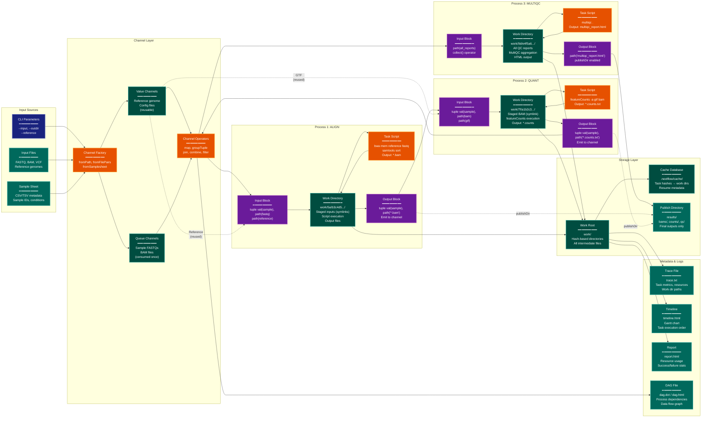

> **Example Note:** This is a whole-codebase example for demonstration purposes.
> In typical usage, arch lens diagrams are scoped to the subsystem being
> modified/added/removed by a plan — not the entire project. The result is
> normally much simpler and more focused than what you see here.

# Data Lineage Diagram: Nextflow

**Lens:** Data Lineage (Data-Centric)
**Question:** Where is the data?
**Date:** 2026-02-14
**Scope:** Full Nextflow data flow from inputs to outputs

## Overview

This diagram traces how data flows through a Nextflow pipeline, showing transformations from input parameters to channels, through process work directories, and finally to published outputs. It highlights Nextflow's unique data management approach using channels as first-class dataflow primitives.

| Data Location | Type | Lifecycle | Access Pattern |
|---------------|------|-----------|----------------|
| Input Parameters | Values/paths from CLI | Read once at startup | params.input_dir, params.reference |
| Value Channels | Reusable data items | Persist throughout run | Can be read multiple times |
| Queue Channels | Consumed data streams | Consumed by first process | Single-read FIFO queue |
| Process Work Dir | Task scratch space | Persist for resume | work/ab/cdef1234.../ |
| Output Channels | Process results | Flow to downstream tasks | Connect processes in DAG |
| Published Outputs | Final results | Copied at workflow end | results/ directory |
| Trace/Reports | Execution metadata | Written at completion | trace.txt, report.html |

## Data Flow Architecture



## Color Legend

- **Dark Blue (CLI)**: Command-line inputs and parameters
- **Dark Teal (State)**: Persistent storage (work dirs, channels, cache)
- **Orange (Handler)**: Active data transformation (scripts, operators)
- **Purple (Phase)**: Process input/output boundaries
- **Teal (Output)**: Published results and reports

## Channel Types and Behavior

### Value Channels (Reusable)

Created with `Channel.value()` or automatically from singleton inputs:

```groovy
reference = Channel.value(file(params.reference))

process ALIGN {
    input:
    path fastq
    path reference  // Can be used by all tasks

    script:
    """
    bwa mem $reference $fastq > aligned.sam
    """
}
```

Behavior:
- Can be consumed by multiple processes
- Can be read multiple times by same process
- Typically used for reference files, config files
- No data loss on consumption

### Queue Channels (Consumed Once)

Created with `Channel.fromPath()`, `Channel.fromFilePairs()`, etc.:

```groovy
reads = Channel.fromFilePairs('*_{1,2}.fastq.gz')

process ALIGN {
    input:
    tuple val(sample), path(reads)  // Consumed once per sample

    script:
    """
    bwa mem -t 8 reference ${reads[0]} ${reads[1]} > ${sample}.sam
    """
}
```

Behavior:
- Each item consumed by first downstream process
- FIFO queue semantics
- Reading empties the channel
- Cannot be reused without `into` or explicit broadcasting

### Broadcasting Channels

Split one channel into multiple:

```groovy
reads.into { reads_for_qc; reads_for_align }

process FASTQC {
    input:
    tuple val(sample), path(reads) from reads_for_qc
}

process ALIGN {
    input:
    tuple val(sample), path(reads) from reads_for_align
}
```

## Channel Operators and Data Transformation

### map: Transform Each Item

```groovy
Channel
    .fromPath('*.fastq')
    .map { file -> [file.baseName, file] }
    .set { samples }
```

Data transformation:
```
Input:  /data/sample1.fastq, /data/sample2.fastq
Output: ['sample1', /data/sample1.fastq], ['sample2', /data/sample2.fastq]
```

### groupTuple: Collect by Key

```groovy
Channel
    .from(['sample1', 'A'], ['sample1', 'B'], ['sample2', 'C'])
    .groupTuple()
```

Data transformation:
```
Input:  ['sample1', 'A'], ['sample1', 'B'], ['sample2', 'C']
Output: ['sample1', ['A', 'B']], ['sample2', ['C']]
```

### join: Combine Channels by Key

```groovy
bams = Channel.from(['sample1', 'file1.bam'], ['sample2', 'file2.bam'])
vcfs = Channel.from(['sample1', 'file1.vcf'], ['sample2', 'file2.vcf'])
bams.join(vcfs)
```

Data transformation:
```
Input:  bams: ['sample1', 'file1.bam'], vcfs: ['sample1', 'file1.vcf']
Output: ['sample1', 'file1.bam', 'file1.vcf']
```

### combine: Cartesian Product

```groovy
samples = Channel.from('A', 'B')
tools = Channel.from('tool1', 'tool2')
samples.combine(tools)
```

Data transformation:
```
Input:  samples: 'A', 'B'; tools: 'tool1', 'tool2'
Output: ['A', 'tool1'], ['A', 'tool2'], ['B', 'tool1'], ['B', 'tool2']
```

### collect: Gather All Items

```groovy
Channel
    .fromPath('*.txt')
    .collect()
```

Data transformation:
```
Input:  file1.txt, file2.txt, file3.txt
Output: [file1.txt, file2.txt, file3.txt]  (single emission)
```

## Work Directory Structure

Each task gets a unique work directory based on hash:

```
work/
├── 5a/
│   └── b3c4d5e6f7a8b9c0d1e2f3a4b5c6d7e8/
│       ├── .command.sh        # Task script
│       ├── .command.run       # Wrapper script
│       ├── .command.out       # stdout
│       ├── .command.err       # stderr
│       ├── .command.log       # Combined log
│       ├── .command.begin     # Start timestamp
│       ├── .exitcode          # Exit status
│       ├── sample1_R1.fastq -> /data/sample1_R1.fastq  # Input symlink
│       ├── sample1_R2.fastq -> /data/sample1_R2.fastq  # Input symlink
│       └── sample1.bam        # Output file
```

### File Staging Modes

**Symlink (default):**
```groovy
process.stageInMode = 'symlink'
```
- Fast, no disk usage
- Requires shared filesystem
- Risk of accidental modification

**Copy:**
```groovy
process.stageInMode = 'copy'
```
- Safer for network filesystems
- Higher disk I/O and storage
- Protects original files

**Rellink (relative symlink):**
```groovy
process.stageInMode = 'rellink'
```
- Portable work directories
- Can move work dir and links stay valid

## Published Outputs

Process outputs can be published to a final directory:

```groovy
process ALIGN {
    publishDir "${params.outdir}/bams", mode: 'copy', pattern: '*.bam'

    output:
    tuple val(sample), path('*.bam')

    script:
    """
    bwa mem reference $fastq | samtools sort > ${sample}.bam
    """
}
```

### PublishDir Modes

- **copy**: Copy files to publish directory (default)
- **symlink**: Create symlinks to work directory
- **rellink**: Create relative symlinks
- **link**: Create hard links
- **move**: Move files (removes from work dir)

### Selective Publishing

```groovy
publishDir "${params.outdir}/bams",
    mode: 'copy',
    pattern: '*.bam',
    saveAs: { filename -> filename.endsWith('.bam') ? filename : null }
```

Only BAM files are published, other outputs stay in work directory.

## Data Lineage Tracking

### Trace File

CSV log linking tasks to work directories:

```csv
task_id,hash,name,status,workdir,realtime
1,5a/b3c4d5,ALIGN (sample1),COMPLETED,/work/5a/b3c4d5e6f7a8b9c0d1e2f3a4b5c6d7e8,1h 20m
2,7f/a1b2c3,QUANT (sample1),COMPLETED,/work/7f/a1b2c3d4e5f6a7b8c9d0e1f2a3b4c5d6,15m
```

Enables:
- Finding intermediate files for specific samples
- Debugging failed tasks
- Reproducing specific task execution

### DAG Visualization

```bash
nextflow run pipeline.nf -with-dag flowchart.html
```

Generates interactive HTML showing:
- Process dependencies
- Channel connections
- Data flow direction
- Parallel execution paths

## Cache and Resume Data

### Cache Database

Located at `.nextflow/cache/<run-uuid>/db/`:

```
TASK_5a/b3c4d5 -> {
    hash: "5ab3c4d5e6f7a8b9c0d1e2f3a4b5c6d7e8",
    workDir: "/work/5a/b3c4d5e6f7a8b9c0d1e2f3a4b5c6d7e8",
    script: "bwa mem reference fastq",
    inputs: ["sample1_R1.fastq", "sample1_R2.fastq", "reference.fa"],
    outputs: ["sample1.bam"],
    status: "COMPLETED",
    exitCode: 0
}
```

On resume:
1. Compute task hash from current inputs
2. Look up hash in cache database
3. If found and work dir exists: skip execution, emit cached outputs
4. If not found or work dir missing: execute task normally

## Sample Data Flow Example

RNA-seq pipeline data lineage:

```
CLI: --input samples/*.fastq --reference genome.fa --gtf genes.gtf

Channel Creation:
  samples = Channel.fromFilePairs('samples/*_{1,2}.fastq')
  reference = Channel.value(file(params.reference))
  gtf = Channel.value(file(params.gtf))

ALIGN Process:
  Input: ['sample1', [sample1_1.fastq, sample1_2.fastq]], genome.fa
  Work Dir: work/5a/b3c4d5.../
  Output: ['sample1', sample1.bam] → alignment channel

QUANT Process:
  Input: ['sample1', sample1.bam], genes.gtf
  Work Dir: work/7f/a1b2c3.../
  Output: ['sample1', sample1.counts.txt] → counts channel

MULTIQC Process:
  Input: [sample1.counts.txt, sample2.counts.txt, ...] (collected)
  Work Dir: work/9d/e4f5a6.../
  Output: multiqc_report.html
  Published: results/qc/multiqc_report.html
```

Every file has a traceable lineage from input to output via work directories and channels.
