> **Example Note:** This is a whole-codebase example for demonstration purposes.
> In typical usage, arch lens diagrams are scoped to the subsystem being
> modified/added/removed by a plan — not the entire project. The result is
> normally much simpler and more focused than what you see here.

# Deployment Diagram: Nextflow

**Lens:** Deployment (Physical)
**Question:** Where does it run?
**Date:** 2026-02-14
**Scope:** Full Nextflow execution infrastructure

## Overview

This diagram shows where Nextflow components are deployed and how they interact across different execution environments. Nextflow provides an abstraction layer that allows the same pipeline to run on local machines, HPC clusters, or cloud platforms.

| Component | Deployment Location | Purpose |
|-----------|-------------------|---------|
| Nextflow Engine | Head node / local machine | Pipeline orchestration, DAG scheduling |
| Work Directory | Shared filesystem / S3 | Task execution scratch space |
| Container Runtime | Compute nodes | Process isolation (Docker/Singularity) |
| Executor Adapters | Nextflow engine | Submit jobs to schedulers (SLURM/AWS Batch/K8s) |
| Published Outputs | User-defined directory | Final pipeline results |
| Tower | Cloud SaaS | Monitoring and observability |
| Config Profiles | Repository / user config | Environment-specific settings |

## Deployment Architecture

```mermaid
%%{init: {'flowchart': {'nodeSpacing': 50, 'rankSpacing': 60, 'curve': 'basis'}}}%%
flowchart TB
    subgraph "Developer Workstation"
        NF["Nextflow CLI<br/>━━━━━━━━━━<br/>JVM-based orchestrator<br/>Parse DSL, build DAG"]:::cli
        LocalConfig["Local Config<br/>━━━━━━━━━━<br/>nextflow.config<br/>~/.nextflow/config"]:::output
    end

    subgraph "Execution Environments"
        subgraph "Local Execution"
            LocalExec["Local Executor<br/>━━━━━━━━━━<br/>Run tasks on same machine<br/>Good for dev/test"]:::handler
            LocalDocker["Docker Desktop<br/>━━━━━━━━━━<br/>Container runtime"]:::integration
        end

        subgraph "HPC Cluster"
            SLURM["SLURM Executor<br/>━━━━━━━━━━<br/>Submit batch jobs<br/>sbatch wrapper"]:::handler
            PBS["PBS/Torque Executor<br/>━━━━━━━━━━<br/>qsub wrapper"]:::handler
            LSF["LSF Executor<br/>━━━━━━━━━━<br/>bsub wrapper"]:::handler
            Singularity["Singularity<br/>━━━━━━━━━━<br/>HPC-friendly containers<br/>No root required"]:::integration
            SharedFS["Shared Filesystem<br/>━━━━━━━━━━<br/>NFS/Lustre/GPFS<br/>Work directory storage"]:::stateNode
        end

        subgraph "Cloud Platforms"
            AWSBatch["AWS Batch Executor<br/>━━━━━━━━━━<br/>Managed compute<br/>Auto-scaling"]:::handler
            GCPBatch["Google Batch Executor<br/>━━━━━━━━━━<br/>Cloud Life Sciences API"]:::handler
            K8s["Kubernetes Executor<br/>━━━━━━━━━━<br/>Pod-based scheduling<br/>Multi-cloud"]:::handler
            AzureBatch["Azure Batch Executor<br/>━━━━━━━━━━<br/>Azure compute pools"]:::handler
            S3["S3 / Cloud Storage<br/>━━━━━━━━━━<br/>Work directory<br/>Object storage"]:::stateNode
        end
    end

    subgraph "Storage Layer"
        WorkDir["Work Directory<br/>━━━━━━━━━━<br/>work/hash/hash/<br/>Task scratch space"]:::stateNode
        PublishDir["Publish Directory<br/>━━━━━━━━━━<br/>results/<br/>Final outputs (copy/symlink)"]:::output
        CacheDB["Task Cache<br/>━━━━━━━━━━<br/>.nextflow/cache<br/>Resume metadata"]:::stateNode
    end

    subgraph "Container Registries"
        DockerHub["Docker Hub<br/>━━━━━━━━━━<br/>Public images"]:::integration
        Quay["Quay.io<br/>━━━━━━━━━━<br/>Bioinformatics containers"]:::integration
        ECR["AWS ECR<br/>━━━━━━━━━━<br/>Private registry"]:::integration
    end

    subgraph "Monitoring & Observability"
        Tower["Nextflow Tower<br/>━━━━━━━━━━<br/>Cloud monitoring platform<br/>Pipeline tracking"]:::newComponent
        TraceFiles["Trace Files<br/>━━━━━━━━━━<br/>trace.txt, timeline.html<br/>report.html"]:::output
    end

    subgraph "Configuration Profiles"
        StandardProfile["standard profile<br/>━━━━━━━━━━<br/>Local Docker execution"]:::phase
        SLURMProfile["slurm profile<br/>━━━━━━━━━━<br/>HPC cluster config<br/>Queue, memory limits"]:::phase
        AWSProfile["aws profile<br/>━━━━━━━━━━<br/>AWS Batch config<br/>S3 work dir"]:::phase
        K8sProfile["k8s profile<br/>━━━━━━━━━━<br/>Kubernetes namespace<br/>Storage class"]:::phase
    end

    NF -->|"Select profile"| StandardProfile
    NF -->|"Select profile"| SLURMProfile
    NF -->|"Select profile"| AWSProfile
    NF -->|"Select profile"| K8sProfile

    StandardProfile -->|"Execute on"| LocalExec
    SLURMProfile -->|"Execute on"| SLURM
    AWSProfile -->|"Execute on"| AWSBatch
    K8sProfile -->|"Execute on"| K8s

    LocalExec -->|"Pull containers"| LocalDocker
    LocalDocker -->|"From"| DockerHub
    LocalExec -->|"Write to"| WorkDir

    SLURM -->|"Submit jobs to"| SharedFS
    PBS -->|"Submit jobs to"| SharedFS
    LSF -->|"Submit jobs to"| SharedFS
    SLURM -->|"Pull containers"| Singularity
    Singularity -->|"From"| DockerHub
    Singularity -->|"From"| Quay

    AWSBatch -->|"Write to"| S3
    GCPBatch -->|"Write to"| S3
    K8s -->|"Write to"| S3
    AWSBatch -->|"Pull images"| ECR
    AWSBatch -->|"Pull images"| DockerHub

    WorkDir -->|"Copy/symlink to"| PublishDir
    S3 -->|"Copy to"| PublishDir

    NF -->|"Read/write"| CacheDB
    NF -->|"Report to"| Tower
    NF -->|"Generate"| TraceFiles

    LocalConfig -->|"Load config"| NF

    classDef cli fill:#1a237e,stroke:#7986cb,stroke-width:2px,color:#fff;
    classDef stateNode fill:#004d40,stroke:#4db6ac,stroke-width:2px,color:#fff;
    classDef handler fill:#e65100,stroke:#ffb74d,stroke-width:2px,color:#fff;
    classDef phase fill:#6a1b9a,stroke:#ba68c8,stroke-width:2px,color:#fff;
    classDef newComponent fill:#2e7d32,stroke:#81c784,stroke-width:2px,color:#fff;
    classDef output fill:#00695c,stroke:#4db6ac,stroke-width:2px,color:#fff;
    classDef detector fill:#b71c1c,stroke:#ef5350,stroke-width:2px,color:#fff;
    classDef gap fill:#ff6f00,stroke:#ffa726,stroke-width:2px,color:#000;
    classDef integration fill:#c62828,stroke:#ef9a9a,stroke-width:2px,color:#fff;
    classDef terminal fill:#1a237e,stroke:#7986cb,stroke-width:2px,color:#fff;
```



## Color Legend

- **Dark Blue (CLI)**: Command-line interface and main orchestrator
- **Dark Teal (State)**: Persistent storage and caching layers
- **Orange (Handler)**: Executor adapters for different platforms
- **Purple (Phase)**: Configuration profiles for different environments
- **Green (New Component)**: Monitoring and observability services
- **Teal (Output)**: Final outputs and reports
- **Red (Integration)**: External services and container runtimes

## Deployment Patterns

### Local Development

```
Developer Workstation → Local Executor → Docker Desktop → Local Work Dir
```

- Fastest iteration cycle
- No cluster access required
- Limited by single machine resources
- Good for pipeline development and testing

### HPC Cluster

```
Login Node → SLURM Executor → Compute Nodes → Shared Filesystem
```

- Head node runs Nextflow engine (lightweight)
- Executor submits jobs to scheduler (sbatch/qsub/bsub)
- Compute nodes execute tasks in containers (Singularity)
- Shared filesystem (NFS/Lustre) for work directory
- No container privileges required with Singularity

### Cloud Execution

```
Local/CI → AWS Batch Executor → EC2 Spot Instances → S3 Work Dir
```

- Nextflow runs on small instance or CI runner
- AWS Batch manages compute provisioning
- Auto-scaling based on queue depth
- S3 for work directory (object storage)
- Cost-effective with spot instances

### Kubernetes

```
K8s Pod (Nextflow) → K8s Executor → Worker Pods → PVC/S3
```

- Nextflow runs as a pod (or external)
- Tasks execute as pods with resource requests/limits
- Persistent volumes or cloud storage for work directory
- Multi-cloud portable
- Native container orchestration

## Configuration Examples

### Standard Profile (Local)

```groovy
profiles {
    standard {
        process.executor = 'local'
        docker.enabled = true
        docker.runOptions = '-u $(id -u):$(id -g)'
    }
}
```

### SLURM Profile

```groovy
profiles {
    slurm {
        process.executor = 'slurm'
        process.queue = 'batch'
        process.memory = '8 GB'
        process.time = '4h'
        singularity.enabled = true
        singularity.autoMounts = true
    }
}
```

### AWS Batch Profile

```groovy
profiles {
    aws {
        process.executor = 'awsbatch'
        process.queue = 'my-batch-queue'
        workDir = 's3://my-bucket/work'
        aws.region = 'us-east-1'
        aws.batch.cliPath = '/home/ec2-user/miniconda/bin/aws'
    }
}
```

### Kubernetes Profile

```groovy
profiles {
    k8s {
        process.executor = 'k8s'
        k8s.namespace = 'nextflow'
        k8s.serviceAccount = 'nextflow-sa'
        k8s.storageClaimName = 'nextflow-pvc'
        k8s.storageMountPath = '/workspace'
    }
}
```

## Key Deployment Considerations

### Executor Selection

- **Local**: Development, small datasets, single machine
- **SLURM/PBS/LSF**: Traditional HPC, batch scheduling, shared filesystem
- **AWS Batch**: Cloud-native, auto-scaling, pay-per-use
- **Kubernetes**: Container-native, multi-cloud, resource quotas
- **Google Batch**: GCP integration, Cloud Life Sciences API
- **Azure Batch**: Azure integration, managed pools

### Container Runtime

- **Docker**: Local development, cloud (AWS/GCP/Azure)
- **Singularity**: HPC clusters (no root required), better security
- **Podman**: Rootless alternative to Docker
- **Charliecloud**: Lightweight HPC container runtime

### Storage Architecture

- **Work Directory**: Task scratch space, can be large, needs fast I/O
- **Publish Directory**: Final outputs only, copy or symlink
- **Shared Filesystem**: Required for HPC (NFS/Lustre/GPFS)
- **Object Storage**: Cloud-native (S3/GCS/Azure Blob)
- **Task Cache**: Enables resume, stored in .nextflow/cache

### Monitoring

- **Nextflow Tower**: Web UI for pipeline monitoring, logs, metrics
- **Trace File**: Task-level metrics (CPU, memory, time)
- **Timeline**: Gantt chart of task execution
- **Report**: HTML summary with resource usage

## Portability Strategy

Same pipeline code, different profiles:

```bash
# Local development
nextflow run pipeline.nf -profile standard

# HPC cluster
nextflow run pipeline.nf -profile slurm

# AWS cloud
nextflow run pipeline.nf -profile aws

# Kubernetes
nextflow run pipeline.nf -profile k8s
```

Configuration is the only change needed for different environments. This allows:
- Development on laptop
- Testing on small cluster
- Production on cloud at scale
- Reproducibility across sites
