> **Example Note:** This is a whole-codebase example for demonstration purposes.
> In typical usage, arch lens diagrams are scoped to the subsystem being
> modified/added/removed by a plan — not the entire project. The result is
> normally much simpler and more focused than what you see here.

# Process Flow Diagram: Nextflow

**Lens:** Process Flow (Physiological)
**Question:** How does it behave?
**Date:** 2026-02-14
**Scope:** Full Nextflow pipeline execution lifecycle

## Overview

This diagram illustrates the behavioral flow of a Nextflow pipeline from launch to completion, showing how the engine parses DSL, builds the execution DAG, schedules tasks, handles errors, and manages resume/retry logic.

| Phase | Activities | Key Outputs |
|-------|-----------|-------------|
| Parse | Read DSL2 code, validate syntax, parse workflow/process definitions | Abstract syntax tree, process metadata |
| Build | Construct execution DAG, resolve channel dependencies | Task dependency graph |
| Schedule | Queue tasks based on DAG, wait for input availability | Ready queue |
| Execute | Submit tasks to executor, monitor status, collect outputs | Task results, exit codes |
| Handle Errors | Retry failed tasks, apply errorStrategy, fail workflow if needed | Error logs, retry attempts |
| Finalize | Collect final outputs, publish results, generate reports | Published files, trace/timeline |
| Resume | Load cache, skip completed tasks, re-run failed/downstream | Cached task hashes |

## Pipeline Execution Flow

```mermaid
%%{init: {'flowchart': {'nodeSpacing': 50, 'rankSpacing': 60, 'curve': 'basis'}}}%%
flowchart TB
    Start([Launch Pipeline<br/>━━━━━━━━━━<br/>nextflow run pipeline.nf]):::terminal

    subgraph "Parse Phase"
        ParseDSL["Parse DSL2 Code<br/>━━━━━━━━━━<br/>Groovy compiler<br/>Validate syntax"]:::phase
        LoadConfig["Load Configuration<br/>━━━━━━━━━━<br/>Merge config files<br/>Apply profiles"]:::phase
        ValidateParams["Validate Parameters<br/>━━━━━━━━━━<br/>Check required params<br/>Set defaults"]:::phase
    end

    subgraph "Build Phase"
        CreateDAG["Build Execution DAG<br/>━━━━━━━━━━<br/>Process dependencies<br/>Channel topology"]:::phase
        InitChannels["Initialize Channels<br/>━━━━━━━━━━<br/>Bind input data<br/>Create queues"]:::phase
        ComputeHashes["Compute Task Hashes<br/>━━━━━━━━━━<br/>Input files + script<br/>For resume/cache"]:::phase
    end

    subgraph "Schedule Phase"
        ReadyQueue["Ready Queue<br/>━━━━━━━━━━<br/>Tasks with satisfied deps<br/>Waiting for resources"]:::stateNode
        CheckCache["Check Task Cache<br/>━━━━━━━━━━<br/>Hash lookup<br/>Resume optimization"]:::detector
        SubmitTask["Submit to Executor<br/>━━━━━━━━━━<br/>SLURM/AWS Batch/K8s<br/>Resource allocation"]:::handler
    end

    subgraph "Execute Phase"
        TaskStates["Task State Machine<br/>━━━━━━━━━━<br/>PENDING → SUBMITTED<br/>→ RUNNING → COMPLETED"]:::stateNode
        StageInputs["Stage Input Files<br/>━━━━━━━━━━<br/>Symlink or copy<br/>to work directory"]:::handler
        RunContainer["Run Container<br/>━━━━━━━━━━<br/>Docker/Singularity<br/>Execute script"]:::handler
        CollectOutputs["Collect Outputs<br/>━━━━━━━━━━<br/>Match output patterns<br/>Store in work dir"]:::handler
        MonitorTask["Monitor Task<br/>━━━━━━━━━━<br/>Poll executor status<br/>Track resources"]:::detector
    end

    subgraph "Error Handling"
        CheckExit["Check Exit Code<br/>━━━━━━━━━━<br/>0 = success<br/>non-zero = failure"]:::detector
        ErrorStrategy["Apply errorStrategy<br/>━━━━━━━━━━<br/>retry / ignore / terminate<br/>finish"]:::handler
        RetryLogic["Retry Logic<br/>━━━━━━━━━━<br/>Increment attempt counter<br/>Re-submit with backoff"]:::handler
        FailWorkflow["Fail Workflow<br/>━━━━━━━━━━<br/>Terminate execution<br/>Report errors"]:::terminal
    end

    subgraph "Channel Operations"
        EmitOutputs["Emit to Output Channels<br/>━━━━━━━━━━<br/>Send results downstream<br/>Trigger dependent tasks"]:::handler
        ChannelOps["Apply Channel Operators<br/>━━━━━━━━━━<br/>map, filter, groupTuple<br/>join, combine, etc."]:::handler
        DownstreamReady["Mark Downstream Ready<br/>━━━━━━━━━━<br/>Update dependency graph<br/>Add to ready queue"]:::handler
    end

    subgraph "Resume Optimization"
        LoadCacheDB["Load Cache DB<br/>━━━━━━━━━━<br/>.nextflow/cache<br/>Previous run metadata"]:::stateNode
        HashMatch{{"Hash Match?<br/>━━━━━━━━━━<br/>Same inputs + script"}}:::detector
        SkipTask["Skip Task Execution<br/>━━━━━━━━━━<br/>Reuse cached outputs<br/>Restore work dir"]:::newComponent
        UpdateCache["Update Cache DB<br/>━━━━━━━━━━<br/>Store new task hash<br/>Link to work dir"]:::handler
    end

    subgraph "Finalization"
        AllComplete{{"All Tasks Done?<br/>━━━━━━━━━━<br/>No pending tasks"}}:::detector
        PublishOutputs["Publish Outputs<br/>━━━━━━━━━━<br/>Copy to publishDir<br/>Symlink option"]:::output
        GenerateReports["Generate Reports<br/>━━━━━━━━━━<br/>trace.txt, timeline.html<br/>report.html, DAG"]:::output
        Cleanup["Cleanup<br/>━━━━━━━━━━<br/>Optional work dir deletion<br/>Release resources"]:::handler
    end

    Complete([Pipeline Complete<br/>━━━━━━━━━━<br/>Exit code 0]):::terminal

    Start --> ParseDSL
    ParseDSL --> LoadConfig
    LoadConfig --> ValidateParams
    ValidateParams --> CreateDAG
    CreateDAG --> InitChannels
    InitChannels --> ComputeHashes
    ComputeHashes --> LoadCacheDB
    LoadCacheDB --> ReadyQueue

    ReadyQueue --> CheckCache
    CheckCache --> HashMatch
    HashMatch -->|"Cache hit<br/>(resume)"| SkipTask
    HashMatch -->|"Cache miss<br/>(new/changed)"| SubmitTask

    SkipTask --> EmitOutputs
    SubmitTask --> TaskStates
    TaskStates --> StageInputs
    StageInputs --> RunContainer
    RunContainer --> MonitorTask
    MonitorTask --> CollectOutputs
    CollectOutputs --> CheckExit

    CheckExit -->|"Exit 0"| UpdateCache
    CheckExit -->|"Exit non-zero"| ErrorStrategy

    ErrorStrategy -->|"retry<br/>(< maxRetries)"| RetryLogic
    ErrorStrategy -->|"terminate"| FailWorkflow
    ErrorStrategy -->|"ignore"| UpdateCache
    ErrorStrategy -->|"finish"| AllComplete

    RetryLogic --> ReadyQueue
    UpdateCache --> EmitOutputs
    EmitOutputs --> ChannelOps
    ChannelOps --> DownstreamReady
    DownstreamReady --> ReadyQueue

    ReadyQueue --> AllComplete
    AllComplete -->|"Tasks pending"| ReadyQueue
    AllComplete -->|"All done"| PublishOutputs
    PublishOutputs --> GenerateReports
    GenerateReports --> Cleanup
    Cleanup --> Complete

    classDef cli fill:#1a237e,stroke:#7986cb,stroke-width:2px,color:#fff;
    classDef stateNode fill:#004d40,stroke:#4db6ac,stroke-width:2px,color:#fff;
    classDef handler fill:#e65100,stroke:#ffb74d,stroke-width:2px,color:#fff;
    classDef phase fill:#6a1b9a,stroke:#ba68c8,stroke-width:2px,color:#fff;
    classDef newComponent fill:#2e7d32,stroke:#81c784,stroke-width:2px,color:#fff;
    classDef output fill:#00695c,stroke:#4db6ac,stroke-width:2px,color:#fff;
    classDef detector fill:#b71c1c,stroke:#ef5350,stroke-width:2px,color:#fff;
    classDef gap fill:#ff6f00,stroke:#ffa726,stroke-width:2px,color:#000;
    classDef integration fill:#c62828,stroke:#ef9a9a,stroke-width:2px,color:#fff;
    classDef terminal fill:#1a237e,stroke:#7986cb,stroke-width:2px,color:#fff;
```



## Color Legend

- **Dark Blue (Terminal)**: Start and end states
- **Purple (Phase)**: Major execution phases
- **Dark Teal (State)**: Stateful components and queues
- **Orange (Handler)**: Active processing and transformation
- **Red (Detector)**: Decision points and checks
- **Green (New Component)**: Resume optimization (cache hits)
- **Teal (Output)**: Final outputs and reports

## Task State Transitions

Each task goes through a state machine:

```
PENDING → SUBMITTED → RUNNING → COMPLETED (success)
                              → FAILED (error) → RETRY (if errorStrategy allows)
                                              → TERMINATED (if exhausted)
```

### State Descriptions

- **PENDING**: Task is in the ready queue, waiting for submission
- **SUBMITTED**: Task sent to executor (SLURM job queued, AWS Batch job submitted)
- **RUNNING**: Task is actively executing (container running, script in progress)
- **COMPLETED**: Task finished successfully (exit code 0)
- **FAILED**: Task finished with error (non-zero exit code)
- **RETRY**: Task being re-queued after failure (if maxRetries not exhausted)
- **TERMINATED**: Task failed permanently (max retries exceeded or errorStrategy: terminate)

## Error Handling Strategies

Nextflow provides several error handling strategies configured per process:

### errorStrategy: retry

```groovy
process FLAKY_TASK {
    errorStrategy 'retry'
    maxRetries 3

    script:
    """
    # May fail due to network, temporary resource issues
    """
}
```

Behavior: Re-submit failed task up to maxRetries times. Each retry increments attempt number. Useful for transient failures (network, spot instance preemption).

### errorStrategy: ignore

```groovy
process OPTIONAL_TASK {
    errorStrategy 'ignore'

    script:
    """
    # Task failure won't stop pipeline
    """
}
```

Behavior: Log error but continue pipeline. Downstream tasks that depend on this output will fail. Use for optional QC steps.

### errorStrategy: terminate

```groovy
process CRITICAL_TASK {
    errorStrategy 'terminate'

    script:
    """
    # Any failure stops entire pipeline
    """
}
```

Behavior: Immediate pipeline termination on failure. Default for most processes. Ensures data integrity.

### errorStrategy: finish

```groovy
process INDEPENDENT_TASK {
    errorStrategy 'finish'

    script:
    """
    # Let other tasks complete before stopping
    """
}
```

Behavior: Allow currently running tasks to complete, but don't submit new ones. Graceful shutdown.

## Resume Mechanism

Nextflow's resume feature enables restarting pipelines from the point of failure.

### Task Hash Calculation

Each task gets a unique hash based on:
- Process script content
- Input file contents (checksum)
- Input value parameters
- Container image
- Nextflow version (optional)

```
Hash = MD5(script + inputs + container + env)
```

### Cache Lookup Flow

1. **Compute Hash**: Before submitting task, calculate hash
2. **Query Cache**: Look up hash in `.nextflow/cache/<run-uuid>/db/`
3. **Cache Hit**: If found, link to existing work directory, emit outputs
4. **Cache Miss**: Submit task normally, store hash after completion

### Resume Command

```bash
# Initial run (fails at step 5)
nextflow run pipeline.nf

# Resume from last run
nextflow run pipeline.nf -resume

# Resume from specific run
nextflow run pipeline.nf -resume <run-name>
```

Only tasks with changed inputs or scripts are re-executed. Completed tasks are skipped.

## Channel Operator Execution

Channel operators transform data between processes asynchronously:

### map

```groovy
channel
    .fromPath('*.fastq')
    .map { file -> [file.baseName, file] }
```

Transforms each item. Executes immediately as items arrive.

### filter

```groovy
channel
    .fromPath('*.txt')
    .filter { it.size() > 1000 }
```

Passes only items matching predicate. Non-blocking stream operation.

### groupTuple

```groovy
channel
    .from([1, 'A'], [1, 'B'], [2, 'C'])
    .groupTuple()
```

Collects items by key. Blocking until all items received or source closes.

### join

```groovy
left.join(right, by: 0)
```

Inner join on key. Waits for matching items from both channels.

### collect

```groovy
channel
    .fromPath('*.txt')
    .collect()
```

Fully blocking. Waits for all items, emits single list.

## Concurrency and Parallelism

Nextflow achieves parallelism through:

1. **Task-level parallelism**: Multiple tasks run concurrently if dependencies satisfied
2. **Data parallelism**: Process scatters across channel items automatically
3. **Executor-managed**: Executor (SLURM/AWS Batch) handles job scheduling
4. **Resource limits**: Process directives control CPU, memory, queue

### Example: Scatter-Gather

```groovy
workflow {
    Channel.fromPath('samples/*.fastq') | ALIGN
    ALIGN.out.collect() | MERGE
}

process ALIGN {
    // Runs in parallel for each FASTQ (scatter)
    input:
    path fastq

    output:
    path '*.bam'
}

process MERGE {
    // Waits for all BAMs, runs once (gather)
    input:
    path bams

    output:
    path 'merged.bam'
}
```

## Performance Optimization

### Lazy Evaluation

Channels are lazy: operators don't execute until data is consumed by a process. This allows efficient memory usage.

### Work Directory Staging

- **Symlinks** (default): Fast, no disk usage, requires shared filesystem
- **Copy**: Safer for network filesystems, higher disk I/O
- **Hardlinks**: Fast, shared filesystem, preserves inodes

### DAG Optimization

Nextflow optimizes the DAG by:
- Merging identical tasks
- Pruning unreachable branches
- Parallel execution where possible
- Resource-aware scheduling (if executor supports)

## Monitoring During Execution

### Real-time Status

```bash
# Terminal output shows:
[5a/b3c4d5] process > ALIGN (sample1) [100%] 10 of 10 ✔
[7f/a1b2c3] process > QUANT (sample1) [ 50%] 5 of 10
```

- **Hash prefix**: Unique task identifier (work directory)
- **Process name**: Which process is running
- **Sample identifier**: Input parameter for tracking
- **Progress**: Percentage and count of completed tasks

### Trace File

Real-time CSV log of task metrics:

```
task_id,hash,name,status,exit,submit,duration,realtime,%cpu,peak_rss
1,5a/b3c4d5,ALIGN (sample1),COMPLETED,0,2026-02-14 10:00:00,1h 23m,1h 20m,95.2%,4.2 GB
```

Enables post-run analysis of resource usage and bottlenecks.
