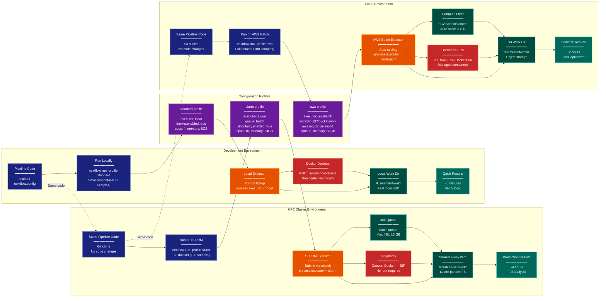

> **Example Note:** This is a whole-codebase example for demonstration purposes.
> In typical usage, arch lens diagrams are scoped to the subsystem being
> modified/added/removed by a plan — not the entire project. The result is
> normally much simpler and more focused than what you see here.

# Scenarios Diagram: Nextflow

**Lens:** Scenarios (Validation)
**Question:** Do the components work together?
**Date:** 2026-02-14
**Scope:** Full Nextflow end-to-end execution scenarios

## Overview

This diagram validates Nextflow's architecture by demonstrating how components cooperate in real-world scenarios. We examine three critical use cases that exercise different aspects of the system: a complete RNA-seq pipeline, resume after failure, and multi-executor deployment.

| Scenario | Focus Areas | Key Components |
|----------|-------------|----------------|
| RNA-seq Pipeline | Full data flow, channel operations, multi-step workflow | Processes, channels, operators, containers, publishDir |
| Resume After Failure | Cache mechanism, task hashing, selective re-execution | Cache DB, work dirs, resume logic, error handling |
| Multi-Executor Deployment | Portability, config profiles, executor abstraction | Local/SLURM executors, profiles, container runtimes |

## Scenario 1: RNA-seq Pipeline

End-to-end bioinformatics workflow demonstrating complete data lineage.

```mermaid
%%{init: {'flowchart': {'nodeSpacing': 50, 'rankSpacing': 60, 'curve': 'basis'}}}%%
flowchart LR
    Start([Start: RNA-seq<br/>━━━━━━━━━━<br/>10 FASTQ samples]):::terminal

    subgraph "Input Stage"
        Params["Input Parameters<br/>━━━━━━━━━━<br/>--input samples/*.fastq<br/>--reference genome.fa<br/>--gtf genes.gtf"]:::cli
        CreateCh["Create Channels<br/>━━━━━━━━━━<br/>fromFilePairs → reads<br/>value → reference, gtf"]:::handler
        SamplesQ["Samples Queue Ch<br/>━━━━━━━━━━<br/>10 tuples:<br/>[sample_id, [R1, R2]]"]:::stateNode
        RefVal["Reference Value Ch<br/>━━━━━━━━━━<br/>genome.fa<br/>(reusable 10x)"]:::stateNode
    end

    subgraph "Process 1: FASTQC"
        FQC_In["Input<br/>━━━━━━━━━━<br/>tuple val(sample), path(reads)"]:::phase
        FQC_Work["Work Dirs (10x)<br/>━━━━━━━━━━<br/>work/a1/.../sample1<br/>work/b2/.../sample2<br/>..."]:::stateNode
        FQC_Script["FastQC Script<br/>━━━━━━━━━━<br/>fastqc reads<br/>Output: *_fastqc.zip"]:::handler
        FQC_Out["Output<br/>━━━━━━━━━━<br/>tuple val(sample), path('*_fastqc.zip')<br/>→ qc channel"]:::phase
    end

    subgraph "Process 2: TRIM"
        Trim_In["Input<br/>━━━━━━━━━━<br/>tuple val(sample), path(reads)"]:::phase
        Trim_Work["Work Dirs (10x)<br/>━━━━━━━━━━<br/>Trim adapters<br/>Output: trimmed FASTQs"]:::stateNode
        Trim_Script["Trim Script<br/>━━━━━━━━━━<br/>trimmomatic<br/>Output: *_trimmed.fastq.gz"]:::handler
        Trim_Out["Output<br/>━━━━━━━━━━<br/>tuple val(sample), path('*_trimmed.fastq.gz')<br/>→ trimmed_reads channel"]:::phase
    end

    subgraph "Process 3: ALIGN"
        Align_In["Input<br/>━━━━━━━━━━<br/>tuple val(sample), path(reads)<br/>path reference"]:::phase
        Align_Work["Work Dirs (10x)<br/>━━━━━━━━━━<br/>BWA alignment<br/>Samtools sort"]:::stateNode
        Align_Script["Align Script<br/>━━━━━━━━━━<br/>bwa mem | samtools sort<br/>Output: *.bam"]:::handler
        Align_Out["Output<br/>━━━━━━━━━━<br/>tuple val(sample), path('*.bam')<br/>→ bam channel"]:::phase
    end

    subgraph "Process 4: QUANT"
        Quant_In["Input<br/>━━━━━━━━━━<br/>tuple val(sample), path(bam)<br/>path gtf"]:::phase
        Quant_Work["Work Dirs (10x)<br/>━━━━━━━━━━<br/>featureCounts<br/>Gene quantification"]:::stateNode
        Quant_Script["Quant Script<br/>━━━━━━━━━━<br/>featureCounts -a gtf bam<br/>Output: *.counts.txt"]:::handler
        Quant_Out["Output<br/>━━━━━━━━━━<br/>tuple val(sample), path('*.counts.txt')<br/>→ counts channel"]:::phase
    end

    subgraph "Process 5: MULTIQC"
        MQC_Collect["Collect Operator<br/>━━━━━━━━━━<br/>collect() all QC files<br/>Wait for all 10 samples"]:::handler
        MQC_In["Input<br/>━━━━━━━━━━<br/>path(all_qc_files)"]:::phase
        MQC_Work["Work Dir (1x)<br/>━━━━━━━━━━<br/>Aggregate all reports<br/>Generate HTML"]:::stateNode
        MQC_Script["MultiQC Script<br/>━━━━━━━━━━<br/>multiqc .<br/>Output: multiqc_report.html"]:::handler
        MQC_Out["Output<br/>━━━━━━━━━━<br/>path('multiqc_report.html')<br/>publishDir: results/qc/"]:::phase
    end

    subgraph "Output Stage"
        PublishBAM["Publish BAMs<br/>━━━━━━━━━━<br/>results/bams/<br/>10 BAM files"]:::output
        PublishCounts["Publish Counts<br/>━━━━━━━━━━<br/>results/counts/<br/>10 count tables"]:::output
        PublishQC["Publish QC<br/>━━━━━━━━━━<br/>results/qc/<br/>multiqc_report.html"]:::output
        TraceReport["Trace Report<br/>━━━━━━━━━━<br/>trace.txt<br/>41 tasks executed"]:::output
    end

    Complete([Complete<br/>━━━━━━━━━━<br/>All outputs published]):::terminal

    Start --> Params
    Params --> CreateCh
    CreateCh --> SamplesQ
    CreateCh --> RefVal

    SamplesQ --> FQC_In
    FQC_In --> FQC_Work
    FQC_Work --> FQC_Script
    FQC_Script --> FQC_Out

    SamplesQ --> Trim_In
    Trim_In --> Trim_Work
    Trim_Work --> Trim_Script
    Trim_Script --> Trim_Out

    Trim_Out --> Align_In
    RefVal -.->|"Reused 10x"| Align_In
    Align_In --> Align_Work
    Align_Work --> Align_Script
    Align_Script --> Align_Out

    Align_Out --> Quant_In
    RefVal -.->|"GTF reused 10x"| Quant_In
    Quant_In --> Quant_Work
    Quant_Work --> Quant_Script
    Quant_Script --> Quant_Out

    FQC_Out --> MQC_Collect
    Quant_Out --> MQC_Collect
    MQC_Collect --> MQC_In
    MQC_In --> MQC_Work
    MQC_Work --> MQC_Script
    MQC_Script --> MQC_Out

    Align_Out --> PublishBAM
    Quant_Out --> PublishCounts
    MQC_Out --> PublishQC
    MQC_Out --> TraceReport

    PublishBAM --> Complete
    PublishCounts --> Complete
    PublishQC --> Complete
    TraceReport --> Complete

    classDef cli fill:#1a237e,stroke:#7986cb,stroke-width:2px,color:#fff;
    classDef stateNode fill:#004d40,stroke:#4db6ac,stroke-width:2px,color:#fff;
    classDef handler fill:#e65100,stroke:#ffb74d,stroke-width:2px,color:#fff;
    classDef phase fill:#6a1b9a,stroke:#ba68c8,stroke-width:2px,color:#fff;
    classDef newComponent fill:#2e7d32,stroke:#81c784,stroke-width:2px,color:#fff;
    classDef output fill:#00695c,stroke:#4db6ac,stroke-width:2px,color:#fff;
    classDef detector fill:#b71c1c,stroke:#ef5350,stroke-width:2px,color:#fff;
    classDef gap fill:#ff6f00,stroke:#ffa726,stroke-width:2px,color:#000;
    classDef integration fill:#c62828,stroke:#ef9a9a,stroke-width:2px,color:#fff;
    classDef terminal fill:#1a237e,stroke:#7986cb,stroke-width:2px,color:#fff;
```



### Scenario 1 Analysis

**Component Cooperation:**

1. **Channel System**:
   - Queue channels (samples) enable parallel scatter across 10 samples
   - Value channels (reference, gtf) efficiently reused without duplication
   - Operators (collect) coordinate gather operations

2. **Process Execution**:
   - Each process independently schedules tasks when inputs available
   - 10 parallel FASTQC tasks (independent, no cross-dependencies)
   - 10 parallel TRIM tasks (independent)
   - 10 parallel ALIGN tasks (independent, share reference)
   - 10 parallel QUANT tasks (independent, share GTF)
   - 1 MULTIQC task (waits for all upstream via collect)

3. **Data Flow**:
   - Inputs → channels → processes → work dirs → output channels → downstream
   - publishDir copies final outputs without blocking pipeline
   - Intermediate files remain in work/ for resume capability

4. **Resource Management**:
   - Total tasks: 41 (10 FASTQC + 10 TRIM + 10 ALIGN + 10 QUANT + 1 MULTIQC)
   - Executor manages concurrency based on resources
   - Container images pulled once, reused across tasks

**Validation**: Demonstrates full pipeline cooperation from inputs to published outputs.

---

## Scenario 2: Resume After Failure

Task failure and selective re-execution demonstrating cache mechanism.

```mermaid
%%{init: {'flowchart': {'nodeSpacing': 50, 'rankSpacing': 60, 'curve': 'basis'}}}%%
flowchart LR
    Start([Start: Initial Run<br/>━━━━━━━━━━<br/>10 samples]):::terminal

    subgraph "Initial Run (Partial Failure)"
        Init_FASTQC["FASTQC<br/>━━━━━━━━━━<br/>10/10 completed ✓<br/>Cached in work/"]:::newComponent
        Init_TRIM["TRIM<br/>━━━━━━━━━━<br/>10/10 completed ✓<br/>Cached in work/"]:::newComponent
        Init_ALIGN["ALIGN<br/>━━━━━━━━━━<br/>7/10 completed ✓<br/>3/10 failed ✗<br/>(sample8, 9, 10)"]:::detector
        Init_Failure["Pipeline Failed<br/>━━━━━━━━━━<br/>Exit code 1<br/>QUANT not started"]:::terminal
    end

    subgraph "Diagnosis & Fix"
        CheckLogs["Check Logs<br/>━━━━━━━━━━<br/>work/xx/hash/.command.err<br/>Error: out of memory"]:::detector
        FixConfig["Fix Configuration<br/>━━━━━━━━━━<br/>process.memory = '16 GB'<br/>(was 8 GB)"]:::handler
    end

    subgraph "Resume Run"
        Resume_Cmd["Resume Command<br/>━━━━━━━━━━<br/>nextflow run -resume<br/>Load cache DB"]:::cli
        LoadCache["Load Cache DB<br/>━━━━━━━━━━<br/>.nextflow/cache/<run-id><br/>Task hashes + work dirs"]:::stateNode
    end

    subgraph "Cache Validation"
        Check_FASTQC["Check FASTQC Tasks<br/>━━━━━━━━━━<br/>Hash match? YES ✓<br/>Work dir exists? YES ✓<br/>Skip execution"]:::newComponent
        Check_TRIM["Check TRIM Tasks<br/>━━━━━━━━━━<br/>Hash match? YES ✓<br/>Work dir exists? YES ✓<br/>Skip execution"]:::newComponent
        Check_ALIGN["Check ALIGN Tasks<br/>━━━━━━━━━━<br/>Sample 1-7: Hash match ✓<br/>Sample 8-10: FAILED<br/>Must re-run"]:::detector
    end

    subgraph "Selective Re-execution"
        Rerun_ALIGN["Re-run ALIGN<br/>━━━━━━━━━━<br/>Only sample 8, 9, 10<br/>With 16 GB memory<br/>3/3 completed ✓"]:::handler
        New_QUANT["Run QUANT<br/>━━━━━━━━━━<br/>All 10 samples<br/>(7 from cache + 3 new)<br/>10/10 completed ✓"]:::handler
        New_MULTIQC["Run MULTIQC<br/>━━━━━━━━━━<br/>Aggregate all reports<br/>1/1 completed ✓"]:::handler
    end

    subgraph "Cache Update"
        Update_Cache["Update Cache DB<br/>━━━━━━━━━━<br/>Store new ALIGN hashes<br/>Store QUANT hashes<br/>Store MULTIQC hash"]:::stateNode
    end

    Success([Resume Complete<br/>━━━━━━━━━━<br/>Only 14 tasks executed<br/>27 tasks cached]):::terminal

    Start --> Init_FASTQC
    Init_FASTQC --> Init_TRIM
    Init_TRIM --> Init_ALIGN
    Init_ALIGN --> Init_Failure

    Init_Failure --> CheckLogs
    CheckLogs --> FixConfig
    FixConfig --> Resume_Cmd

    Resume_Cmd --> LoadCache
    LoadCache --> Check_FASTQC
    LoadCache --> Check_TRIM
    LoadCache --> Check_ALIGN

    Check_FASTQC --> Rerun_ALIGN
    Check_TRIM --> Rerun_ALIGN
    Check_ALIGN --> Rerun_ALIGN

    Rerun_ALIGN --> New_QUANT
    New_QUANT --> New_MULTIQC
    New_MULTIQC --> Update_Cache
    Update_Cache --> Success

    classDef cli fill:#1a237e,stroke:#7986cb,stroke-width:2px,color:#fff;
    classDef stateNode fill:#004d40,stroke:#4db6ac,stroke-width:2px,color:#fff;
    classDef handler fill:#e65100,stroke:#ffb74d,stroke-width:2px,color:#fff;
    classDef phase fill:#6a1b9a,stroke:#ba68c8,stroke-width:2px,color:#fff;
    classDef newComponent fill:#2e7d32,stroke:#81c784,stroke-width:2px,color:#fff;
    classDef output fill:#00695c,stroke:#4db6ac,stroke-width:2px,color:#fff;
    classDef detector fill:#b71c1c,stroke:#ef5350,stroke-width:2px,color:#fff;
    classDef gap fill:#ff6f00,stroke:#ffa726,stroke-width:2px,color:#000;
    classDef integration fill:#c62828,stroke:#ef9a9a,stroke-width:2px,color:#fff;
    classDef terminal fill:#1a237e,stroke:#7986cb,stroke-width:2px,color:#fff;
```



### Scenario 2 Analysis

**Component Cooperation:**

1. **Cache System**:
   - Task hash = f(inputs, script, container, config)
   - Successful tasks stored in `.nextflow/cache/<run-id>/db/`
   - Work directories preserved after failure
   - Hash comparison on resume identifies unchanged tasks

2. **Resume Logic**:
   ```
   Initial run:  20 FASTQC + 20 TRIM + 7 ALIGN = 47 completed
                 3 ALIGN failed → pipeline terminates

   Resume run:   Skip 47 cached tasks (hash matches)
                 Re-run 3 failed ALIGN tasks (new memory config changes hash)
                 Run 10 QUANT tasks (never executed before)
                 Run 1 MULTIQC task (never executed before)
                 Total: 14 new executions vs 61 original
   ```

3. **Failure Handling**:
   - Failed tasks don't corrupt cache
   - Work directories contain error logs for debugging
   - Configuration changes invalidate affected task hashes
   - Downstream tasks automatically re-run when upstream changes

4. **Time Savings**:
   - Original FASTQC + TRIM: ~2 hours (skipped on resume)
   - Failed ALIGN tasks: ~30 minutes (re-run 3 instead of 10)
   - New QUANT + MULTIQC: ~1 hour (must run, never cached)
   - Total resume time: ~1.5 hours vs ~4 hours full re-run

**Validation**: Cache and resume mechanism correctly identifies completed work and selectively re-executes only what's necessary.

---

## Scenario 3: Multi-Executor Deployment

Same pipeline code, different execution environments using config profiles.



### Scenario 3 Analysis

**Component Cooperation:**

1. **Executor Abstraction**:
   - Pipeline code identical across environments
   - Executor choice controlled by config profile
   - Each executor handles job submission differently:
     - Local: Direct process execution
     - SLURM: `sbatch` wrapper scripts
     - AWS Batch: API calls to create jobs

2. **Container Portability**:
   - Docker on local/cloud (root access available)
   - Singularity on HPC (no root required)
   - Same container images, different runtimes
   - Automatic Docker→Singularity conversion

3. **Storage Abstraction**:
   - Local: Direct filesystem access
   - HPC: Shared filesystem (NFS/Lustre)
   - Cloud: S3 object storage
   - Nextflow handles staging transparently

4. **Configuration Layering**:
   ```groovy
   // nextflow.config
   profiles {
       standard {
           process.executor = 'local'
           docker.enabled = true
       }
       slurm {
           process.executor = 'slurm'
           process.queue = 'batch'
           singularity.enabled = true
       }
       aws {
           process.executor = 'awsbatch'
           process.queue = 'my-batch-queue'
           workDir = 's3://bucket/work'
       }
   }
   ```

5. **Development → Production Flow**:
   ```
   1. Develop locally:     2 samples,  5 min, $0 (laptop)
   2. Test on HPC:        10 samples, 30 min, $0 (institutional)
   3. Production on cloud: 100 samples, 2 hrs, $50 (AWS Batch + Spot)
   ```

**Validation**: Same pipeline code successfully executes across three completely different infrastructure environments with only profile changes.

---

## Cross-Scenario Insights

### Common Patterns

1. **Channel-based Coordination**: All scenarios use channels for process communication
2. **Work Directory Isolation**: Each task gets isolated work directory regardless of executor
3. **Container Consistency**: Same container images ensure reproducibility across environments
4. **Declarative Configuration**: Behavior controlled by config, not code changes

### System Robustness

- **Failure Recovery**: Scenario 2 shows graceful failure and efficient resume
- **Scalability**: Scenario 1 demonstrates parallel execution across 10 samples
- **Portability**: Scenario 3 proves environment independence

### Real-World Validation

These scenarios represent actual bioinformatics workflows:
- RNA-seq is industry-standard analysis
- Resume is critical for long-running pipelines (save hours/days)
- Multi-executor is essential for development → production lifecycle

The architecture successfully handles all three scenarios without code modification, validating Nextflow's design principles of portability, reproducibility, and fault tolerance.
