> **Example Note:** This is a whole-codebase example for demonstration purposes.
> In typical usage, arch lens diagrams are scoped to the subsystem being
> modified/added/removed by a plan — not the entire project. The result is
> normally much simpler and more focused than what you see here.

# Data Lineage Diagram: Scanpy

**Lens:** Data Lineage (Data-Centric)
**Question:** Where is the data?
**Date:** 2026-02-14
**Scope:** Full Scanpy data transformation pipeline

## Overview

This diagram tracks how AnnData objects and their internal slots (.X, .obs, .var, .obsm, .obsp, .uns, .layers, .raw) are populated and transformed through a typical single-cell RNA-seq analysis pipeline in Scanpy.

| Stage | Primary Functions | Data Slots Modified | Data Transformations |
|-------|------------------|---------------------|---------------------|
| **Raw Input** | `read_h5ad()`, `read_10x_mtx()` | .X, .obs, .var | Load count matrix and metadata |
| **Quality Control** | `filter_cells()`, `filter_genes()` | .X, .obs, .var | Subset matrix by QC metrics |
| **Normalization** | `normalize_total()`, `log1p()` | .X, .layers, .raw | Scale counts, log-transform |
| **Feature Selection** | `highly_variable_genes()` | .var | Mark HVG in .var['highly_variable'] |
| **Scaling** | `scale()` | .X | Z-score normalization |
| **Dimensionality Reduction** | `pca()`, `umap()` | .obsm, .uns, .varm | Compute embeddings |
| **Neighborhood Graph** | `neighbors()` | .obsp, .uns | Build KNN graph |
| **Clustering** | `leiden()`, `louvain()` | .obs | Assign cluster labels |
| **Marker Genes** | `rank_genes_groups()` | .uns | Differential expression results |

## Data Lineage Flow

```mermaid
%%{init: {'flowchart': {'nodeSpacing': 50, 'rankSpacing': 60, 'curve': 'basis'}}}%%
flowchart LR
    classDef cli fill:#1a237e,stroke:#7986cb,stroke-width:2px,color:#fff;
    classDef stateNode fill:#004d40,stroke:#4db6ac,stroke-width:2px,color:#fff;
    classDef handler fill:#e65100,stroke:#ffb74d,stroke-width:2px,color:#fff;
    classDef phase fill:#6a1b9a,stroke:#ba68c8,stroke-width:2px,color:#fff;
    classDef newComponent fill:#2e7d32,stroke:#81c784,stroke-width:2px,color:#fff;
    classDef output fill:#00695c,stroke:#4db6ac,stroke-width:2px,color:#fff;
    classDef detector fill:#b71c1c,stroke:#ef5350,stroke-width:2px,color:#fff;
    classDef gap fill:#ff6f00,stroke:#ffa726,stroke-width:2px,color:#000;
    classDef integration fill:#c62828,stroke:#ef9a9a,stroke-width:2px,color:#fff;
    classDef terminal fill:#1a237e,stroke:#7986cb,stroke-width:2px,color:#fff;

    %% Input Stage
    RawData["Raw Count Data<br/>━━━━━━━━━━<br/>H5AD, MTX, CSV"]:::cli

    subgraph Input["Data Loading"]
        ReadH5AD["read_h5ad()<br/>━━━━━━━━━━<br/>Load from HDF5"]:::handler
        Read10X["read_10x_mtx()<br/>━━━━━━━━━━<br/>Load CellRanger output"]:::handler
        ReadCSV["read_csv()<br/>━━━━━━━━━━<br/>Load CSV matrix"]:::handler
    end

    AnnData1["AnnData Object<br/>━━━━━━━━━━<br/>.X: raw counts<br/>.obs: cell IDs<br/>.var: gene IDs"]:::stateNode

    %% QC Stage
    subgraph QC["Quality Control"]
        FilterCells["filter_cells()<br/>━━━━━━━━━━<br/>Remove low-quality cells"]:::handler
        FilterGenes["filter_genes()<br/>━━━━━━━━━━<br/>Remove low-count genes"]:::handler
        CalcQC["calculate_qc_metrics()<br/>━━━━━━━━━━<br/>Compute n_genes, total_counts"]:::handler
    end

    AnnData2["AnnData Object<br/>━━━━━━━━━━<br/>.X: filtered counts<br/>.obs: QC metrics added<br/>.var: QC metrics added"]:::stateNode

    %% Normalization Stage
    subgraph Norm["Normalization"]
        Normalize["normalize_total()<br/>━━━━━━━━━━<br/>Scale to target_sum"]:::handler
        Log1p["log1p()<br/>━━━━━━━━━━<br/>Log-transform"]:::handler
        FreezeRaw["Freeze .raw<br/>━━━━━━━━━━<br/>Store pre-HVG state"]:::phase
    end

    AnnData3["AnnData Object<br/>━━━━━━━━━━<br/>.X: log-normalized<br/>.raw: frozen copy<br/>.layers: original counts"]:::stateNode

    %% Feature Selection
    subgraph FeatSel["Feature Selection"]
        HVG["highly_variable_genes()<br/>━━━━━━━━━━<br/>Identify variable genes"]:::handler
        SubsetHVG["Subset to HVG<br/>━━━━━━━━━━<br/>adata[:, hvg_mask]"]:::handler
    end

    AnnData4["AnnData Object<br/>━━━━━━━━━━<br/>.X: log-norm (HVG only)<br/>.var['highly_variable']<br/>.raw: full gene set"]:::stateNode

    %% Scaling Stage
    subgraph Scale["Scaling"]
        ScaleData["scale()<br/>━━━━━━━━━━<br/>Z-score per gene"]:::handler
        RegOut["regress_out()<br/>━━━━━━━━━━<br/>Remove covariates"]:::handler
    end

    AnnData5["AnnData Object<br/>━━━━━━━━━━<br/>.X: scaled (zero-mean)<br/>.layers['log1p']<br/>.raw: preserved"]:::stateNode

    %% Dimensionality Reduction
    subgraph DimRed["Dimensionality Reduction"]
        PCA["pca()<br/>━━━━━━━━━━<br/>Compute PCs"]:::handler
        UMAP["umap()<br/>━━━━━━━━━━<br/>Compute UMAP"]:::handler
        tSNE["tsne()<br/>━━━━━━━━━━<br/>Compute t-SNE"]:::handler
    end

    AnnData6["AnnData Object<br/>━━━━━━━━━━<br/>.obsm['X_pca']<br/>.obsm['X_umap']<br/>.varm['PCs']<br/>.uns['pca']"]:::stateNode

    %% Neighborhood Graph
    subgraph Graph["Graph Construction"]
        Neighbors["neighbors()<br/>━━━━━━━━━━<br/>Build KNN graph"]:::handler
    end

    AnnData7["AnnData Object<br/>━━━━━━━━━━<br/>.obsp['distances']<br/>.obsp['connectivities']<br/>.uns['neighbors']"]:::stateNode

    %% Clustering
    subgraph Cluster["Clustering"]
        Leiden["leiden()<br/>━━━━━━━━━━<br/>Community detection"]:::handler
        Louvain["louvain()<br/>━━━━━━━━━━<br/>Alternative clustering"]:::handler
    end

    AnnData8["AnnData Object<br/>━━━━━━━━━━<br/>.obs['leiden']<br/>.obs['louvain']"]:::stateNode

    %% Differential Expression
    subgraph DiffExp["Differential Expression"]
        RankGenes["rank_genes_groups()<br/>━━━━━━━━━━<br/>Find marker genes"]:::handler
    end

    AnnDataFinal["AnnData Object<br/>━━━━━━━━━━<br/>.uns['rank_genes_groups']<br/>Complete analysis state"]:::output

    %% Flow connections
    RawData --> ReadH5AD & Read10X & ReadCSV
    ReadH5AD & Read10X & ReadCSV --> AnnData1

    AnnData1 --> CalcQC --> FilterCells --> FilterGenes --> AnnData2

    AnnData2 --> Normalize --> Log1p --> FreezeRaw --> AnnData3

    AnnData3 --> HVG --> SubsetHVG --> AnnData4

    AnnData4 --> RegOut --> ScaleData --> AnnData5

    AnnData5 --> PCA --> UMAP & tSNE --> AnnData6

    AnnData6 --> Neighbors --> AnnData7

    AnnData7 --> Leiden & Louvain --> AnnData8

    AnnData8 --> RankGenes --> AnnDataFinal
```

## Color Legend

| Color | Purpose | Examples |
|-------|---------|----------|
| Dark Blue | Entry points / Raw data | Raw count data, input files |
| Dark Teal | State nodes | AnnData objects at each stage |
| Orange | Processing functions | filter_cells(), normalize_total() |
| Purple | Phase transitions | Freezing .raw, subsetting to HVG |
| Green | New data structures | HVG subset, embeddings |
| Teal | Final outputs | Complete AnnData with all results |
| Red | Validators | QC metric calculators |
| Amber | Missing capabilities | N/A in this pipeline |
| Dark Red | Integration points | N/A in this pipeline |

## Key Data Transformations

### 1. Raw Counts → Filtered Counts
- **Functions**: `filter_cells()`, `filter_genes()`
- **Slots Modified**: `.X` (rows/columns removed), `.obs` (rows removed), `.var` (rows removed)
- **Transformation**: Subset sparse matrix to remove low-quality cells and genes
- **Typical Criteria**: min_genes=200, min_cells=3, mito < 5%

### 2. Filtered Counts → Normalized Counts
- **Functions**: `normalize_total()`, `log1p()`
- **Slots Modified**: `.X` (values scaled), `.layers['counts']` (original preserved)
- **Transformation**:
  - Normalize: each cell to target_sum (default 10,000)
  - Log: apply log(x + 1) transformation
- **Formula**: X_norm = log(X_raw / total_counts * target_sum + 1)

### 3. Normalized Counts → HVG Subset
- **Functions**: `highly_variable_genes()`
- **Slots Modified**: `.var['highly_variable']` (boolean mask), `.raw` (frozen full state)
- **Transformation**: Identify top ~2000 genes with high variance after controlling for mean
- **Critical**: `.raw` preserves full gene set for later marker gene analysis

### 4. HVG Subset → Scaled Matrix
- **Functions**: `scale()`, `regress_out()`
- **Slots Modified**: `.X` (z-scored), `.layers['log1p']` (pre-scale preserved)
- **Transformation**: Zero-mean, unit-variance per gene
- **Purpose**: Prevent highly-expressed genes from dominating PCA

### 5. Scaled Matrix → PCA Embedding
- **Functions**: `pca()`
- **Slots Modified**:
  - `.obsm['X_pca']` (cell × PC matrix)
  - `.varm['PCs']` (gene × PC loadings)
  - `.uns['pca']` (variance explained, parameters)
- **Transformation**: SVD on scaled matrix, retain top 50 PCs
- **Output Shape**: (n_cells, 50)

### 6. PCA → UMAP/t-SNE
- **Functions**: `umap()`, `tsne()`
- **Slots Modified**: `.obsm['X_umap']`, `.obsm['X_tsne']`
- **Input**: Uses PCA coordinates (.obsm['X_pca']), not full matrix
- **Transformation**: Non-linear dimensionality reduction to 2D
- **Output Shape**: (n_cells, 2)

### 7. PCA → Neighborhood Graph
- **Functions**: `neighbors()`
- **Slots Modified**:
  - `.obsp['distances']` (KNN distance matrix)
  - `.obsp['connectivities']` (weighted adjacency)
  - `.uns['neighbors']` (parameters)
- **Input**: Uses PCA coordinates (.obsm['X_pca'])
- **Transformation**: Compute k=15 nearest neighbors in PC space
- **Output Shape**: (n_cells, n_cells) sparse matrices

### 8. Graph → Clusters
- **Functions**: `leiden()`, `louvain()`
- **Slots Modified**: `.obs['leiden']` (categorical cluster labels)
- **Input**: Uses `.obsp['connectivities']`
- **Transformation**: Community detection on cell graph
- **Output**: Categorical array of cluster assignments

### 9. Clusters → Marker Genes
- **Functions**: `rank_genes_groups()`
- **Slots Modified**: `.uns['rank_genes_groups']` (structured array)
- **Input**: Uses `.raw.X` (full gene set) and `.obs['leiden']`
- **Transformation**: Differential expression per cluster (t-test, Wilcoxon, etc.)
- **Output**: Top N genes per cluster, ranked by score

## Data Slot Evolution

| Slot | After Load | After Norm | After HVG | After Scale | After PCA | After Neighbors | After Clustering |
|------|-----------|-----------|-----------|-------------|-----------|----------------|-----------------|
| `.X` | Raw counts | Log-norm | HVG subset | Scaled | Scaled | Scaled | Scaled |
| `.obs` | Cell IDs | +QC metrics | Unchanged | Unchanged | Unchanged | Unchanged | +Clusters |
| `.var` | Gene IDs | +QC metrics | +HVG flag | Unchanged | Unchanged | Unchanged | Unchanged |
| `.obsm` | Empty | Empty | Empty | Empty | +PCA, +UMAP | Unchanged | Unchanged |
| `.obsp` | Empty | Empty | Empty | Empty | Empty | +Distances, +Connectivities | Unchanged |
| `.uns` | Empty | Empty | Empty | Empty | +PCA params | +Neighbors params | +Marker genes |
| `.layers` | Empty | +Counts | Unchanged | +Log1p | Unchanged | Unchanged | Unchanged |
| `.raw` | None | None | Frozen! | Preserved | Preserved | Preserved | Preserved |

## Critical Data Dependencies

### 1. .raw Freeze Point
- **When**: After `log1p()`, before `highly_variable_genes()`
- **Why**: Marker gene analysis needs full gene set, not just HVGs
- **How**: `adata.raw = adata` creates frozen copy
- **Impact**: `.raw.X` never modified after this point

### 2. HVG Subsetting
- **When**: After `highly_variable_genes()`, before `scale()`
- **Why**: Scaling/PCA only use informative genes
- **How**: `adata = adata[:, adata.var.highly_variable]`
- **Impact**: `.X` shape changes, `.raw` preserves original

### 3. PCA Input
- **When**: After `scale()`, before `neighbors()`
- **Why**: UMAP and neighbors both use PCA, not raw data
- **How**: `neighbors()` and `umap()` default to `use_rep='X_pca'`
- **Impact**: `.obsm['X_pca']` is critical intermediate

### 4. Clustering Input
- **When**: After `neighbors()`, before `leiden()`
- **Why**: Leiden requires pre-computed graph
- **How**: `leiden()` reads `.obsp['connectivities']`
- **Impact**: Must call `neighbors()` first

### 5. Marker Gene Input
- **When**: After clustering, uses `.raw.X`
- **Why**: Compare expression across clusters for all genes
- **How**: `rank_genes_groups()` defaults to `use_raw=True`
- **Impact**: `.raw` must be set, `.obs` must have cluster labels

