> **Example Note:** This is a whole-codebase example for demonstration purposes.
> In typical usage, arch lens diagrams are scoped to the subsystem being
> modified/added/removed by a plan — not the entire project. The result is
> normally much simpler and more focused than what you see here.

# Module Dependency Diagram: Scanpy

**Lens:** Module Dependency (Structural)
**Question:** How are modules coupled?
**Date:** 2026-02-14
**Scope:** Full Scanpy module architecture

## Overview

This diagram shows the dependency relationships between Scanpy's core modules and their external dependencies. Scanpy follows a layered architecture where preprocessing (pp) → tools (tl) → plotting (pl) form a sequential pipeline, with shared access to data I/O (read/get) and AnnData slots.

| Module | Purpose | Primary Dependencies | Data Flow |
|--------|---------|---------------------|-----------|
| **scanpy.read** | Data loading | anndata, pandas, scipy.io | File → AnnData |
| **scanpy.pp** | Preprocessing | scipy.sparse, sklearn.preprocessing | AnnData.X → filtered/normalized |
| **scanpy.tl** | Analysis tools | sklearn.decomposition, igraph, leidenalg | .X/.obsm → .obsm/.obsp/.uns |
| **scanpy.pl** | Plotting | matplotlib, seaborn | All AnnData slots → figures |
| **scanpy.get** | Data access | anndata | AnnData → arrays/dataframes |
| **scanpy.datasets** | Example data | anndata, requests | Remote → AnnData |

## Module Dependency Graph

```mermaid
%%{init: {'flowchart': {'nodeSpacing': 50, 'rankSpacing': 60, 'curve': 'basis'}}}%%
flowchart TB
    classDef cli fill:#1a237e,stroke:#7986cb,stroke-width:2px,color:#fff;
    classDef stateNode fill:#004d40,stroke:#4db6ac,stroke-width:2px,color:#fff;
    classDef handler fill:#e65100,stroke:#ffb74d,stroke-width:2px,color:#fff;
    classDef phase fill:#6a1b9a,stroke:#ba68c8,stroke-width:2px,color:#fff;
    classDef newComponent fill:#2e7d32,stroke:#81c784,stroke-width:2px,color:#fff;
    classDef output fill:#00695c,stroke:#4db6ac,stroke-width:2px,color:#fff;
    classDef detector fill:#b71c1c,stroke:#ef5350,stroke-width:2px,color:#fff;
    classDef gap fill:#ff6f00,stroke:#ffa726,stroke-width:2px,color:#000;
    classDef integration fill:#c62828,stroke:#ef9a9a,stroke-width:2px,color:#fff;
    classDef terminal fill:#1a237e,stroke:#7986cb,stroke-width:2px,color:#fff;

    %% External Dependencies - Core
    subgraph External["External Dependencies"]
        AnnData["anndata<br/>━━━━━━━━━━<br/>Core data structure"]:::integration
        NumPy["numpy<br/>━━━━━━━━━━<br/>Array operations"]:::integration
        SciPy["scipy<br/>━━━━━━━━━━<br/>Sparse matrices, stats"]:::integration
        Pandas["pandas<br/>━━━━━━━━━━<br/>DataFrames, I/O"]:::integration
    end

    %% External Dependencies - ML/Graph
    subgraph MLDeps["ML & Graph Libraries"]
        Sklearn["scikit-learn<br/>━━━━━━━━━━<br/>PCA, neighbors, preprocessing"]:::integration
        Igraph["igraph<br/>━━━━━━━━━━<br/>Graph algorithms"]:::integration
        Leiden["leidenalg<br/>━━━━━━━━━━<br/>Leiden clustering"]:::integration
        Louvain["louvain<br/>━━━━━━━━━━<br/>Louvain clustering"]:::integration
    end

    %% External Dependencies - Visualization
    subgraph VizDeps["Visualization Libraries"]
        MPL["matplotlib<br/>━━━━━━━━━━<br/>Base plotting"]:::integration
        Seaborn["seaborn<br/>━━━━━━━━━━<br/>Statistical plots"]:::integration
        Plotly["plotly (optional)<br/>━━━━━━━━━━<br/>Interactive plots"]:::integration
    end

    %% Scanpy Modules - I/O Layer
    subgraph IOLayer["I/O Layer"]
        ScRead["scanpy.read<br/>━━━━━━━━━━<br/>read_h5ad, read_10x_mtx,<br/>read_csv, read_loom"]:::handler
        ScGet["scanpy.get<br/>━━━━━━━━━━<br/>obs_df, var_df,<br/>rank_genes_groups_df"]:::handler
        ScDatasets["scanpy.datasets<br/>━━━━━━━━━━<br/>pbmc3k, paul15,<br/>krumsiek11"]:::handler
    end

    %% Scanpy Modules - Processing Layer
    subgraph ProcessLayer["Processing Layer (scanpy.pp)"]
        PPFilter["Filtering<br/>━━━━━━━━━━<br/>filter_cells,<br/>filter_genes"]:::handler
        PPNorm["Normalization<br/>━━━━━━━━━━<br/>normalize_total,<br/>log1p, sqrt"]:::handler
        PPScale["Scaling<br/>━━━━━━━━━━<br/>scale, regress_out"]:::handler
        PPHVG["Feature Selection<br/>━━━━━━━━━━<br/>highly_variable_genes"]:::handler
        PPQC["QC Metrics<br/>━━━━━━━━━━<br/>calculate_qc_metrics"]:::handler
    end

    %% Scanpy Modules - Tools Layer
    subgraph ToolsLayer["Analysis Tools (scanpy.tl)"]
        TLDimRed["Dimensionality Reduction<br/>━━━━━━━━━━<br/>pca, umap, tsne,<br/>diffmap, draw_graph"]:::handler
        TLNeigh["Neighborhood<br/>━━━━━━━━━━<br/>neighbors"]:::handler
        TLCluster["Clustering<br/>━━━━━━━━━━<br/>leiden, louvain,<br/>dendrogram"]:::handler
        TLDiffExp["Differential Expression<br/>━━━━━━━━━━<br/>rank_genes_groups,<br/>filter_rank_genes_groups"]:::handler
        TLTrajectory["Trajectory<br/>━━━━━━━━━━<br/>paga, dpt,<br/>embedding_density"]:::handler
    end

    %% Scanpy Modules - Plotting Layer
    subgraph PlotLayer["Plotting Layer (scanpy.pl)"]
        PLEmbed["Embedding Plots<br/>━━━━━━━━━━<br/>umap, pca, tsne,<br/>diffmap, draw_graph"]:::output
        PLMarker["Marker Plots<br/>━━━━━━━━━━<br/>rank_genes_groups,<br/>dotplot, heatmap"]:::output
        PLQC["QC Plots<br/>━━━━━━━━━━<br/>violin, scatter,<br/>highest_expr_genes"]:::output
        PLTrajectory["Trajectory Plots<br/>━━━━━━━━━━<br/>paga, paga_path,<br/>dpt_timeseries"]:::output
    end

    %% Central State
    AnnDataObj["AnnData Object<br/>━━━━━━━━━━<br/>.X, .obs, .var, .obsm,<br/>.obsp, .uns, .layers, .raw"]:::stateNode

    %% Dependencies: External → I/O
    AnnData --> ScRead & ScGet
    Pandas --> ScRead
    SciPy --> ScRead
    ScRead -.-> ScDatasets

    %% Dependencies: I/O → AnnData Object
    ScRead --> AnnDataObj
    ScDatasets --> AnnDataObj

    %% Dependencies: External → pp
    AnnData --> PPFilter & PPNorm & PPScale & PPHVG & PPQC
    NumPy --> PPFilter & PPNorm & PPScale
    SciPy --> PPFilter & PPNorm & PPHVG
    Sklearn --> PPScale & PPHVG

    %% Dependencies: pp → AnnData Object
    PPFilter --> AnnDataObj
    PPNorm --> AnnDataObj
    PPScale --> AnnDataObj
    PPHVG --> AnnDataObj
    PPQC --> AnnDataObj

    %% Dependencies: AnnData Object → tl
    AnnDataObj --> TLDimRed & TLNeigh & TLCluster & TLDiffExp & TLTrajectory

    %% Dependencies: External → tl
    Sklearn --> TLDimRed & TLNeigh
    Igraph --> TLCluster & TLTrajectory
    Leiden --> TLCluster
    Louvain --> TLCluster
    SciPy --> TLDimRed & TLDiffExp

    %% Dependencies: tl → AnnData Object
    TLDimRed --> AnnDataObj
    TLNeigh --> AnnDataObj
    TLCluster --> AnnDataObj
    TLDiffExp --> AnnDataObj
    TLTrajectory --> AnnDataObj

    %% Dependencies: AnnData Object → pl
    AnnDataObj --> PLEmbed & PLMarker & PLQC & PLTrajectory

    %% Dependencies: External → pl
    MPL --> PLEmbed & PLMarker & PLQC & PLTrajectory
    Seaborn --> PLMarker & PLQC
    Plotly -.-> PLEmbed

    %% Dependencies: tl → pl (direct for styling)
    TLDimRed -.-> PLEmbed
    TLCluster -.-> PLEmbed
    TLDiffExp -.-> PLMarker
    TLTrajectory -.-> PLTrajectory

    %% Dependencies: get (reads from AnnData)
    AnnDataObj --> ScGet
    Pandas --> ScGet
```



## Color Legend

| Color | Purpose | Examples |
|-------|---------|----------|
| Dark Blue | Entry points | User-facing API entry points |
| Dark Teal | Central state | AnnData object (shared mutable state) |
| Orange | Processing modules | scanpy.pp, scanpy.tl functions |
| Purple | Phase transitions | N/A |
| Green | New components | N/A |
| Teal | Output modules | scanpy.pl plotting functions |
| Red | Validators | QC metric calculations |
| Amber | Missing capabilities | N/A |
| Dark Red | External dependencies | anndata, numpy, scipy, sklearn, igraph |

## Module Coupling Analysis

### 1. scanpy.read (Data Loading)
**Purpose**: Load data into AnnData objects

**Dependencies**:
- `anndata`: Core AnnData class
- `pandas`: CSV/TSV reading, DataFrame construction
- `scipy.io`: Matrix Market format
- `h5py` (via anndata): H5AD format
- `loompy` (optional): Loom format

**Exports**:
- `read_h5ad()` → AnnData
- `read_10x_mtx()` → AnnData from CellRanger output
- `read_csv()` → AnnData from CSV/TSV
- `read_loom()` → AnnData from Loom

**Coupling**:
- **Tight coupling** to `anndata.AnnData` (creates instances)
- **Loose coupling** to file format specs (delegates to format libraries)
- **No coupling** to pp/tl/pl (purely I/O)

### 2. scanpy.pp (Preprocessing)
**Purpose**: Filter, normalize, and prepare data for analysis

**Dependencies**:
- `anndata`: Reads/writes AnnData slots (.X, .obs, .var, .layers)
- `numpy`: Array operations
- `scipy.sparse`: Sparse matrix operations
- `scipy.stats`: Statistical functions for HVG selection
- `sklearn.preprocessing`: Scaling, normalization

**Key Functions & Slot Modifications**:
- `filter_cells()` → modifies `.X`, `.obs` (row subsetting)
- `filter_genes()` → modifies `.X`, `.var` (column subsetting)
- `normalize_total()` → modifies `.X` (in-place scaling)
- `log1p()` → modifies `.X` (in-place log transform)
- `highly_variable_genes()` → modifies `.var['highly_variable']`
- `scale()` → modifies `.X` (in-place z-score)
- `regress_out()` → modifies `.X` (linear regression)
- `calculate_qc_metrics()` → modifies `.obs`, `.var` (add QC columns)

**Coupling**:
- **Tight coupling** to `anndata.AnnData` (mutates in-place)
- **Medium coupling** to `.X`, `.obs`, `.var` slot structure
- **No coupling** to tl/pl (pure preprocessing)
- **Idempotency**: Most functions can be re-run (overwrites previous result)

### 3. scanpy.tl (Tools/Analysis)
**Purpose**: Compute embeddings, graphs, clusters, differential expression

**Dependencies**:
- `anndata`: Reads `.X`, writes to `.obsm`, `.obsp`, `.uns`
- `sklearn.decomposition`: PCA, TruncatedSVD
- `sklearn.neighbors`: KNN graph construction
- `umap-learn`: UMAP embedding
- `igraph`: Graph analysis, clustering
- `leidenalg`: Leiden algorithm
- `louvain`: Louvain algorithm
- `scipy.sparse`: Graph operations
- `scipy.stats`: Differential expression statistics

**Key Functions & Slot Modifications**:
- `pca()` → writes `.obsm['X_pca']`, `.varm['PCs']`, `.uns['pca']`
- `umap()` → writes `.obsm['X_umap']`
- `tsne()` → writes `.obsm['X_tsne']`
- `neighbors()` → writes `.obsp['distances']`, `.obsp['connectivities']`, `.uns['neighbors']`
- `leiden()` → writes `.obs['leiden']`
- `louvain()` → writes `.obs['louvain']`
- `rank_genes_groups()` → writes `.uns['rank_genes_groups']`
- `paga()` → writes `.uns['paga']`
- `dpt()` → writes `.obs['dpt_pseudotime']`

**Coupling**:
- **Tight coupling** to `anndata.AnnData` (reads `.X`, writes multiple slots)
- **Strong coupling** to pp output (expects normalized, scaled data)
- **Medium coupling** to external ML libraries (sklearn, umap, igraph)
- **Dependency chain**: `pca()` → `neighbors()` → `leiden()`/`umap()`
- **Optional .raw usage**: `rank_genes_groups()` reads `.raw.X` by default

### 4. scanpy.pl (Plotting)
**Purpose**: Visualize embeddings, clusters, gene expression, QC metrics

**Dependencies**:
- `anndata`: Reads all slots (`.X`, `.obs`, `.var`, `.obsm`, `.uns`)
- `matplotlib`: Base plotting, figure/axes management
- `seaborn`: Statistical plot styling
- `pandas`: Data reshaping for plotting
- `plotly` (optional): Interactive plots

**Key Functions & Data Sources**:
- `umap()`, `pca()`, `tsne()` → reads `.obsm['X_umap']`, etc.
- `rank_genes_groups()` → reads `.uns['rank_genes_groups']`
- `dotplot()`, `heatmap()` → reads `.X` or `.raw.X`
- `violin()`, `scatter()` → reads `.obs`, `.X`
- `paga()` → reads `.uns['paga']`
- `highest_expr_genes()` → reads `.X`

**Coupling**:
- **Read-only coupling** to `anndata.AnnData` (never modifies)
- **Strong coupling** to tl output (expects specific `.obsm`/`.uns` keys)
- **Medium coupling** to matplotlib API (creates figures/axes)
- **Styling dependency**: Expects certain `.uns` keys for color palettes

### 5. scanpy.get (Data Access)
**Purpose**: Extract data from AnnData as DataFrames/arrays

**Dependencies**:
- `anndata`: Reads all slots
- `pandas`: DataFrame construction

**Key Functions**:
- `obs_df()` → DataFrame from `.obs` with selected `.obsm` columns
- `var_df()` → DataFrame from `.var` with selected `.varm` columns
- `rank_genes_groups_df()` → DataFrame from `.uns['rank_genes_groups']`

**Coupling**:
- **Read-only coupling** to `anndata.AnnData`
- **No side effects**
- **Convenience layer** over direct AnnData access

### 6. scanpy.datasets (Example Data)
**Purpose**: Download and cache example datasets

**Dependencies**:
- `anndata`: Returns AnnData objects
- `requests`: Download from remote URLs
- `pathlib`: Cache management

**Coupling**:
- **Loose coupling** (independent module)
- **Delegates to scanpy.read** for parsing

## Dependency Patterns

### 1. Sequential Pipeline Dependency
```
scanpy.read → scanpy.pp → scanpy.tl → scanpy.pl
```
- Each layer depends on previous layer's output
- Strong ordering constraint
- Violations cause runtime errors (e.g., `umap()` before `neighbors()`)

### 2. Shared Mutable State (AnnData)
- All modules read/write to central AnnData object
- **Risk**: In-place mutations can cause side effects
- **Mitigation**: `copy=True` parameter in most functions

### 3. Slot-Based Coupling
- pp modifies: `.X`, `.obs`, `.var`, `.layers`
- tl modifies: `.obsm`, `.obsp`, `.uns`, `.obs` (clusters)
- pl reads: all slots
- **Benefit**: Clear separation of concerns
- **Risk**: Slot name collisions (e.g., overwriting `.obsm['X_pca']`)

### 4. External Dependency Isolation
- Core algorithms delegated to external libraries
- Scanpy provides thin wrappers with AnnData I/O
- **Benefit**: Leverage specialized implementations
- **Risk**: Breaking changes in external APIs

## Circular Dependencies

### None Detected
Scanpy maintains strict layering:
- read/get → AnnData (I/O only)
- pp → AnnData (preprocessing only)
- tl → AnnData (analysis only)
- pl → AnnData (visualization only)

**No module imports another Scanpy module's functions**, only AnnData.

## Optional Dependencies

| Dependency | Required For | Fallback |
|-----------|-------------|----------|
| `leidenalg` | `leiden()` | Error message |
| `louvain` | `louvain()` | Error message |
| `umap-learn` | `umap()` | Error message |
| `igraph` | Graph algorithms | Error message |
| `plotly` | Interactive plots | Skip feature |
| `loompy` | `read_loom()` | Error message |
| `scikit-misc` | `loess()` | Error message |

**Pattern**: Scanpy uses lazy imports and raises informative errors when optional deps missing.

## Module Interface Contracts

### scanpy.pp Functions
**Input Contract**:
- AnnData with `.X` (sparse or dense matrix)
- Optional: `.obs`, `.var` metadata

**Output Contract**:
- Modifies `.X` in-place (unless `copy=True`)
- Adds columns to `.obs`, `.var` (QC metrics, HVG flags)
- Optionally stores original in `.layers`

**Guarantees**:
- Preserves `.obs`/`.var` index alignment
- Maintains `.X` shape (unless filtering)

### scanpy.tl Functions
**Input Contract**:
- AnnData with preprocessed `.X` (normalized, scaled)
- For `umap()`/`leiden()`: requires prior `neighbors()` call
- For `rank_genes_groups()`: requires cluster labels in `.obs`

**Output Contract**:
- Never modifies `.X`
- Writes to `.obsm` (embeddings), `.obsp` (graphs), `.uns` (metadata)
- Optionally writes to `.obs` (cluster labels, pseudotime)

**Guarantees**:
- Idempotent (can re-run with same parameters)
- Deterministic (with fixed random seed)

### scanpy.pl Functions
**Input Contract**:
- AnnData with required slot populated (e.g., `.obsm['X_umap']` for `pl.umap()`)
- Optional: color by `.obs` column, gene expression

**Output Contract**:
- Returns matplotlib Figure/Axes
- Never modifies AnnData
- Optionally saves to file (`save='filename'`)

**Guarantees**:
- Read-only operations
- No side effects on data

## Coupling Metrics

| Module Pair | Coupling Type | Strength | Notes |
|-------------|--------------|----------|-------|
| pp → AnnData | Data | Tight | In-place mutation |
| tl → AnnData | Data | Tight | Reads/writes multiple slots |
| pl → AnnData | Data | Medium | Read-only |
| tl → pp | Functional | Strong | Expects specific preprocessing |
| pl → tl | Functional | Strong | Expects specific tl outputs |
| read → AnnData | Data | Tight | Creates instances |
| get → AnnData | Data | Weak | Read-only, no format assumptions |

## Analysis

### Strengths
1. **Clear layering**: I/O → preprocess → analyze → visualize
2. **Separation of concerns**: Each module has distinct responsibility
3. **AnnData-centric**: Unified data model reduces impedance mismatch
4. **Minimal cross-module imports**: Reduces circular dependency risk

### Weaknesses
1. **In-place mutation**: Default `copy=False` can cause unexpected side effects
2. **Implicit dependencies**: `umap()` requires prior `neighbors()` call (not enforced)
3. **Slot name conventions**: No namespacing (risk of key collisions in `.uns`)
4. **Tight external coupling**: Breaking changes in sklearn/igraph affect Scanpy

### Recommendations
1. Add runtime validation for required slots (e.g., check `.obsp['connectivities']` exists before `leiden()`)
2. Consider immutable AnnData operations (return modified copy by default)
3. Namespace `.uns` keys by module (e.g., `.uns['scanpy.tl.pca']`)
4. Version-pin critical external dependencies
