> **Example Note:** This is a whole-codebase example for demonstration purposes.
> In typical usage, arch lens diagrams are scoped to the subsystem being
> modified/added/removed by a plan — not the entire project. The result is
> normally much simpler and more focused than what you see here.

# Repository Access Diagram: Scanpy

**Lens:** Repository Access (Data-Centric)
**Question:** How is data accessed?
**Date:** 2026-02-14
**Scope:** Full Scanpy data persistence and I/O patterns

## Overview

This diagram shows how Scanpy reads, writes, and manages persistent data through AnnData's I/O system. Key patterns include: in-memory vs. backed mode (H5AD on disk), file format support (H5AD, Loom, MTX, CSV), chunked operations for out-of-core processing, and dataset concatenation strategies.

| Access Pattern | Functions | Storage Format | Use Case |
|----------------|-----------|----------------|----------|
| **Full Load** | `read_h5ad()`, `read_10x_mtx()` | H5AD, MTX, CSV | Small datasets (< 10GB) |
| **Backed Mode** | `read_h5ad(backed='r+')` | H5AD (HDF5) | Large datasets (> 10GB) |
| **Chunked Read** | `read_h5ad(backed='r')` + iteration | H5AD | Streaming analysis |
| **Partial Load** | `read_h5ad(backed='r')` + slicing | H5AD | Subset extraction |
| **Write** | `write_h5ad()`, `write_csvs()` | H5AD, CSV | Checkpointing, export |
| **Concatenation** | `concat()` | Multiple AnnData → 1 | Batch integration |

## Data Access Flow

```mermaid
%%{init: {'flowchart': {'nodeSpacing': 50, 'rankSpacing': 60, 'curve': 'basis'}}}%%
flowchart LR
    classDef cli fill:#1a237e,stroke:#7986cb,stroke-width:2px,color:#fff;
    classDef stateNode fill:#004d40,stroke:#4db6ac,stroke-width:2px,color:#fff;
    classDef handler fill:#e65100,stroke:#ffb74d,stroke-width:2px,color:#fff;
    classDef phase fill:#6a1b9a,stroke:#ba68c8,stroke-width:2px,color:#fff;
    classDef newComponent fill:#2e7d32,stroke:#81c784,stroke-width:2px,color:#fff;
    classDef output fill:#00695c,stroke:#4db6ac,stroke-width:2px,color:#fff;
    classDef detector fill:#b71c1c,stroke:#ef5350,stroke-width:2px,color:#fff;
    classDef gap fill:#ff6f00,stroke:#ffa726,stroke-width:2px,color:#000;
    classDef integration fill:#c62828,stroke:#ef9a9a,stroke-width:2px,color:#fff;
    classDef terminal fill:#1a237e,stroke:#7986cb,stroke-width:2px,color:#fff;

    %% File Sources
    subgraph FileSources["Data Sources"]
        H5ADFile["H5AD File<br/>━━━━━━━━━━<br/>data.h5ad<br/>(HDF5 format)"]:::cli
        MTXFiles["MTX Files<br/>━━━━━━━━━━<br/>matrix.mtx + genes/barcodes<br/>(CellRanger output)"]:::cli
        CSVFile["CSV File<br/>━━━━━━━━━━<br/>expression.csv<br/>(Plain text matrix)"]:::cli
        LoomFile["Loom File<br/>━━━━━━━━━━<br/>data.loom<br/>(HDF5-based)"]:::cli
        RemoteData["Remote URL<br/>━━━━━━━━━━<br/>Example datasets<br/>(pbmc3k, paul15)"]:::cli
    end

    %% Read Functions
    subgraph ReadLayer["Read Functions"]
        ReadH5AD["read_h5ad()<br/>━━━━━━━━━━<br/>Load from HDF5"]:::handler
        Read10X["read_10x_mtx()<br/>━━━━━━━━━━<br/>Load CellRanger output"]:::handler
        ReadCSV["read_csv()<br/>━━━━━━━━━━<br/>Load CSV matrix"]:::handler
        ReadLoom["read_loom()<br/>━━━━━━━━━━<br/>Load Loom file"]:::handler
        Datasets["datasets.pbmc3k()<br/>━━━━━━━━━━<br/>Download example data"]:::handler
    end

    %% Backing Mode Decision
    BackingDecision{"Backed mode?<br/>━━━━━━━━━━<br/>backed='r' or 'r+'"}:::phase

    %% In-Memory Path
    subgraph InMemory["In-Memory Mode"]
        LoadFull["Load Full Data<br/>━━━━━━━━━━<br/>Read entire .h5ad into RAM"]:::handler
        AnnDataMem["AnnData (in-memory)<br/>━━━━━━━━━━<br/>.X: numpy/scipy array<br/>.isbacked: False"]:::stateNode
    end

    %% Backed Path
    subgraph Backed["Backed Mode"]
        LoadBacked["Load Metadata Only<br/>━━━━━━━━━━<br/>Keep .X on disk"]:::handler
        AnnDataBacked["AnnData (backed)<br/>━━━━━━━━━━<br/>.X: h5py.Dataset<br/>.isbacked: True<br/>.filename: path"]:::stateNode
        ChunkedRead["Chunked Access<br/>━━━━━━━━━━<br/>adata.X[i:j] → read chunk"]:::handler
        ChunkedWrite["Chunked Write<br/>━━━━━━━━━━<br/>adata.X[i:j] = value"]:::handler
    end

    %% Processing
    subgraph Processing["In-Memory Processing"]
        FilterOp["filter_cells/genes()<br/>━━━━━━━━━━<br/>Subset in memory"]:::handler
        NormalizeOp["normalize_total()<br/>━━━━━━━━━━<br/>Scale in memory"]:::handler
        PCAOp["pca()<br/>━━━━━━━━━━<br/>Decomposition"]:::handler
        ValidateBacked["Check .isbacked<br/>━━━━━━━━━━<br/>Warn if in-place on backed"]:::detector
    end

    %% Write Functions
    subgraph WriteLayer["Write Functions"]
        WriteH5AD["write_h5ad()<br/>━━━━━━━━━━<br/>Save to HDF5"]:::handler
        WriteCSVs["write_csvs()<br/>━━━━━━━━━━<br/>Export to CSV"]:::handler
        WriteLoom["write_loom()<br/>━━━━━━━━━━<br/>Export to Loom"]:::handler
        WriteZarr["write_zarr()<br/>━━━━━━━━━━<br/>Export to Zarr"]:::handler
    end

    %% H5AD Structure
    subgraph H5ADStructure["H5AD File Structure (HDF5)"]
        H5Groups["HDF5 Groups<br/>━━━━━━━━━━<br/>/X, /obs, /var, /obsm,<br/>/obsp, /uns, /layers"]:::integration
        H5Datasets["HDF5 Datasets<br/>━━━━━━━━━━<br/>Chunked arrays<br/>Compression: gzip/lzf"]:::integration
        H5Attrs["HDF5 Attributes<br/>━━━━━━━━━━<br/>Metadata, encoding"]:::integration
    end

    %% Output Files
    OutputH5AD["Output H5AD<br/>━━━━━━━━━━<br/>processed.h5ad"]:::output
    OutputCSV["Output CSV<br/>━━━━━━━━━━<br/>expression.csv"]:::output

    %% Concatenation
    subgraph Concat["Dataset Concatenation"]
        ConcatFunc["concat()<br/>━━━━━━━━━━<br/>Merge multiple AnnData"]:::handler
        ValidateConcat["Validate .var_names<br/>━━━━━━━━━━<br/>Check gene alignment"]:::detector
        MergeStrategy{"Merge strategy<br/>━━━━━━━━━━<br/>inner/outer join"}:::phase
    end

    CombinedData["Combined AnnData<br/>━━━━━━━━━━<br/>Concatenated obs<br/>Aligned var"]:::output

    %% Flow: File Sources → Read
    H5ADFile --> ReadH5AD
    MTXFiles --> Read10X
    CSVFile --> ReadCSV
    LoomFile --> ReadLoom
    RemoteData --> Datasets

    %% Flow: Read → Backing Decision
    ReadH5AD --> BackingDecision
    Read10X & ReadCSV & ReadLoom & Datasets --> LoadFull

    %% Flow: In-Memory Path
    BackingDecision -->|"backed=None"| LoadFull
    LoadFull --> AnnDataMem

    %% Flow: Backed Path
    BackingDecision -->|"backed='r' or 'r+'"| LoadBacked
    LoadBacked --> AnnDataBacked
    AnnDataBacked --> ChunkedRead & ChunkedWrite

    %% Flow: Processing
    AnnDataMem --> FilterOp & NormalizeOp & PCAOp
    AnnDataBacked --> ValidateBacked --> FilterOp
    FilterOp & NormalizeOp & PCAOp --> AnnDataMem

    %% Flow: Write
    AnnDataMem --> WriteH5AD & WriteCSVs & WriteLoom & WriteZarr
    WriteH5AD --> H5Groups --> H5Datasets & H5Attrs --> OutputH5AD
    WriteCSVs --> OutputCSV

    %% Flow: Concatenation
    AnnDataMem --> ConcatFunc
    ConcatFunc --> ValidateConcat --> MergeStrategy --> CombinedData
    CombinedData --> WriteH5AD

    %% Backed write-back
    ChunkedWrite --> H5ADFile
```



## Color Legend

| Color | Purpose | Examples |
|-------|---------|----------|
| Dark Blue | Entry points | H5AD file, MTX files, CSV files |
| Dark Teal | Data states | AnnData (in-memory), AnnData (backed) |
| Orange | I/O functions | read_h5ad(), write_h5ad(), concat() |
| Purple | Decision points | Backed mode?, Merge strategy? |
| Green | New data structures | Combined AnnData |
| Teal | Output files | processed.h5ad, expression.csv |
| Red | Validators | Check .var_names, validate backed ops |
| Amber | Missing capabilities | N/A |
| Dark Red | Storage internals | HDF5 groups, datasets, attributes |

## Access Patterns

### 1. Full Load (In-Memory)
**Use Case**: Small to medium datasets (< 10GB), interactive analysis

**Function**:
```python
adata = sc.read_h5ad('data.h5ad')
```

**Behavior**:
- Reads entire `.h5ad` file into RAM
- All slots (`.X`, `.obs`, `.var`, `.obsm`, etc.) loaded as numpy/scipy arrays
- Fast random access
- Memory footprint = file size (uncompressed)

**Advantages**:
- Fast operations (no disk I/O)
- All functions work (filtering, normalization, PCA, etc.)

**Disadvantages**:
- Memory-limited (cannot load > RAM size)
- Slow initial load for large files

### 2. Backed Mode (Read-Only)
**Use Case**: Large datasets (> 10GB), exploratory analysis, subsetting

**Function**:
```python
adata = sc.read_h5ad('data.h5ad', backed='r')
```

**Behavior**:
- Loads only metadata (`.obs`, `.var`, `.uns`) into RAM
- `.X` remains on disk as `h5py.Dataset`
- Access via `adata.X[i:j]` reads chunks from disk
- `adata.isbacked == True`

**Advantages**:
- Low memory footprint (only metadata in RAM)
- Fast startup
- Can handle arbitrarily large datasets

**Disadvantages**:
- Slow `.X` access (disk I/O latency)
- Many operations require conversion to memory (`adata.to_memory()`)
- Cannot modify `.X` in-place (read-only mode)

### 3. Backed Mode (Read-Write)
**Use Case**: Large datasets with incremental updates

**Function**:
```python
adata = sc.read_h5ad('data.h5ad', backed='r+')
```

**Behavior**:
- Same as `backed='r'` but allows writes to `.X`
- `adata.X[i:j] = value` writes chunks to disk
- Changes persist to file immediately

**Advantages**:
- Can update large datasets without loading fully
- Useful for iterative processing

**Disadvantages**:
- Risk of file corruption if interrupted
- Slower than in-memory operations
- Not all operations supported (e.g., `scale()` requires memory)

### 4. Chunked Processing
**Use Case**: Streaming analysis, batch processing

**Pattern**:
```python
adata = sc.read_h5ad('data.h5ad', backed='r')
chunk_size = 1000
for i in range(0, adata.n_obs, chunk_size):
    chunk = adata.X[i:i+chunk_size]
    # Process chunk
    result[i:i+chunk_size] = process(chunk)
```

**Behavior**:
- Iterate over `.X` in chunks
- Each chunk read from disk on-demand
- Results can be written back (if `backed='r+'`)

**Advantages**:
- Constant memory usage
- Scalable to arbitrarily large datasets

**Disadvantages**:
- Slower due to disk I/O overhead
- Requires algorithm to be chunk-compatible

### 5. Partial Load (Subsetting)
**Use Case**: Extract specific cells/genes without loading full dataset

**Pattern**:
```python
adata = sc.read_h5ad('data.h5ad', backed='r')
subset = adata[adata.obs['leiden'] == '0', :1000]  # Cluster 0, first 1000 genes
subset = subset.to_memory()  # Convert to in-memory
```

**Behavior**:
- Boolean indexing on backed AnnData
- Reads only selected rows/columns from disk
- `to_memory()` loads subset into RAM

**Advantages**:
- Efficient extraction of subsets
- Avoid loading unused data

**Disadvantages**:
- Indexing still requires reading chunks
- Boolean masks must fit in memory

## File Formats

### 1. H5AD (HDF5 Anndata)
**Primary format** for Scanpy/AnnData persistence

**Structure**:
```
data.h5ad (HDF5 file)
├── /X                     # Main expression matrix (dataset)
├── /obs                   # Cell metadata (group)
│   ├── _index            # Cell names (dataset)
│   └── column_name       # Each .obs column (dataset)
├── /var                   # Gene metadata (group)
│   ├── _index            # Gene names (dataset)
│   └── column_name       # Each .var column (dataset)
├── /obsm                  # Cell embeddings (group)
│   ├── X_pca             # PCA coordinates (dataset)
│   └── X_umap            # UMAP coordinates (dataset)
├── /obsp                  # Cell graphs (group)
│   ├── distances         # KNN distances (sparse dataset)
│   └── connectivities    # KNN adjacency (sparse dataset)
├── /varm                  # Gene embeddings (group)
│   └── PCs               # PCA loadings (dataset)
├── /layers                # Alternative matrices (group)
│   ├── counts            # Raw counts (dataset)
│   └── log1p             # Log-normalized (dataset)
├── /uns                   # Unstructured metadata (group)
│   ├── neighbors         # Neighbors params (group)
│   └── rank_genes_groups # DE results (group)
└── /raw                   # Frozen pre-HVG state (group)
    ├── /X                # Full gene matrix (dataset)
    └── /var              # Full gene metadata (group)
```

**Compression**:
- Default: gzip compression (level 6)
- Options: lzf (faster), blosc (better ratio)
- Chunking: HDF5 auto-chunks for efficient access

**Read/Write**:
```python
# Write
adata.write('data.h5ad', compression='gzip')

# Read (full)
adata = sc.read_h5ad('data.h5ad')

# Read (backed)
adata = sc.read_h5ad('data.h5ad', backed='r')
```

### 2. MTX (Matrix Market)
**CellRanger output format**

**Structure**:
```
filtered_gene_bc_matrices/
├── matrix.mtx         # Sparse matrix (genes × cells)
├── genes.tsv          # Gene names
└── barcodes.tsv       # Cell barcodes
```

**Read**:
```python
adata = sc.read_10x_mtx('filtered_gene_bc_matrices/')
```

**Behavior**:
- Reads sparse matrix as `scipy.sparse.csr_matrix`
- Sets `.obs_names` from barcodes, `.var_names` from genes
- Transpose applied (MTX is genes × cells, AnnData is cells × genes)

### 3. CSV/TSV
**Plain text expression matrix**

**Format**:
- Rows: genes (or cells, if `first_column_names=True`)
- Columns: cells (or genes)
- Header: cell names
- First column: gene names

**Read**:
```python
adata = sc.read_csv('expression.csv')
```

**Write**:
```python
adata.write_csvs('output_dir/')  # Writes X.csv, obs.csv, var.csv separately
```

**Limitations**:
- No support for `.obsm`, `.obsp`, `.uns` (only `.X`, `.obs`, `.var`)
- Inefficient for sparse data
- Large file sizes

### 4. Loom
**HDF5-based format** for single-cell data

**Structure**:
- Similar to H5AD but different schema
- `/matrix`: expression matrix (genes × cells)
- `/row_attrs`: gene metadata
- `/col_attrs`: cell metadata

**Read/Write**:
```python
adata = sc.read_loom('data.loom')
adata.write_loom('output.loom')
```

**Interoperability**:
- Loom ↔ H5AD conversion possible
- Some metadata may not transfer (`.uns` structure different)

### 5. Zarr (Experimental)
**Cloud-optimized chunked storage**

**Advantages**:
- Better cloud performance (S3, GCS)
- Parallel I/O

**Write**:
```python
adata.write_zarr('data.zarr')
```

**Read**:
- Requires `zarr` and `fsspec` libraries
- Not yet fully integrated in Scanpy

## H5AD Internals

### HDF5 Dataset Chunking
**Purpose**: Enable efficient partial reads and compression

**Default Chunk Size**:
- Automatically determined by HDF5
- Typically 1MB chunks
- Row-major for `.X` (cells × genes)

**Custom Chunking**:
```python
# Via AnnData (experimental)
adata.write('data.h5ad', compression='gzip', compression_opts=9)
```

**Chunk Access**:
```python
adata = sc.read_h5ad('data.h5ad', backed='r')
chunk = adata.X[0:1000, :]  # Reads only relevant chunks from disk
```

### Sparse Matrix Storage
**Format**: CSR (Compressed Sparse Row) or CSC (Compressed Sparse Column)

**HDF5 Encoding**:
```
/X (group)
├── data        # Non-zero values
├── indices     # Column indices
├── indptr      # Row pointers
└── shape       # Matrix shape (attribute)
```

**Read**:
- Reconstructed as `scipy.sparse.csr_matrix` on load
- Backed mode: chunks read as dense (inefficient for very sparse data)

### Categorical Data
**Storage**: Encoded as integers + categories array

**Example** (`.obs['leiden']`):
```
/obs/leiden (group)
├── codes       # Integer codes [0, 1, 0, 2, ...]
└── categories  # Category names ['0', '1', '2']
```

**Memory Saving**:
- Categorical encoding reduces memory (int8/int16 vs. string)
- Preserved on H5AD read/write

## Concatenation Strategies

### 1. Vertical Concatenation (Merge Samples)
**Use Case**: Combine multiple samples (cells from different batches)

**Function**:
```python
adata = sc.concat([adata1, adata2, adata3], axis=0)
```

**Behavior**:
- Concatenate `.obs` (cell metadata) vertically
- Merge `.var` (gene metadata) — require matching or join
- Concatenate `.X` (expression matrix) vertically

**Join Modes**:
- `join='inner'`: Keep only common genes (intersection)
- `join='outer'`: Keep all genes (union, fill missing with 0)

**Batch Labels**:
```python
adata = sc.concat([adata1, adata2], label='batch', keys=['batch1', 'batch2'])
# Adds adata.obs['batch'] = ['batch1', 'batch1', ..., 'batch2', 'batch2', ...]
```

**Validation**:
- Check `.var_names` alignment
- Warn if `.var` columns differ (merge outer join)

### 2. Horizontal Concatenation (Merge Features)
**Use Case**: Add additional features (e.g., protein expression to RNA)

**Function**:
```python
adata = sc.concat([adata_rna, adata_protein], axis=1)
```

**Behavior**:
- Concatenate `.var` (gene/feature metadata) horizontally
- Require matching `.obs_names` (cell alignment)
- Concatenate `.X` (expression matrix) horizontally

**Validation**:
- Check `.obs_names` match exactly
- Raise error if cell order differs

### 3. Memory-Efficient Concatenation
**Use Case**: Merge large datasets without loading all into memory

**Pattern**:
```python
adatas = [sc.read_h5ad(f, backed='r') for f in files]
adata_combined = sc.concat(adatas, join='outer')
adata_combined.write('combined.h5ad')  # Write immediately
```

**Chunked Merge** (manual):
```python
# Initialize empty H5AD
adata_combined = adatas[0].copy()
for adata in adatas[1:]:
    adata_combined = sc.concat([adata_combined, adata], axis=0)
    adata_combined.write('combined.h5ad')  # Checkpoint
    adata_combined = sc.read_h5ad('combined.h5ad', backed='r+')
```

## Validation and Error Handling

### 1. File Existence Check
```python
if not os.path.exists('data.h5ad'):
    raise FileNotFoundError("data.h5ad not found")
```

### 2. Format Validation
```python
# In sc.read_h5ad()
if not h5py.is_hdf5('data.h5ad'):
    raise ValueError("Not a valid HDF5 file")
```

### 3. Version Compatibility
```python
# Check anndata version in .uns
if 'anndata_version' in adata.uns:
    version = adata.uns['anndata_version']
    if version < '0.7':
        warnings.warn("File created with old anndata version")
```

### 4. Backed Mode Warnings
```python
# In sc.pp.scale()
if adata.isbacked:
    raise ValueError("Cannot scale backed AnnData in-place. Use adata.to_memory() first.")
```

### 5. Concatenation Validation
```python
# In sc.concat()
var_names = [ad.var_names for ad in adatas]
if not all(vn.equals(var_names[0]) for vn in var_names):
    if join == 'inner':
        # Compute intersection
        common_vars = var_names[0].intersection(*var_names[1:])
    elif join == 'outer':
        # Compute union, fill missing with 0
        all_vars = var_names[0].union(*var_names[1:])
```

## Performance Considerations

### 1. In-Memory vs. Backed Trade-offs
| Aspect | In-Memory | Backed |
|--------|-----------|--------|
| Load time | Slow (read full file) | Fast (metadata only) |
| Random access | Fast (RAM speed) | Slow (disk I/O) |
| Sequential access | Fast | Medium (chunked read) |
| Memory usage | High (full dataset) | Low (metadata only) |
| Modifiability | Full | Limited (depends on mode) |

### 2. Compression Trade-offs
| Compression | Speed | Ratio | Use Case |
|-------------|-------|-------|----------|
| None | Fastest | 1x | Temporary files |
| lzf | Fast | 2-3x | Intermediate checkpoints |
| gzip (default) | Medium | 3-5x | Final storage |
| blosc | Medium | 4-6x | Large archives |

### 3. Chunking Strategies
**Small Chunks**:
- Pro: Lower memory per read
- Con: More I/O operations (overhead)

**Large Chunks**:
- Pro: Fewer I/O operations
- Con: Higher memory per read

**Optimal**: Match chunk size to access pattern (e.g., 1000 cells for row-wise ops)

### 4. Concatenation Performance
**Small Datasets** (< 1GB each):
- Load all into memory → `concat()` → write

**Large Datasets** (> 1GB each):
- Use `backed='r'` → `concat()` → write immediately
- Consider Dask/Distributed for parallel merge

## Analysis

### Access Pattern Strengths
1. **H5AD format**: Efficient, compressed, supports all AnnData features
2. **Backed mode**: Enables analysis of datasets > RAM
3. **Chunked access**: Scalable to arbitrarily large data
4. **Format diversity**: MTX, CSV, Loom support for interoperability

### Access Pattern Weaknesses
1. **Backed mode limitations**: Many operations require `to_memory()` conversion
2. **Single-file bottleneck**: H5AD not optimized for distributed/cloud (vs. Zarr)
3. **Sparse backed mode**: Chunked reads densify sparse data (memory spike)
4. **Concatenation memory**: Joining large datasets can OOM

### Recommendations
1. **Default to in-memory** for datasets < 50% of available RAM
2. **Use backed mode** for initial QC/subsetting, then `to_memory()`
3. **Checkpoint frequently** with `write_h5ad()` after expensive operations
4. **Prefer H5AD** over CSV for production workflows
5. **Migrate to Zarr** for cloud-based or distributed analysis (future)
6. **Use `join='inner'`** in `concat()` unless outer join explicitly needed
7. **Monitor `.isbacked`** before in-place operations to avoid errors
