> **Example Note:** This is a whole-codebase example for demonstration purposes.
> In typical usage, arch lens diagrams are scoped to the subsystem being
> modified/added/removed by a plan — not the entire project. The result is
> normally much simpler and more focused than what you see here.

# State Lifecycle Diagram: Scanpy

**Lens:** State Lifecycle (Contract Overlay)
**Question:** How is state corruption prevented?
**Date:** 2026-02-14
**Scope:** Full Scanpy AnnData state management

## Overview

This diagram shows how AnnData object state evolves through the analysis pipeline and what validation mechanisms prevent invalid state transitions. Different AnnData slots have different mutability contracts: `.raw` is INIT_ONLY (frozen after first set), `.X` is MUTABLE (modified by most operations), `.obs`/`.var` are APPEND_ONLY (columns added but rarely removed), and `.uns` is MUTABLE (arbitrary key-value storage).

| State Category | AnnData Slots | Mutability | Validation |
|----------------|--------------|------------|------------|
| **INIT_ONLY** | `.raw` | Frozen after `adata.raw = adata` | Runtime error if reset |
| **MUTABLE** | `.X`, `.layers` | Modified in-place by pp/tl | Shape/type checks |
| **APPEND_ONLY** | `.obs`, `.var` | Columns added, rarely removed | Index alignment checks |
| **GRAPH_STATE** | `.obsp`, `.obsm` | Written by tl, read by tl/pl | Key existence checks |
| **METADATA** | `.uns` | Arbitrary dict | Minimal validation |

## State Lifecycle Flow

```mermaid
%%{init: {'flowchart': {'nodeSpacing': 50, 'rankSpacing': 60, 'curve': 'basis'}}}%%
flowchart TB
    classDef cli fill:#1a237e,stroke:#7986cb,stroke-width:2px,color:#fff;
    classDef stateNode fill:#004d40,stroke:#4db6ac,stroke-width:2px,color:#fff;
    classDef handler fill:#e65100,stroke:#ffb74d,stroke-width:2px,color:#fff;
    classDef phase fill:#6a1b9a,stroke:#ba68c8,stroke-width:2px,color:#fff;
    classDef newComponent fill:#2e7d32,stroke:#81c784,stroke-width:2px,color:#fff;
    classDef output fill:#00695c,stroke:#4db6ac,stroke-width:2px,color:#fff;
    classDef detector fill:#b71c1c,stroke:#ef5350,stroke-width:2px,color:#fff;
    classDef gap fill:#ff6f00,stroke:#ffa726,stroke-width:2px,color:#000;
    classDef integration fill:#c62828,stroke:#ef9a9a,stroke-width:2px,color:#fff;
    classDef terminal fill:#1a237e,stroke:#7986cb,stroke-width:2px,color:#fff;

    %% Initial State
    Init["Initial State<br/>━━━━━━━━━━<br/>Empty AnnData()"]:::cli

    %% Load Phase
    subgraph LoadPhase["Load Phase"]
        Load["read_h5ad()<br/>━━━━━━━━━━<br/>Populate .X, .obs, .var"]:::handler
        ValidateLoad["Validate Shape<br/>━━━━━━━━━━<br/>.X.shape == (n_obs, n_vars)"]:::detector
    end

    StateLoaded["LOADED<br/>━━━━━━━━━━<br/>.X: raw counts<br/>.obs: cell metadata<br/>.var: gene metadata<br/>.raw: None"]:::stateNode

    %% QC Phase
    subgraph QCPhase["QC & Filtering Phase"]
        CalcQC["calculate_qc_metrics()<br/>━━━━━━━━━━<br/>Add .obs/.var columns"]:::handler
        ValidateQC["Validate Metrics<br/>━━━━━━━━━━<br/>n_genes_by_counts, total_counts"]:::detector
        Filter["filter_cells/genes()<br/>━━━━━━━━━━<br/>Subset .X, .obs, .var"]:::handler
        ValidateFilter["Validate Subset<br/>━━━━━━━━━━<br/>Preserve index alignment"]:::detector
    end

    StateFiltered["FILTERED<br/>━━━━━━━━━━<br/>.X: filtered counts<br/>.obs: APPEND (QC cols)<br/>.var: APPEND (QC cols)<br/>.raw: None"]:::stateNode

    %% Normalization Phase
    subgraph NormPhase["Normalization Phase"]
        Normalize["normalize_total()<br/>━━━━━━━━━━<br/>Scale .X in-place"]:::handler
        ValidateNorm["Validate Totals<br/>━━━━━━━━━━<br/>Sum per cell ≈ target_sum"]:::detector
        Log["log1p()<br/>━━━━━━━━━━<br/>Transform .X in-place"]:::handler
        ValidateLog["Validate Range<br/>━━━━━━━━━━<br/>.X >= 0 (log input)"]:::detector
        FreezeRaw["FREEZE .raw<br/>━━━━━━━━━━<br/>adata.raw = adata"]:::phase
    end

    StateNormalized["NORMALIZED<br/>━━━━━━━━━━<br/>.X: log-normalized<br/>.layers['counts']: original<br/>.raw: FROZEN COPY<br/>(INIT_ONLY)"]:::stateNode

    %% HVG Phase
    subgraph HVGPhase["Feature Selection Phase"]
        HVG["highly_variable_genes()<br/>━━━━━━━━━━<br/>Set .var['highly_variable']"]:::handler
        ValidateHVG["Validate HVG<br/>━━━━━━━━━━<br/>Boolean column, sum > 0"]:::detector
        SubsetHVG["Subset to HVG<br/>━━━━━━━━━━<br/>adata[:, hvg_mask]"]:::handler
        ValidateSubset["Validate .raw<br/>━━━━━━━━━━<br/>.raw must exist before subset"]:::detector
    end

    StateHVG["HVG_SUBSET<br/>━━━━━━━━━━<br/>.X: log-norm (HVG only)<br/>.var: subset<br/>.raw: PRESERVED (full genes)"]:::stateNode

    %% Scaling Phase
    subgraph ScalePhase["Scaling Phase"]
        Scale["scale()<br/>━━━━━━━━━━<br/>Z-score .X in-place"]:::handler
        ValidateScale["Validate Scaling<br/>━━━━━━━━━━<br/>Mean ≈ 0, Std ≈ 1 per gene"]:::detector
        CheckMaxValue["Check max_value<br/>━━━━━━━━━━<br/>Clip to prevent outliers"]:::detector
    end

    StateScaled["SCALED<br/>━━━━━━━━━━<br/>.X: z-scored<br/>.layers['log1p']: pre-scale<br/>.raw: PRESERVED"]:::stateNode

    %% PCA Phase
    subgraph PCAPhase["PCA Phase"]
        PCA["pca()<br/>━━━━━━━━━━<br/>Write .obsm['X_pca']"]:::handler
        ValidatePCA["Validate PCA<br/>━━━━━━━━━━<br/>Check .X not sparse after scale"]:::detector
        CheckNComps["Check n_comps<br/>━━━━━━━━━━<br/>n_comps <= min(n_obs, n_vars)"]:::detector
    end

    StatePCA["PCA_COMPUTED<br/>━━━━━━━━━━<br/>.obsm['X_pca']: NEW<br/>.varm['PCs']: NEW<br/>.uns['pca']: metadata"]:::stateNode

    %% Neighbors Phase
    subgraph NeighPhase["Neighbors Phase"]
        Neighbors["neighbors()<br/>━━━━━━━━━━<br/>Write .obsp, .uns"]:::handler
        ValidateNeighbors["Validate Input<br/>━━━━━━━━━━<br/>Check .obsm['X_pca'] exists"]:::detector
        CheckKNN["Check n_neighbors<br/>━━━━━━━━━━<br/>k < n_obs"]:::detector
    end

    StateNeighbors["GRAPH_BUILT<br/>━━━━━━━━━━<br/>.obsp['distances']: NEW<br/>.obsp['connectivities']: NEW<br/>.uns['neighbors']: params"]:::stateNode

    %% UMAP Phase
    subgraph UMAPPhase["UMAP Phase"]
        UMAP["umap()<br/>━━━━━━━━━━<br/>Write .obsm['X_umap']"]:::handler
        ValidateUMAP["Validate Graph<br/>━━━━━━━━━━<br/>Check .obsp['connectivities']"]:::detector
    end

    StateUMAP["EMBEDDING_COMPUTED<br/>━━━━━━━━━━<br/>.obsm['X_umap']: NEW<br/>(2D coordinates)"]:::stateNode

    %% Clustering Phase
    subgraph ClusterPhase["Clustering Phase"]
        Leiden["leiden()<br/>━━━━━━━━━━<br/>Write .obs['leiden']"]:::handler
        ValidateLeiden["Validate Graph<br/>━━━━━━━━━━<br/>Check .obsp['connectivities']"]:::detector
        CheckResolution["Check resolution<br/>━━━━━━━━━━<br/>resolution > 0"]:::detector
    end

    StateClustered["CLUSTERED<br/>━━━━━━━━━━<br/>.obs['leiden']: APPEND<br/>(categorical labels)"]:::stateNode

    %% Marker Genes Phase
    subgraph MarkerPhase["Marker Genes Phase"]
        RankGenes["rank_genes_groups()<br/>━━━━━━━━━━<br/>Write .uns['rank_genes_groups']"]:::handler
        ValidateRank["Validate Clusters<br/>━━━━━━━━━━<br/>Check groupby column exists"]:::detector
        ValidateRaw["Validate .raw<br/>━━━━━━━━━━<br/>Check .raw exists if use_raw=True"]:::detector
        CheckMinGroups["Check n_groups<br/>━━━━━━━━━━<br/>At least 2 groups"]:::detector
    end

    StateFinal["ANALYSIS_COMPLETE<br/>━━━━━━━━━━<br/>.uns['rank_genes_groups']: DE results<br/>All state valid"]:::output

    %% Error States
    ErrorRawReset["ERROR: .raw reset<br/>━━━━━━━━━━<br/>Cannot modify frozen state"]:::gap
    ErrorNoGraph["ERROR: Missing graph<br/>━━━━━━━━━━<br/>Call neighbors() first"]:::gap
    ErrorNoRaw["ERROR: Missing .raw<br/>━━━━━━━━━━<br/>Freeze before HVG subset"]:::gap
    ErrorBadShape["ERROR: Shape mismatch<br/>━━━━━━━━━━<br/>Index alignment broken"]:::gap

    %% Flow
    Init --> Load --> ValidateLoad --> StateLoaded
    StateLoaded --> CalcQC --> ValidateQC --> Filter --> ValidateFilter --> StateFiltered
    StateFiltered --> Normalize --> ValidateNorm --> Log --> ValidateLog --> FreezeRaw --> StateNormalized
    StateNormalized --> HVG --> ValidateHVG --> SubsetHVG --> ValidateSubset --> StateHVG
    StateHVG --> Scale --> ValidateScale & CheckMaxValue --> StateScaled
    StateScaled --> PCA --> ValidatePCA & CheckNComps --> StatePCA
    StatePCA --> Neighbors --> ValidateNeighbors & CheckKNN --> StateNeighbors
    StateNeighbors --> UMAP --> ValidateUMAP --> StateUMAP
    StateNeighbors --> Leiden --> ValidateLeiden & CheckResolution --> StateClustered
    StateClustered --> RankGenes --> ValidateRank & ValidateRaw & CheckMinGroups --> StateFinal

    %% Error paths
    FreezeRaw -.-> ErrorRawReset
    ValidateSubset -.-> ErrorNoRaw
    ValidateUMAP -.-> ErrorNoGraph
    ValidateLeiden -.-> ErrorNoGraph
    ValidateFilter -.-> ErrorBadShape
```



## Color Legend

| Color | Purpose | Examples |
|-------|---------|----------|
| Dark Blue | Entry points | Initial empty AnnData |
| Dark Teal | Valid states | LOADED, FILTERED, NORMALIZED |
| Orange | State transformations | normalize_total(), pca(), leiden() |
| Purple | Critical transitions | Freezing .raw, subsetting to HVG |
| Green | New state additions | .obsm['X_pca'], .obs['leiden'] |
| Teal | Terminal state | ANALYSIS_COMPLETE |
| Red | Validators | Shape checks, existence checks |
| Amber | Error states | Missing .raw, missing graph, shape mismatch |
| Dark Red | Integration points | N/A |

## State Categories & Contracts

### 1. INIT_ONLY State: `.raw`

**Contract**:
- Set exactly once via `adata.raw = adata`
- Never modified after initialization
- Preserves full gene set before HVG subsetting

**Lifecycle**:
```
None → FROZEN (one-time transition) → PRESERVED (immutable)
```

**Validation**:
```python
# In AnnData.__setattr__
if hasattr(self, 'raw') and self.raw is not None:
    raise ValueError("Cannot reset .raw (already frozen)")
```

**Usage Pattern**:
```python
# Correct
adata.raw = adata  # Freeze after log1p
adata = adata[:, adata.var.highly_variable]  # .raw preserved

# Incorrect
adata.raw = adata  # First freeze
adata.raw = adata[:, hvg_mask]  # ERROR: Cannot reset
```

**Prevention of Corruption**:
- AnnData prevents reassignment to `.raw`
- Subsetting AnnData does NOT subset `.raw`
- `.raw` maintains separate `.X`, `.var` from main object

### 2. MUTABLE State: `.X`

**Contract**:
- Modified in-place by most pp/tl functions (unless `copy=True`)
- Shape can change (filtering) or stay constant (normalization)
- Type can change (sparse → dense after `scale()`)

**Lifecycle**:
```
Raw counts → Filtered → Normalized → Log-transformed → Scaled
```

**Validation**:
```python
# Shape check after filtering
assert adata.X.shape[0] == len(adata.obs)
assert adata.X.shape[1] == len(adata.var)

# Non-negative check before log1p
if (adata.X < 0).any():
    raise ValueError("Cannot log-transform negative values")

# Scaling check
if scipy.sparse.issparse(adata.X) and max_value is not None:
    raise ValueError("Cannot clip sparse matrix (densify first)")
```

**Usage Pattern**:
```python
# In-place (default)
sc.pp.normalize_total(adata)  # Modifies adata.X

# Copy mode
adata_copy = sc.pp.normalize_total(adata, copy=True)  # Returns new object
```

**Prevention of Corruption**:
- Shape validation after every operation
- Type checks before sparse/dense-specific operations
- Optional `copy=True` for non-destructive workflows

### 3. APPEND_ONLY State: `.obs` and `.var`

**Contract**:
- Columns added by QC, clustering, etc.
- Rows removed only by filtering (with corresponding `.X` subset)
- Index must remain aligned with `.X` rows/columns

**Lifecycle**:
```
Initial metadata → + QC columns → + cluster labels → + scores
```

**Validation**:
```python
# Index alignment check
assert adata.obs.index.equals(pd.RangeIndex(adata.n_obs))
assert adata.var.index.equals(pd.Index(adata.var_names))

# Duplicate column warning
if col_name in adata.obs.columns:
    warnings.warn(f"Overwriting .obs['{col_name}']")
```

**Usage Pattern**:
```python
# Append columns
sc.pp.calculate_qc_metrics(adata)  # Adds n_genes_by_counts, total_counts
sc.tl.leiden(adata)  # Adds .obs['leiden']

# Filtering (removes rows + corresponding .X rows)
sc.pp.filter_cells(adata, min_genes=200)  # Preserves index alignment
```

**Prevention of Corruption**:
- Index alignment checks after subsetting
- Warning on column overwrite
- No silent row removal (only via explicit filtering)

### 4. GRAPH_STATE: `.obsp` and `.obsm`

**Contract**:
- Written by specific tl functions
- Keys follow convention: `X_pca`, `X_umap`, `distances`, `connectivities`
- Required by downstream functions (UMAP needs graph, clustering needs graph)

**Lifecycle**:
```
Empty → pca() writes .obsm['X_pca'] → neighbors() writes .obsp → umap()/leiden() read .obsp
```

**Validation**:
```python
# In sc.tl.umap()
if 'connectivities' not in adata.obsp:
    raise ValueError("Run sc.tl.neighbors() before UMAP")

# In sc.tl.leiden()
if 'neighbors' not in adata.uns:
    raise ValueError("No neighbor graph found. Run sc.tl.neighbors() first")
```

**Usage Pattern**:
```python
# Correct order
sc.tl.pca(adata)
sc.tl.neighbors(adata)  # Requires .obsm['X_pca']
sc.tl.umap(adata)  # Requires .obsp['connectivities']

# Incorrect order
sc.tl.umap(adata)  # ERROR: neighbors() not called yet
```

**Prevention of Corruption**:
- Explicit key existence checks before reading
- Clear error messages guiding correct call order
- Optional `use_rep` parameter to override default input

### 5. METADATA State: `.uns`

**Contract**:
- Arbitrary dict for storing analysis parameters and results
- No strict schema (weak validation)
- Keys follow convention: `'pca'`, `'neighbors'`, `'rank_genes_groups'`

**Lifecycle**:
```
Empty → tl functions write params/results → pl functions read for styling
```

**Validation**:
```python
# Minimal validation
if 'rank_genes_groups' not in adata.uns:
    warnings.warn("No differential expression results found")

# Schema check for complex structures
if 'rank_genes_groups' in adata.uns:
    required_keys = ['names', 'scores', 'pvals']
    if not all(k in adata.uns['rank_genes_groups'] for k in required_keys):
        raise ValueError("Malformed rank_genes_groups structure")
```

**Usage Pattern**:
```python
# Write
sc.tl.rank_genes_groups(adata, groupby='leiden')
# Adds adata.uns['rank_genes_groups'] = {'names': ..., 'scores': ..., ...}

# Read
sc.pl.rank_genes_groups(adata)  # Reads from .uns
```

**Prevention of Corruption**:
- Minimal enforcement (flexibility vs. safety trade-off)
- Documentation of expected structure
- Graceful degradation on missing keys

## Critical State Transitions

### Transition 1: Raw Freeze (INIT_ONLY)
**Trigger**: `adata.raw = adata` (after `log1p()`)

**Purpose**: Preserve full gene set before HVG subsetting

**Validation**:
- Check `.raw` is None before setting
- Prevent reassignment

**Consequences**:
- `.raw.X` becomes immutable snapshot
- Subsequent `.X` subsetting does not affect `.raw`
- `rank_genes_groups()` can use full gene set

### Transition 2: HVG Subsetting (Shape Change)
**Trigger**: `adata = adata[:, adata.var.highly_variable]`

**Purpose**: Reduce dimensionality for PCA/scaling

**Validation**:
- Check `.raw` exists (otherwise lose full gene set)
- Verify HVG mask is boolean and sum > 0

**Consequences**:
- `.X` shape changes (columns reduced)
- `.var` rows reduced
- `.raw` unchanged (preserves full genes)

### Transition 3: Graph Construction (Dependency Chain)
**Trigger**: `sc.tl.neighbors()` after `pca()`

**Purpose**: Build KNN graph for clustering/UMAP

**Validation**:
- Check `.obsm['X_pca']` exists
- Check `n_neighbors < n_obs`

**Consequences**:
- `.obsp['distances']` and `.obsp['connectivities']` created
- Enables `leiden()`, `louvain()`, `umap()`

### Transition 4: Clustering (Categorical State)
**Trigger**: `sc.tl.leiden()` after `neighbors()`

**Purpose**: Assign cluster labels

**Validation**:
- Check `.obsp['connectivities']` exists
- Check `resolution > 0`

**Consequences**:
- `.obs['leiden']` added (categorical)
- Enables `rank_genes_groups(groupby='leiden')`

## Validation Mechanisms

### 1. Shape Consistency Checks
```python
# After filtering
assert adata.X.shape == (len(adata.obs), len(adata.var))

# After subsetting
assert adata.obs.index.equals(adata.X.obs_names)
assert adata.var.index.equals(adata.X.var_names)
```

### 2. Type Checks
```python
# Before log1p
if adata.X.min() < 0:
    raise ValueError("log1p requires non-negative values")

# Before sparse-specific ops
if not scipy.sparse.issparse(adata.X):
    raise ValueError("Expected sparse matrix")
```

### 3. Dependency Checks
```python
# Before UMAP
if 'connectivities' not in adata.obsp:
    raise ValueError("Run neighbors() first")

# Before rank_genes_groups with use_raw=True
if adata.raw is None:
    raise ValueError("Set .raw before HVG subsetting")
```

### 4. Parameter Validation
```python
# In scale()
if max_value is not None and max_value <= 0:
    raise ValueError("max_value must be positive")

# In neighbors()
if n_neighbors >= adata.n_obs:
    raise ValueError("n_neighbors must be < n_obs")
```

### 5. Index Alignment
```python
# In concatenate()
if not all(ad.var_names.equals(adatas[0].var_names) for ad in adatas):
    raise ValueError("Variable names must match for concatenation")
```

## State Corruption Scenarios

### Scenario 1: Missing .raw
**Cause**: Subsetting to HVG without freezing `.raw`

**Symptom**:
```python
sc.pp.highly_variable_genes(adata)
adata = adata[:, adata.var.highly_variable]  # .raw still None
sc.tl.rank_genes_groups(adata, use_raw=True)  # ERROR or wrong results
```

**Prevention**:
```python
adata.raw = adata  # Freeze BEFORE subsetting
```

### Scenario 2: Out-of-Order Operations
**Cause**: Calling `umap()` before `neighbors()`

**Symptom**:
```python
sc.tl.pca(adata)
sc.tl.umap(adata)  # ERROR: neighbors not called
```

**Prevention**: Explicit validation in `umap()` checks for `.obsp['connectivities']`

### Scenario 3: Index Misalignment
**Cause**: Manual modification of `.obs` without updating `.X`

**Symptom**:
```python
adata.obs = adata.obs.iloc[:100]  # Truncate .obs
# Now adata.X.shape[0] != len(adata.obs) → corruption
```

**Prevention**: Use AnnData slicing API (`adata[:100]`) instead of direct assignment

### Scenario 4: Sparse/Dense Mismatch
**Cause**: Calling sparse-specific functions on dense matrix

**Symptom**:
```python
adata.X = adata.X.toarray()  # Densify
sc.pp.filter_genes(adata, min_cells=3)  # Expects sparse, may be inefficient
```

**Prevention**: Type checks in functions that assume sparse representation

