> **Example Note:** This is a whole-codebase example for demonstration purposes.
> In typical usage, arch lens diagrams are scoped to the subsystem being
> modified/added/removed by a plan — not the entire project. The result is
> normally much simpler and more focused than what you see here.

# C4 Container Diagram: STAR Aligner

**Lens:** C4 Container (Anatomical)
**Question:** How is it built?
**Date:** 2026-02-14
**Scope:** Full STAR aligner container architecture

## Overview

| Aspect | Description |
|--------|-------------|
| **Primary Container** | STAR executable (single monolithic binary) |
| **Internal Modules** | genomeGenerate, alignReads, sharedMemory, outputWriters |
| **Persistent Data** | Genome index files (SA, SAindex, Genome, chrName, chrLength, etc.) |
| **External Dependencies** | zlib (compression), htslib (optional BAM), pthreads, OpenMP runtime |
| **Build System** | Makefile with platform-specific targets |

## Container Architecture

```mermaid
%%{init: {'flowchart': {'nodeSpacing': 50, 'rankSpacing': 60, 'curve': 'basis'}}}%%
flowchart TB
    subgraph User["User / External Systems"]
        Pipeline["Bioinformatics Pipeline<br/>━━━━━━━━━━<br/>NextFlow, Snakemake, CWL<br/>Orchestrates STAR runs"]:::cli
    end

    subgraph STARContainer["STAR Executable Container"]
        MainBinary["STAR Binary<br/>━━━━━━━━━━<br/>C++ compiled executable<br/>All modes in one binary"]:::handler

        subgraph CoreModules["Core Modules"]
            GenomeGen["genomeGenerate Module<br/>━━━━━━━━━━<br/>Index builder<br/>Suffix array construction"]:::newComponent

            AlignReads["alignReads Module<br/>━━━━━━━━━━<br/>Main alignment engine<br/>Splice-aware mapper"]:::newComponent

            STARlong["STARlong Module<br/>━━━━━━━━━━<br/>Long read aligner<br/>Modified seed parameters"]:::newComponent
        end

        subgraph MemoryMgmt["Memory Management"]
            SharedMem["Shared Memory Manager<br/>━━━━━━━━━━<br/>mmap handler<br/>/dev/shm IPC"]:::stateNode

            GenomeLoader["Genome Loader<br/>━━━━━━━━━━<br/>Index deserializer<br/>Memory mapper"]:::stateNode
        end

        subgraph OutputWriters["Output Writers"]
            SAMWriter["SAM Writer<br/>━━━━━━━━━━<br/>Text format output<br/>Optional sorting"]:::output

            BAMWriter["BAM Writer<br/>━━━━━━━━━━<br/>Binary compressed<br/>Uses htslib"]:::output

            SJWriter["Splice Junction Writer<br/>━━━━━━━━━━<br/>SJ.out.tab format<br/>Novel junction catalog"]:::output
        end
    end

    subgraph GenomeIndex["Genome Index Storage"]
        SAFile["Suffix Array (SA)<br/>━━━━━━━━━━<br/>Large binary file<br/>Core index structure"]:::detector

        SAindexFile["SA Index (SAindex)<br/>━━━━━━━━━━<br/>Index of the index<br/>Fast lookup table"]:::detector

        GenomeFile["Genome Sequence (Genome)<br/>━━━━━━━━━━<br/>Packed 2-bit encoding<br/>Reference bases"]:::detector

        ChrFiles["Chromosome Metadata<br/>━━━━━━━━━━<br/>chrName.txt, chrLength.txt<br/>chrNameLength.txt, chrStart.txt"]:::detector

        GeneInfo["Gene Annotations (Optional)<br/>━━━━━━━━━━<br/>sjdbList.fromGTF.out.tab<br/>exonGeTrInfo.tab"]:::detector
    end

    subgraph InputData["Input Data Files"]
        FASTQ["FASTQ Files<br/>━━━━━━━━━━<br/>Single/paired-end reads<br/>Gzip compressed supported"]:::cli

        GTF["GTF/GFF Annotations<br/>━━━━━━━━━━<br/>Gene models (optional)<br/>For sjdb construction"]:::cli
    end

    subgraph OutputData["Output Data Files"]
        SAMOut["Aligned.out.sam<br/>━━━━━━━━━━<br/>Primary alignment output<br/>Text format"]:::output

        BAMOut["Aligned.sortedByCoord.out.bam<br/>━━━━━━━━━━<br/>Binary sorted alignments<br/>Index-ready"]:::output

        SJOut["SJ.out.tab<br/>━━━━━━━━━━<br/>Splice junctions<br/>Discovery mode"]:::output

        LogFiles["Log Files<br/>━━━━━━━━━━<br/>Log.final.out, Log.out<br/>Progress, stats, errors"]:::terminal
    end

    subgraph ExternalLibs["External Libraries"]
        Zlib["zlib<br/>━━━━━━━━━━<br/>GZIP compression<br/>FASTQ/BAM I/O"]:::integration

        Htslib["htslib (Optional)<br/>━━━━━━━━━━<br/>BAM/CRAM format<br/>SAMtools integration"]:::integration

        OpenMP["OpenMP Runtime<br/>━━━━━━━━━━<br/>Thread parallelization<br/>libgomp or libomp"]:::integration
    end

    subgraph SharedMemFS["Shared Memory Filesystem"]
        DevShm["/dev/shm/<br/>━━━━━━━━━━<br/>tmpfs ramdisk<br/>Multi-process genome sharing"]:::gap
    end

    %% User interactions
    Pipeline -->|"Execute STAR commands"| MainBinary
    Pipeline -->|"Provide FASTQ"| FASTQ
    Pipeline -->|"Provide GTF (optional)"| GTF

    %% STAR executable internal flow
    MainBinary --> GenomeGen
    MainBinary --> AlignReads
    MainBinary --> STARlong

    GenomeGen --> SharedMem
    AlignReads --> GenomeLoader
    GenomeLoader --> SharedMem

    SharedMem -->|"mmap/IPC"| DevShm

    AlignReads --> SAMWriter
    AlignReads --> BAMWriter
    AlignReads --> SJWriter

    %% Genome index interactions
    GenomeGen -->|"Writes index files"| SAFile
    GenomeGen -->|"Writes metadata"| SAindexFile
    GenomeGen -->|"Writes sequence"| GenomeFile
    GenomeGen -->|"Writes chr info"| ChrFiles
    GenomeGen -->|"Processes GTF"| GeneInfo

    GenomeLoader -->|"Reads index"| SAFile
    GenomeLoader -->|"Reads metadata"| SAindexFile
    GenomeLoader -->|"Reads sequence"| GenomeFile
    GenomeLoader -->|"Reads chr info"| ChrFiles
    GenomeLoader -->|"Reads annotations"| GeneInfo

    SharedMem -->|"Loads to /dev/shm"| SAFile
    SharedMem -->|"Loads to /dev/shm"| SAindexFile
    SharedMem -->|"Loads to /dev/shm"| GenomeFile

    %% Input/output connections
    FASTQ --> AlignReads
    GTF --> GenomeGen

    SAMWriter --> SAMOut
    BAMWriter --> BAMOut
    SJWriter --> SJOut
    AlignReads --> LogFiles

    %% External library usage
    MainBinary -.->|"Links against"| Zlib
    BAMWriter -.->|"Optional link"| Htslib
    MainBinary -.->|"Links against"| OpenMP

    classDef cli fill:#1a237e,stroke:#7986cb,stroke-width:2px,color:#fff;
    classDef stateNode fill:#004d40,stroke:#4db6ac,stroke-width:2px,color:#fff;
    classDef handler fill:#e65100,stroke:#ffb74d,stroke-width:2px,color:#fff;
    classDef phase fill:#6a1b9a,stroke:#ba68c8,stroke-width:2px,color:#fff;
    classDef newComponent fill:#2e7d32,stroke:#81c784,stroke-width:2px,color:#fff;
    classDef output fill:#00695c,stroke:#4db6ac,stroke-width:2px,color:#fff;
    classDef detector fill:#b71c1c,stroke:#ef5350,stroke-width:2px,color:#fff;
    classDef gap fill:#ff6f00,stroke:#ffa726,stroke-width:2px,color:#000;
    classDef integration fill:#c62828,stroke:#ef9a9a,stroke-width:2px,color:#fff;
    classDef terminal fill:#1a237e,stroke:#7986cb,stroke-width:2px,color:#fff;
```



## Color Legend

- **CLI (Dark Blue)**: User-facing entry points and input files
- **Handler (Orange)**: Main STAR executable entry point
- **New Component (Green)**: Core internal modules
- **State Node (Teal)**: Memory management subsystems
- **Output (Dark Teal)**: Output writer modules and files
- **Detector (Red)**: Genome index file components
- **Gap (Amber)**: Shared memory filesystem
- **Integration (Dark Red)**: External library dependencies
- **Terminal (Dark Blue)**: Log and monitoring outputs

## Analysis

### Container Responsibilities

**STAR Executable**: Monolithic binary with multiple operational modes:
- `--runMode genomeGenerate`: Build genome index
- `--runMode alignReads`: Perform alignment (default)
- `--runMode liftOver`: Convert coordinates between genome versions
- `--runThreadN N`: Configure parallelism

### Internal Module Architecture

1. **genomeGenerate Module**:
   - Suffix array construction using SA-IS algorithm
   - 2-bit genome packing (4 bases per byte)
   - GTF parsing for splice junction database (sjdb)
   - Outputs 10-15 index files to `--genomeDir`

2. **alignReads Module**:
   - Seed-and-extend alignment strategy
   - Splice-aware dynamic programming
   - Multi-mapping resolution
   - CIGAR string generation

3. **STARlong Module**:
   - Specialized for PacBio/Nanopore reads
   - Longer seeds, different scoring
   - Same codebase, different parameter defaults

4. **Shared Memory Manager**:
   - Handles `--genomeLoad LoadAndKeep/LoadAndRemove/LoadAndExit`
   - POSIX shared memory (`shm_open`, `mmap`)
   - Allows multiple STAR processes to share genome
   - Saves 10-30 GB RAM per process

### Genome Index Structure

The genome index is split across multiple files for efficiency:

```
genomeDir/
├── SA                  # Suffix array (largest file, ~30 GB for human)
├── SAindex             # Sparse index into SA (~1 GB)
├── Genome              # Packed genome sequence (~3 GB)
├── chrName.txt         # Chromosome names
├── chrLength.txt       # Chromosome lengths
├── chrStart.txt        # Offsets into Genome
├── chrNameLength.txt   # Combined chr metadata
├── genomeParameters.txt # Index build settings
└── sjdbList.fromGTF.out.tab # Splice junctions from GTF
```

**Why split files?**
- SA and SAindex can be mmap'd separately
- Genome sequence needed for CIGAR/MD computation
- Metadata files are tiny, loaded into heap
- Allows partial index loading for memory-constrained systems

### Data Flow Patterns

**Index Generation Flow**:
```
GTF + FASTA → genomeGenerate → Suffix Array Construction
→ 2-bit Packing → Index Files (genomeDir/)
```

**Alignment Flow**:
```
FASTQ + Genome Index → GenomeLoader → mmap to RAM/shm
→ alignReads (parallel) → SAM/BAM Writer → Output Files
```

**Two-Pass Flow**:
```
Pass 1: FASTQ → Alignment → SJ.out.tab
Pass 2: Re-load genome + SJ.out.tab → Enhanced alignment → Final SAM/BAM
```

### External Dependencies

1. **zlib** (required):
   - Decompress gzipped FASTQ files
   - Compress BAM output (if not using htslib)
   - Statically linkable for portability

2. **htslib** (optional):
   - Professional BAM/CRAM output
   - Better compression algorithms
   - SAMtools-compatible headers
   - Enabled with `make STAR CXXFLAGS=-DUSE_HTSLIB`

3. **OpenMP** (required):
   - Thread pool management
   - Parallel alignment loops
   - Dynamic scheduling of read chunks
   - Usually libgomp (GCC) or libomp (Clang)

### Build Targets

The Makefile provides platform-specific builds:

```makefile
STARforMacStatic      # macOS with static libs
STAR                  # Linux dynamic linking
STARstatic            # Linux static binary
STARlong              # Long read mode
```

### Inter-Process Communication

**Shared Memory Mode**:
- First STAR process: loads index to `/dev/shm/starIndex_<PID>`
- Subsequent processes: attach to existing shared memory
- Genome is read-only, no locking needed
- Last process removes shared memory on exit (if `LoadAndRemove`)

### Output File Patterns

STAR generates multiple output files with configurable prefixes:

```
--outFileNamePrefix output/sample_
→ output/sample_Aligned.out.sam
→ output/sample_Log.out
→ output/sample_Log.final.out
→ output/sample_SJ.out.tab
```

### Container Deployment

STAR is typically deployed as:
- **Bare binary**: Compiled on target system
- **Docker container**: Precompiled with dependencies
- **Conda package**: Managed by bioconda
- **Module system**: HPC environment modules

### Performance Characteristics

- **Index size**: ~10-12x reference genome size (human: ~30 GB)
- **RAM usage**: Index size + per-thread buffers (~2 GB/thread)
- **Disk I/O**: Sequential FASTQ read, random genome access
- **CPU**: 16-32 cores optimal, limited by I/O beyond that

### Configuration Management

STAR uses command-line parameters exclusively (no config files):
- 100+ parameters controlling alignment
- Saved to `Log.out` for reproducibility
- `--parametersFiles` can load params from file

### Monitoring and Logging

Three types of logs:
1. **Log.out**: Real-time progress, timestamps
2. **Log.final.out**: Summary statistics (mapping rate, etc.)
3. **Log.progress.out**: Alignment progress percentage

## Implications for Modification

When modifying STAR's container architecture:

1. **Adding New Module**: Follow existing module pattern in `source/` directory
2. **New Index File**: Update `genomeGenerate` and `GenomeLoader` in parallel
3. **External Library**: Update Makefile, add conditional compilation flags
4. **Output Format**: Create new writer module, inherit from base output class
5. **Shared Memory**: Be cautious with IPC changes, affects multi-process setups
6. **Build System**: Test on Linux and macOS, verify static linking
