> **Example Note:** This is a whole-codebase example for demonstration purposes.
> In typical usage, arch lens diagrams are scoped to the subsystem being
> modified/added/removed by a plan — not the entire project. The result is
> normally much simpler and more focused than what you see here.

# Concurrency Diagram: STAR Aligner

**Lens:** Concurrency (Physiological)
**Question:** How does parallelism work?
**Date:** 2026-02-14
**Scope:** Full STAR aligner parallel execution model

## Overview

| Aspect | Description |
|--------|-------------|
| **Primary Pattern** | OpenMP thread pool with shared memory genome index |
| **Thread Model** | Master thread + worker pool for alignment, dedicated I/O thread |
| **Synchronization** | Barrier sync for genome loading, mutex for output writing |
| **Memory Sharing** | Read-only shared genome index via mmap, thread-local read buffers |
| **Concurrency Hotspots** | Read alignment (parallelized), genome index loading (one-time), BAM output writing (serialized) |

## Concurrency Architecture

```mermaid
%%{init: {'flowchart': {'nodeSpacing': 50, 'rankSpacing': 60, 'curve': 'basis'}}}%%
flowchart TB
    Start["STAR Process Start<br/>━━━━━━━━━━<br/>Main thread initialization"]:::terminal

    subgraph GenomeLoad["Genome Index Loading Phase"]
        LoadDecision{"Shared Memory<br/>Mode?"}:::phase

        LoadShared["Load from /dev/shm<br/>━━━━━━━━━━<br/>mmap existing index<br/>(read-only, multi-process)"]:::stateNode

        LoadPrivate["Load to RAM<br/>━━━━━━━━━━<br/>Allocate private memory<br/>(single-process)"]:::stateNode

        GenomeReady["Genome Index Ready<br/>━━━━━━━━━━<br/>Barrier: all threads wait"]:::phase
    end

    subgraph ThreadPool["OpenMP Thread Pool Execution"]
        PoolInit["Initialize Thread Pool<br/>━━━━━━━━━━<br/>OMP_NUM_THREADS workers<br/>Each gets thread ID"]:::handler

        subgraph WorkerThreads["Worker Thread Execution (Parallel)"]
            ReadChunk["Get Read Chunk<br/>━━━━━━━━━━<br/>Atomic counter increment<br/>Thread-local buffer"]:::newComponent

            AlignReads["Align Reads<br/>━━━━━━━━━━<br/>Shared genome (read-only)<br/>Private alignment structures"]:::newComponent

            ScoreCalc["Calculate Scores<br/>━━━━━━━━━━<br/>Thread-local CIGAR/MD<br/>No synchronization needed"]:::newComponent

            LocalBuffer["Write to Thread Buffer<br/>━━━━━━━━━━<br/>Thread-local SAM output<br/>Accumulate until threshold"]:::output
        end

        BufferFull{"Buffer<br/>Full?"}:::phase
    end

    subgraph OutputSync["Output Synchronization"]
        AcquireLock["Acquire Output Mutex<br/>━━━━━━━━━━<br/>Critical section entry<br/>One thread at a time"]:::handler

        FlushOutput["Flush to Output File<br/>━━━━━━━━━━<br/>Write SAM/BAM records<br/>Maintain read order"]:::output

        ReleaseLock["Release Mutex<br/>━━━━━━━━━━<br/>Allow next thread"]:::handler
    end

    subgraph PassTwo["Two-Pass Mode (Optional)"]
        Pass1Complete["Pass 1 Complete<br/>━━━━━━━━━━<br/>Barrier: collect SJ.out.tab<br/>All threads synchronized"]:::phase

        ReloadGenome["Reload Genome Index<br/>━━━━━━━━━━<br/>Add novel junctions<br/>Barrier before pass 2"]:::stateNode

        Pass2Align["Pass 2 Alignment<br/>━━━━━━━━━━<br/>Same thread pool pattern<br/>New junction annotations"]:::newComponent
    end

    MoreReads{"More<br/>Reads?"}:::phase

    Finalize["Finalize Output<br/>━━━━━━━━━━<br/>Join all threads<br/>Close output files"]:::terminal

    Start --> LoadDecision
    LoadDecision -->|"--genomeLoad LoadAndKeep"| LoadShared
    LoadDecision -->|"--genomeLoad NoSharedMemory"| LoadPrivate
    LoadShared --> GenomeReady
    LoadPrivate --> GenomeReady

    GenomeReady --> PoolInit
    PoolInit --> ReadChunk
    ReadChunk --> AlignReads
    AlignReads --> ScoreCalc
    ScoreCalc --> LocalBuffer
    LocalBuffer --> BufferFull

    BufferFull -->|"Yes"| AcquireLock
    BufferFull -->|"No"| MoreReads

    AcquireLock --> FlushOutput
    FlushOutput --> ReleaseLock
    ReleaseLock --> MoreReads

    MoreReads -->|"Yes (same thread)"| ReadChunk
    MoreReads -->|"No (this thread)"| Pass1Complete

    Pass1Complete -->|"--twopassMode Basic"| ReloadGenome
    Pass1Complete -->|"Single pass"| Finalize

    ReloadGenome --> Pass2Align
    Pass2Align --> Finalize

    classDef cli fill:#1a237e,stroke:#7986cb,stroke-width:2px,color:#fff;
    classDef stateNode fill:#004d40,stroke:#4db6ac,stroke-width:2px,color:#fff;
    classDef handler fill:#e65100,stroke:#ffb74d,stroke-width:2px,color:#fff;
    classDef phase fill:#6a1b9a,stroke:#ba68c8,stroke-width:2px,color:#fff;
    classDef newComponent fill:#2e7d32,stroke:#81c784,stroke-width:2px,color:#fff;
    classDef output fill:#00695c,stroke:#4db6ac,stroke-width:2px,color:#fff;
    classDef detector fill:#b71c1c,stroke:#ef5350,stroke-width:2px,color:#fff;
    classDef gap fill:#ff6f00,stroke:#ffa726,stroke-width:2px,color:#000;
    classDef integration fill:#c62828,stroke:#ef9a9a,stroke-width:2px,color:#fff;
    classDef terminal fill:#1a237e,stroke:#7986cb,stroke-width:2px,color:#fff;
```



## Color Legend

- **Terminal (Dark Blue)**: Process start/end points
- **Phase (Purple)**: Synchronization barriers and decision points
- **State Node (Teal)**: Genome loading states
- **Handler (Orange)**: Thread pool management and mutex operations
- **New Component (Green)**: Parallel worker thread operations
- **Output (Dark Teal)**: Output buffer and file writing

## Analysis

### Parallelization Strategy

STAR uses a two-level parallelization approach:

1. **OpenMP Thread Pool**: Configurable via `--runThreadN` or `OMP_NUM_THREADS`
   - Master thread distributes read chunks to workers
   - Each worker processes reads independently
   - No inter-thread dependencies during alignment phase

2. **Thread-Local Buffers**: Minimize contention
   - Each thread maintains private alignment structures
   - CIGAR strings, MD tags, and scores computed locally
   - Buffers accumulate results before synchronized flush

### Shared Memory Architecture

The genome index is the largest data structure (10-30 GB for human genome):

- **Shared Memory Mode** (`--genomeLoad LoadAndKeep`):
  - Index loaded once into `/dev/shm/`
  - Multiple STAR processes mmap the same physical memory
  - Read-only access, no synchronization needed
  - Huge memory savings for multi-sample pipelines

- **Private Memory Mode** (`--genomeLoad NoSharedMemory`):
  - Each process loads its own copy
  - Faster initialization (no IPC setup)
  - Higher total memory usage

### Synchronization Points

1. **Genome Index Loading Barrier**:
   - All threads wait until genome is fully loaded
   - Ensures consistent read-only view
   - One-time cost at startup

2. **Output Mutex**:
   - Critical section for writing SAM/BAM records
   - Maintains original read order (optional with `--outSAMorder`)
   - Thread buffers reduce mutex contention

3. **Two-Pass Barrier**:
   - End of pass 1: all threads must finish
   - Collect splice junctions from all threads
   - Reload genome with merged junctions before pass 2

### Lock-Free Operations

Most of the alignment pipeline is lock-free:

- **Read Distribution**: Atomic counter for chunk assignment
- **Alignment Computation**: No shared state
- **Score Calculation**: Thread-local only
- **Buffer Accumulation**: Private per thread

### Performance Characteristics

- **Scalability**: Nearly linear up to 16-32 threads (I/O bound beyond that)
- **Bottlenecks**:
  - Genome loading (one-time, ~30 seconds)
  - Output writing (mitigated by buffering)
  - BAM compression (can use `--outBAMcompression` threads)
- **Memory per Thread**: ~2-3 GB for human genome alignment
- **Cache Efficiency**: Shared genome index fits in L3 cache for hotspots

### Thread Safety Guarantees

- **Genome Index**: Immutable after loading, safe for concurrent reads
- **Input FASTQ**: Sequential read with atomic chunking
- **Output SAM/BAM**: Mutex-protected or unsorted mode
- **Temporary Files**: Per-thread temp files for intermediate results

### Concurrency Configuration

Key parameters affecting parallelism:

```bash
--runThreadN 16                    # Thread pool size
--genomeLoad LoadAndKeep           # Shared memory mode
--outSAMorder Paired               # Requires output synchronization
--limitBAMsortRAM 30000000000      # Per-thread sort buffer
--outBAMcompression 6              # BAM compression threads
```

## Implications for Modification

When modifying STAR's concurrency model:

1. **Adding Per-Thread State**: Use OpenMP `threadprivate` or thread-local storage
2. **New Synchronization**: Prefer lock-free atomics over mutexes
3. **Output Changes**: Consider unsorted mode to avoid serialization
4. **Memory Scaling**: Account for per-thread overhead (multiply by thread count)
5. **Debugging**: Use `--runThreadN 1` to isolate race conditions
