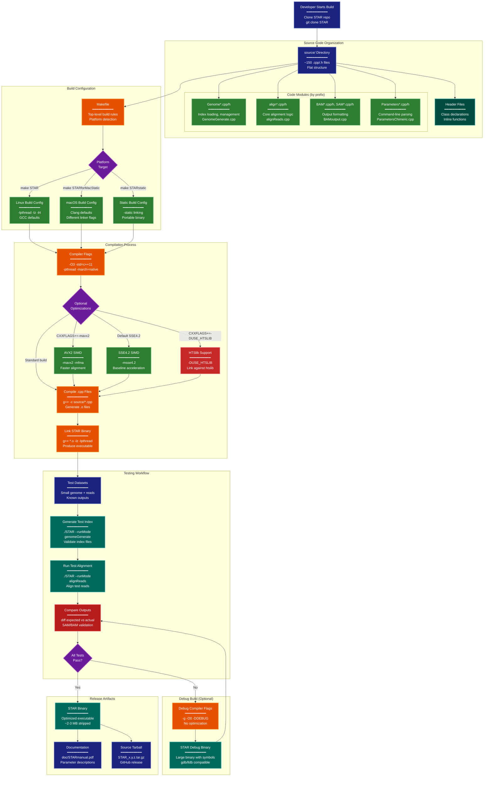

> **Example Note:** This is a whole-codebase example for demonstration purposes.
> In typical usage, arch lens diagrams are scoped to the subsystem being
> modified/added/removed by a plan — not the entire project. The result is
> normally much simpler and more focused than what you see here.

# Development Diagram: STAR Aligner

**Lens:** Development (Development)
**Question:** How is it built and tested?
**Date:** 2026-02-14
**Scope:** Full STAR aligner build and development workflow

## Overview

| Aspect | Description |
|--------|-------------|
| **Build System** | GNU Make with platform-specific targets |
| **Language** | C++11 with some C (zlib, htslib interfaces) |
| **Compiler Support** | GCC 4.8+, Clang 3.4+, Intel C++ |
| **Optimization** | -O3, -march=native, optional AVX2/SSE4.2 |
| **Test Strategy** | Regression tests with known datasets, output comparison |
| **Source Organization** | Flat source/ directory with module prefixes |

## Development Workflow



## Color Legend

- **CLI (Dark Blue)**: Source code entry points and test data
- **Handler (Orange)**: Build system and compiler configuration
- **Phase (Purple)**: Build decision points
- **New Component (Green)**: Source code modules and build variants
- **State Node (Teal)**: Code organization structures
- **Output (Dark Teal)**: Build outputs and test results
- **Detector (Red)**: Validation and comparison steps
- **Integration (Dark Red)**: External library integration
- **Terminal (Dark Blue)**: Final release artifacts

## Analysis

### Source Code Organization

STAR uses a **flat source directory** with module prefixes:

```
source/
├── STAR.cpp                    # Main entry point
├── Genome*.cpp/h               # Genome index (15 files)
├── Parameters*.cpp/h           # Command-line parsing (20 files)
├── alignReads*.cpp/h           # Alignment engine (30 files)
├── BAMoutput*.cpp/h            # BAM writing (10 files)
├── SAMoutput*.cpp/h            # SAM writing (5 files)
├── ReadAlign*.cpp/h            # Read alignment classes (25 files)
├── SuffixArray*.cpp/h          # Suffix array construction (8 files)
├── Transcript*.cpp/h           # Transcript handling (12 files)
└── [other modules]
```

**Why flat structure?**
- Simpler build system (all files at same level)
- Easier to search and navigate
- Avoids deep include paths
- Module prefixes provide logical grouping

### Build System Architecture

The Makefile uses **target-based builds** for different platforms:

```makefile
# Core variables
CXX := g++
CXXFLAGS := -O3 -std=c++11 -pthread -march=native
LDFLAGS := -lz -lrt

# Platform-specific targets
STAR: # Linux dynamic
    $(CXX) $(CXXFLAGS) source/*.cpp -o STAR $(LDFLAGS)

STARstatic: # Linux static
    $(CXX) $(CXXFLAGS) -static source/*.cpp -o STAR $(LDFLAGS)

STARforMacStatic: # macOS
    clang++ $(CXXFLAGS) -Xpreprocessor -fopenmp source/*.cpp -o STAR -lz
```

### Compiler Flags Breakdown

**Standard flags** (always used):
- `-O3`: Aggressive optimization (loop unrolling, inlining)
- `-std=c++11`: C++11 standard (range-based for, auto, lambdas)
- `-pthread`: POSIX threads support
- `-march=native`: Optimize for build machine CPU

**Optional flags** (user can add):
- `-mavx2 -mfma`: AVX2 SIMD for vectorized alignment
- `-DUSE_HTSLIB`: Enable htslib for BAM output
- `-g -O0`: Debug build with symbols
- `-static`: Static linking for portability

### Platform Differences

**Linux**:
- Uses GCC by default
- Links against `-lrt` (realtime library for shm_open)
- Requires `-lpthread` explicitly

**macOS**:
- Uses Clang (GCC compatibility mode)
- No `-lrt` needed (shm_open in libc)
- OpenMP requires `-Xpreprocessor -fopenmp` and separate libomp
- Static linking more complex (macOS discourages it)

**Windows**:
- Not officially supported
- Community builds via Cygwin or WSL
- Some success with MinGW-w64

### SIMD Optimizations

STAR has hand-optimized SIMD code for alignment:

1. **AVX2** (256-bit vectors):
   - Process 32 bases in parallel
   - Smith-Waterman scoring
   - Requires `-mavx2 -mfma`
   - ~30% faster on Haswell+ CPUs

2. **SSE4.2** (128-bit vectors):
   - Baseline SIMD support
   - Compatible with most x86-64 CPUs
   - Used if AVX2 not available

3. **Auto-detection**:
   - Runtime CPU feature detection
   - Falls back to scalar code if SIMD unavailable

### Dependency Management

STAR has minimal external dependencies:

**Required**:
- **zlib**: Included in most systems, statically linkable
- **pthreads**: Part of libc on POSIX systems
- **OpenMP**: libgomp (GCC) or libomp (Clang)

**Optional**:
- **htslib**: For professional BAM/CRAM output
  - User must install separately
  - Enable with `-DUSE_HTSLIB` and `-lhts`

**Build-time only**:
- Standard C++ library (libstdc++ or libc++)
- C standard library (glibc or musl)

### Testing Strategy

STAR uses **regression testing** rather than unit tests:

1. **Test Datasets**:
   - Small reference genome (e.g., 1 MB bacterial genome)
   - Synthetic FASTQ reads with known alignments
   - Stored in `test/` or downloaded on demand

2. **Test Commands**:
   ```bash
   # Generate genome index
   STAR --runMode genomeGenerate \
        --genomeDir test/genome \
        --genomeFastaFiles test/chr1.fa

   # Align reads
   STAR --genomeDir test/genome \
        --readFilesIn test/reads.fq \
        --outFileNamePrefix test/output_
   ```

3. **Validation**:
   - Compare SAM output to known-good reference
   - Check mapping statistics in `Log.final.out`
   - Verify splice junction discovery

4. **Continuous Integration**:
   - Not heavily used (as of recent versions)
   - Some projects use TravisCI for basic builds

### Debug Workflow

When developing new features:

1. **Build debug binary**:
   ```bash
   make clean
   make STAR CXXFLAGS="-g -O0 -DDEBUG"
   ```

2. **Run under debugger**:
   ```bash
   gdb --args ./STAR [params]
   (gdb) break alignReads.cpp:123
   (gdb) run
   ```

3. **Enable verbose logging**:
   - Many modules have `#ifdef DEBUG` blocks
   - Add custom logging to trace execution

4. **Test on small dataset**:
   - Use `--genomeLoad NoSharedMemory` (simpler)
   - Single thread (`--runThreadN 1`) avoids race conditions

### Release Process

1. **Version tagging**:
   - Tags in git: `2.7.11a`, `2.7.11b`
   - Version hardcoded in `source/STAR.cpp`

2. **Build matrix**:
   - Linux x86-64 (static binary)
   - macOS Intel (static binary)
   - Source tarball (for custom builds)

3. **Testing**:
   - Run on multiple test datasets
   - Check backward compatibility with old indices
   - Verify against SAMtools validation

4. **Distribution**:
   - GitHub Releases (binary + source)
   - Bioconda package (`conda install star`)
   - Docker images (`quay.io/biocontainers/star`)

### Development Tools

**Recommended**:
- Editor: Any (vim, emacs, VSCode)
- Debugger: GDB (Linux), LLDB (macOS)
- Profiler: `perf`, `gprof`, `Instruments`
- Memory checker: Valgrind, AddressSanitizer

**Code style**:
- No official style guide
- Mix of camelCase and snake_case
- Indentation: 4 spaces
- Comments: C++ style `//`

### Build Performance

**Clean build time** (on modern workstation):
- Full build: ~2-3 minutes (150 source files)
- Incremental rebuild: ~10-30 seconds (touch 1-5 files)
- Parallel make: `make -j8` cuts time in half

**Binary size**:
- Debug build: ~50 MB (with symbols)
- Release build: ~10 MB (unstripped)
- Stripped release: ~2-3 MB

### Common Build Issues

1. **OpenMP not found**:
   - Install `libomp-dev` (Linux) or `libomp` (macOS)
   - Or disable OpenMP (slower): remove `-fopenmp`

2. **zlib missing**:
   - Install `zlib1g-dev` (Debian) or `zlib-devel` (RedHat)

3. **C++11 not supported**:
   - Upgrade compiler: GCC 4.8+, Clang 3.4+

4. **Static linking fails on macOS**:
   - Don't use static build on macOS
   - Use `STARforMacStatic` target instead

## Implications for Modification

When modifying STAR's build and development workflow:

1. **Adding Source Files**: Update Makefile if needed (wildcard should catch new .cpp)
2. **New Dependencies**: Document in README, update Makefile LDFLAGS
3. **Platform Support**: Test on Linux and macOS, verify static builds
4. **Optimization Flags**: Benchmark before/after, test on different CPUs
5. **Testing**: Add regression tests for new features, not just unit tests
6. **Documentation**: Update `doc/STARmanual.pdf` with new parameters
