> **Example Note:** This is a whole-codebase example for demonstration purposes.
> In typical usage, arch lens diagrams are scoped to the subsystem being
> modified/added/removed by a plan — not the entire project. The result is
> normally much simpler and more focused than what you see here.

# C4 Container Diagram: UMI-tools

**Lens:** C4 Container (Anatomical)
**Question:** How is it built?
**Date:** 2026-02-14
**Scope:** Full UMI-tools static architecture

## Container Overview

| Container | Technology | Responsibility |
|-----------|-----------|----------------|
| CLI Entry Point | Python 3.x (umi_tools.py) | Main entry point that dispatches to command modules via dynamic import |
| Command Modules | Python modules (dedup, extract, group, count, count_tab, whitelist, prepare-for-rsem) | Implement CLI commands for UMI processing workflows |
| UMI Clustering Service | Python (network.py) | Provides UMIClusterer functor for error-aware UMI deduplication via network-based clustering methods |
| UMI Methods Library | Python (umi_methods.py) | FASTQ parsing, record handling, quality score processing |
| SAM/BAM Methods Library | Python (sam_methods.py) | BAM/SAM file parsing, read position calculation, bundle construction |
| Extract Methods Library | Python (extract_methods.py) | Barcode extraction from reads (regex and string-based patterns) |
| Whitelist Methods Library | Python (whitelist_methods.py) | Cell barcode extraction, validation, and correction |
| Utilities Library | Python (Utilities.py) | Argument parsing, logging, I/O redirection, benchmarking, option validation |
| Documentation Module | Python (Documentation.py) | Shared docstring components for CLI help text |
| C Extension Module | C (_dedup_umi.c) | Performance-critical edit distance calculation compiled as Python extension |
| PyPi Package | setuptools (setup.py) | Package metadata, dependency management, console_scripts entry point |
| External Dependencies | pysam, numpy, pandas, scipy, regex, matplotlib, pybktree, future, six | Third-party libraries for BAM I/O, numerical processing, plotting, and pattern matching |

## Architecture Diagram

```mermaid
graph TB
    classDef cli fill:#1a237e,stroke:#7986cb,stroke-width:2px,color:#fff;
    classDef command fill:#004d40,stroke:#4db6ac,stroke-width:2px,color:#fff;
    classDef service fill:#e65100,stroke:#ffb74d,stroke-width:2px,color:#fff;
    classDef utility fill:#6a1b9a,stroke:#ba68c8,stroke-width:2px,color:#fff;
    classDef extension fill:#00695c,stroke:#4db6ac,stroke-width:2px,color:#fff;
    classDef external fill:#c62828,stroke:#ef9a9a,stroke-width:2px,color:#fff;

    %% === APPLICATION LAYER === %%
    subgraph Application ["Application Layer"]
        CLI[CLI Entry Point<br/>━━━━━━━━━━<br/>umi_tools.py<br/>━━━━━━━━━━<br/>Dynamic module import<br/>Command dispatcher]:::cli
        PKG[Package Metadata<br/>━━━━━━━━━━<br/>setup.py<br/>━━━━━━━━━━<br/>setuptools config<br/>console_scripts entry]:::cli
        VER[Version Module<br/>━━━━━━━━━━<br/>version.py<br/>━━━━━━━━━━<br/>__version__ = 1.1.6]:::cli
    end

    %% === COMMAND LAYER === %%
    subgraph Commands ["Command Modules Layer"]
        DEDUP[dedup.py<br/>━━━━━━━━━━<br/>483 lines<br/>━━━━━━━━━━<br/>Error-aware deduplication<br/>using UMI + mapping coords<br/>ReadDeduplicator class<br/>Stats generation]:::command
        EXTRACT[extract.py<br/>━━━━━━━━━━<br/>535 lines<br/>━━━━━━━━━━<br/>Extract UMI from FASTQ<br/>Append to read name<br/>Regex/string patterns<br/>Cell barcode filtering]:::command
        GROUP[group.py<br/>━━━━━━━━━━<br/>342 lines<br/>━━━━━━━━━━<br/>Group reads by UMI<br/>Output tagged BAM<br/>or flatfile]:::command
        COUNT[count.py<br/>━━━━━━━━━━<br/>234 lines<br/>━━━━━━━━━━<br/>Count reads per gene<br/>Per-cell counting<br/>Wide format output]:::command
        COUNTTAB[count_tab.py<br/>━━━━━━━━━━<br/>170 lines<br/>━━━━━━━━━━<br/>Count from flatfile<br/>TSV input processing]:::command
        WHITELIST[whitelist.py<br/>━━━━━━━━━━<br/>531 lines<br/>━━━━━━━━━━<br/>Identify true cell barcodes<br/>Knee detection<br/>Error correction map]:::command
        RSEM[prepare-for-rsem.py<br/>━━━━━━━━━━<br/>248 lines<br/>━━━━━━━━━━<br/>Make output RSEM-compatible<br/>Ensure read1/read2 pairing<br/>Tag propagation]:::command
    end

    %% === SERVICE LAYER === %%
    subgraph Services ["Service Layer"]
        NETWORK[network.py<br/>━━━━━━━━━━<br/>544 lines<br/>━━━━━━━━━━<br/>UMIClusterer functor<br/>━━━━━━━━━━<br/>Clustering methods:<br/>• directional<br/>• adjacency<br/>• cluster<br/>• unique<br/>• percentile<br/>━━━━━━━━━━<br/>Adjacency list builder<br/>BFS component search<br/>Substring indexing]:::service
        SAMMETHOD[sam_methods.py<br/>━━━━━━━━━━<br/>727 lines<br/>━━━━━━━━━━<br/>BAM/SAM processing<br/>━━━━━━━━━━<br/>get_bundles generator<br/>Read position calc<br/>Splice-aware positioning<br/>Bundle construction<br/>TwoPassPairWriter]:::service
        UMIMETHOD[umi_methods.py<br/>━━━━━━━━━━<br/>239 lines<br/>━━━━━━━━━━<br/>FASTQ parsing<br/>━━━━━━━━━━<br/>fastqIterate generator<br/>Record class<br/>Quality score ranges<br/>Format detection]:::service
        EXTRACTMETHOD[extract_methods.py<br/>━━━━━━━━━━<br/>615 lines<br/>━━━━━━━━━━<br/>Barcode extraction<br/>━━━━━━━━━━<br/>Regex matching<br/>String pattern parsing<br/>Quality filtering<br/>UMI masking]:::service
        WHITELISTMETHOD[whitelist_methods.py<br/>━━━━━━━━━━<br/>718 lines<br/>━━━━━━━━━━<br/>Cell barcode handling<br/>━━━━━━━━━━<br/>Tag/read ID extraction<br/>Error correction<br/>Whitelist validation]:::service
    end

    %% === UTILITY LAYER === %%
    subgraph Utilities ["Utility Layer"]
        UTIL[Utilities.py<br/>━━━━━━━━━━<br/>1,495 lines<br/>━━━━━━━━━━<br/>OptionParser wrapper<br/>Start/Stop lifecycle<br/>Logging framework<br/>I/O redirection<br/>Benchmarking<br/>Option validation]:::utility
        DOC[Documentation.py<br/>━━━━━━━━━━<br/>469 lines<br/>━━━━━━━━━━<br/>Shared docstrings<br/>GENERIC_DOCSTRING_WE<br/>GENERIC_DOCSTRING_GDC<br/>Parameter documentation]:::utility
    end

    %% === EXTENSION LAYER === %%
    subgraph Extensions ["C Extension Layer"]
        CEXT[_dedup_umi.c<br/>━━━━━━━━━━<br/>251,407 bytes<br/>━━━━━━━━━━<br/>edit_distance function<br/>━━━━━━━━━━<br/>Performance-critical<br/>Levenshtein distance<br/>Compiled Python extension]:::extension
    end

    %% === EXTERNAL LAYER === %%
    subgraph External ["External Dependencies"]
        PYSAM[pysam >= 0.16.0.1<br/>━━━━━━━━━━<br/>BAM/SAM I/O<br/>AlignmentFile API<br/>Read/write operations]:::external
        NUMPY[numpy >= 1.7<br/>━━━━━━━━━━<br/>Numerical arrays<br/>Statistics calculations]:::external
        PANDAS[pandas >= 0.12.0<br/>━━━━━━━━━━<br/>DataFrames<br/>Stats aggregation<br/>Wide format output]:::external
        SCIPY[scipy<br/>━━━━━━━━━━<br/>Statistical functions<br/>Distance calculations]:::external
        REGEX[regex<br/>━━━━━━━━━━<br/>Advanced regex<br/>Fuzzy matching<br/>Named groups]:::external
        MATPLOTLIB[matplotlib<br/>━━━━━━━━━━<br/>Plotting library<br/>Knee plots<br/>Stats visualization]:::external
        PYBKTREE[pybktree<br/>━━━━━━━━━━<br/>BK-tree data structure<br/>Fast nearest neighbor<br/>for barcode correction]:::external
        FUTURE[future + six<br/>━━━━━━━━━━<br/>Python 2/3 compatibility<br/>iteritems, builtins]:::external
    end

    %% === CONNECTIONS === %%

    %% CLI to Commands
    CLI -->|importlib.import_module| DEDUP
    CLI -->|importlib.import_module| EXTRACT
    CLI -->|importlib.import_module| GROUP
    CLI -->|importlib.import_module| COUNT
    CLI -->|importlib.import_module| COUNTTAB
    CLI -->|importlib.import_module| WHITELIST
    CLI -->|importlib.import_module| RSEM
    CLI -->|reads| VER
    PKG -->|defines entry point| CLI
    PKG -->|reads| VER

    %% Commands to Services
    DEDUP -->|uses ReadDeduplicator| NETWORK
    DEDUP -->|uses get_bundles| SAMMETHOD
    DEDUP -->|uses| DOC
    GROUP -->|uses UMIClusterer| NETWORK
    GROUP -->|uses get_bundles| SAMMETHOD
    GROUP -->|uses| DOC
    COUNT -->|uses UMIClusterer| NETWORK
    COUNT -->|uses get_bundles| SAMMETHOD
    COUNT -->|uses| UMIMETHOD
    COUNT -->|uses| DOC
    COUNTTAB -->|uses UMIClusterer| NETWORK
    COUNTTAB -->|uses| UMIMETHOD
    COUNTTAB -->|uses| DOC
    EXTRACT -->|uses ExtractBarcodes| EXTRACTMETHOD
    EXTRACT -->|uses fastqIterate| UMIMETHOD
    EXTRACT -->|uses| WHITELISTMETHOD
    EXTRACT -->|uses| DOC
    WHITELIST -->|uses| WHITELISTMETHOD
    WHITELIST -->|uses fastqIterate| UMIMETHOD
    WHITELIST -->|uses| DOC
    RSEM -->|uses| SAMMETHOD

    %% Services to Utilities/Extensions
    NETWORK -->|uses edit_distance| CEXT
    NETWORK -->|uses logging| UTIL
    NETWORK -->|uses| WHITELISTMETHOD
    SAMMETHOD -->|uses| WHITELISTMETHOD
    EXTRACTMETHOD -->|uses RANGES| UMIMETHOD
    EXTRACTMETHOD -->|uses| UTIL
    WHITELISTMETHOD -->|uses| UTIL

    %% All Commands to Utilities
    DEDUP -->|OptionParser, Start, Stop| UTIL
    EXTRACT -->|OptionParser, Start, Stop| UTIL
    GROUP -->|OptionParser, Start, Stop| UTIL
    COUNT -->|OptionParser, Start, Stop| UTIL
    COUNTTAB -->|OptionParser, Start, Stop| UTIL
    WHITELIST -->|OptionParser, Start, Stop| UTIL
    RSEM -->|OptionParser, Start, Stop| UTIL

    %% Services to External Dependencies
    SAMMETHOD -->|AlignmentFile, pysam.sort| PYSAM
    NETWORK -->|np.random| NUMPY
    COUNT -->|DataFrame| PANDAS
    WHITELIST -->|pyplot| MATPLOTLIB
    EXTRACTMETHOD -->|regex.match| REGEX
    WHITELISTMETHOD -->|AlignmentSegment| PYSAM
    UMIMETHOD -->|AlignmentSegment| PYSAM

    %% Commands to External Dependencies
    DEDUP -->|AlignmentFile| PYSAM
    DEDUP -->|np.array| NUMPY
    DEDUP -->|DataFrame| PANDAS
    GROUP -->|AlignmentFile| PYSAM
    COUNT -->|AlignmentFile| PYSAM
    COUNT -->|np.array| NUMPY
    WHITELIST -->|BKTree| PYBKTREE
    WHITELIST -->|pyplot| MATPLOTLIB
    EXTRACT -->|regex.compile| REGEX

    class CLI,PKG,VER cli;
    class DEDUP,EXTRACT,GROUP,COUNT,COUNTTAB,WHITELIST,RSEM command;
    class NETWORK,SAMMETHOD,UMIMETHOD,EXTRACTMETHOD,WHITELISTMETHOD service;
    class UTIL,DOC utility;
    class CEXT extension;
    class PYSAM,NUMPY,PANDAS,SCIPY,REGEX,MATPLOTLIB,PYBKTREE,FUTURE external;
```



## Color Legend

| Color | Category | Description |
|-------|----------|-------------|
| Dark Blue | CLI | Application entry point and package metadata |
| Teal | Command | Command module implementations (main CLI commands) |
| Orange | Service | Core service libraries (clustering, BAM/FASTQ processing) |
| Purple | Utility | Cross-cutting utilities (logging, argument parsing, docs) |
| Dark Teal | Extension | C extension for performance-critical operations |
| Red | External | Third-party dependencies |

## Key Architectural Insights

| Aspect | Design Decision | Rationale |
|--------|----------------|-----------|
| **Command Dispatch** | Dynamic module import via `importlib.import_module` | Allows extensible CLI without tight coupling; new commands added by creating new module files |
| **Entry Point** | Single console_scripts entry (`umi_tools = umi_tools.umi_tools:main`) | Unified CLI interface; all commands invoked via `umi_tools <command>` pattern |
| **UMI Clustering** | Functor-based design (UMIClusterer) with pluggable methods | Separates adjacency list construction, component finding, and grouping; enables 5 different clustering algorithms with shared infrastructure |
| **BAM Processing** | Generator-based bundle construction (`get_bundles`) | Memory-efficient streaming; yields bundles when genomic window moves >1000bp; prevents loading entire BAM into memory |
| **FASTQ Processing** | Generator-based iteration (`fastqIterate`) | Memory-efficient streaming for large FASTQ files; lazy evaluation |
| **Edit Distance** | C extension for performance | Bottleneck operation (O(n²) pairwise comparisons); ~100x speedup via compiled C |
| **Substring Indexing** | Used for large UMI sets (>= 25 UMIs) | Reduces pairwise comparisons by indexing on substrings; only compare UMIs sharing substring |
| **Option Parsing** | Centralized in Utilities.OptionParser wrapper | Consistent argument handling; shared options (logging, I/O redirection); validates SAM-specific options |
| **Documentation** | Shared docstring constants | DRY principle; common parameter descriptions reused across commands |
| **Paired-End Output** | TwoPassPairWriter wrapper class | Ensures both mates output if read1 kept; buffers read1 IDs, scans for mates on contig change |
| **Stats Collection** | Optional in-memory DataFrames | Generated only when `--output-stats` specified; tracks edit distance distributions, null expectations |
| **Quality Encoding** | Auto-detection via RANGES dict | Supports phred33, phred64, solexa formats; inspects min/max quality scores |
| **Cell Barcode Extraction** | Dual strategy (read ID vs BAM tag) | Flexible input support; handles 10X format (tags) and custom formats (read name) |
| **Whitelist Generation** | Knee detection (distance-based or density-based) | Identifies true cell barcodes from background; generates error correction map |

## Communication Patterns

### Inter-Module Communication
| Source | Target | Interface | Data Flow |
|--------|--------|-----------|-----------|
| CLI Entry | Command Modules | `module.main(sys.argv)` | Command-line arguments (list of strings) |
| Commands | UMIClusterer | `clusterer(umis, counts, threshold)` | Dict of UMI→count → List of clustered UMIs |
| Commands | get_bundles | Generator iteration | BAM reads → Bundles (dict of UMI→reads) |
| Commands | Utilities | `U.Start(parser)` then `U.Stop()` | Options object, logging lifecycle |
| network.py | _dedup_umi.c | `edit_distance(umi1, umi2)` | Two UMI strings → Integer edit distance |
| sam_methods | pysam | `pysam.AlignmentFile(filename)` | Filename → Iterator of AlignmentSegment objects |
| extract | regex | `regex.match(pattern, sequence)` | Pattern + sequence → Match object with named groups |

### Data Format Contracts
| Interface | Input Format | Output Format | Example |
|-----------|-------------|---------------|---------|
| fastqIterate | FASTQ file handle | Generator of Record objects | Record(identifier, seq, quals, format) |
| get_bundles | pysam.AlignmentFile iterator | Generator of bundle dicts | `{position_key: {umi: [reads]}}` |
| UMIClusterer | `umis` dict (UMI→count), threshold int | List of UMI lists (clusters) | `[['AGTC', 'AGTT'], ['CGTA']]` |
| ExtractBarcodes | read, regex.match, flags | (identifier, seq, quals, UMI, cell) | Updated Record with UMI in read name |
| get_read_position | AlignmentSegment | (position, is_spliced, strand, tlen, read_length) | Tuple for bundle key construction |

### Key Algorithmic Flows

#### Deduplication Flow
```
BAM Input
  → get_bundles generator (groups by position/gene)
    → Bundle dict {UMI: [reads]}
      → UMIClusterer (builds adj list, finds components, groups)
        → edit_distance C extension (pairwise UMI comparison)
      → Clustered UMIs [[umi1, umi2], [umi3], ...]
    → Select representative read (by MAPQ, multimapping)
  → Write deduplicated BAM
  → Optional: Generate stats (edit distance, null distribution)
```

#### Extraction Flow
```
FASTQ Input
  → fastqIterate generator
    → Regex/string pattern matching
      → ExtractBarcodes (extracts UMI, cell barcode)
        → Quality filtering (mask/threshold)
        → Whitelist validation (optional)
    → Append barcodes to read identifier
  → Write modified FASTQ
```

#### Whitelist Generation Flow
```
FASTQ Input
  → fastqIterate generator
    → Extract cell barcodes
    → Count occurrences
  → Sort by count
  → Knee detection (distance or density method)
    → Find threshold separating true cells from background
  → Build error correction map
    → BKTree nearest neighbor search (edit distance ≤ 1)
  → Output whitelist TSV (barcode, corrections, counts)
  → Optional: Plot knee curve (matplotlib)
```

## Technology Stack Summary

| Layer | Technologies | Purpose |
|-------|-------------|---------|
| **Language** | Python 3.x | Core implementation language |
| **Performance** | C (compiled extension) | Edit distance calculation |
| **I/O** | pysam (HTSlib wrapper) | BAM/SAM/FASTQ parsing and writing |
| **Numerical** | numpy, scipy | Array operations, statistics |
| **Data Analysis** | pandas | DataFrame operations, stats aggregation |
| **Pattern Matching** | regex (advanced regex module) | Barcode extraction with fuzzy matching |
| **Visualization** | matplotlib | Knee plots, stats visualization |
| **Data Structures** | pybktree | BK-tree for fast edit-distance search |
| **Compatibility** | future, six | Python 2/3 compatibility layer |
| **CLI Framework** | argparse (via Utilities.OptionParser) | Command-line interface |
| **Build System** | setuptools | Package distribution, extension compilation |

## Deployment Model

| Aspect | Implementation |
|--------|---------------|
| **Installation** | PyPI package (`pip install umi-tools`) |
| **Entry Point** | Console script registered in setuptools |
| **Extension Compilation** | Automatic via setup.py during `pip install` |
| **Dependencies** | Declared in setup.py and requirements.txt |
| **Command Invocation** | `umi_tools <command> [options]` |
| **Configuration** | Command-line arguments only (no config files) |
| **Output** | Stdout (BAM/FASTQ/TSV) + optional stats files + log file |
| **Logging** | Configurable via `--log` (file) or `--log2stderr` |
| **Documentation** | Embedded in module docstrings + online ReadTheDocs |
