> **Example Note:** This is a whole-codebase example for demonstration purposes.
> In typical usage, arch lens diagrams are scoped to the subsystem being
> modified/added/removed by a plan — not the entire project. The result is
> normally much simpler and more focused than what you see here.

# Concurrency Diagram: UMI-tools

**Lens:** Concurrency (Physiological)
**Question:** How does parallelism work?
**Date:** 2026-02-14
**Scope:** Full UMI-tools concurrency model

---

## Concurrency Model

| Aspect | Implementation |
|--------|----------------|
| **Primary Model** | Sequential single-threaded processing |
| **Cooperative Concurrency** | Python generators (`yield`) for streaming I/O |
| **Subprocess Parallelism** | `pysam.sort()` delegates to samtools (external process) |
| **Pysam Threading** | No explicit multi-threading enabled in pysam operations |
| **Asyncio/Multiprocessing** | Not used |
| **Architectural Constraint** | Position-sorted BAM iteration requires sequential processing |

---

## Concurrency Flow Diagram

```mermaid
flowchart TB
    Start([CLI Entry Point<br/>dedup/count/group/extract]):::terminal

    Start --> OpenBAM[Open BAM/SAM File<br/>pysam.Samfile/AlignmentFile]:::stateNode

    OpenBAM --> FetchReads[Sequential Read Iteration<br/>infile.fetch&#40;&#41;]:::stateNode

    FetchReads --> GenBundle[Generator: get_bundles&#40;&#41;<br/>Yields position-grouped bundles]:::phase

    GenBundle --> WindowBuffer{Sliding Window<br/>Buffer<br/>1000bp or per-gene}:::detector

    WindowBuffer -->|Read in window| Accumulate[Accumulate Reads<br/>in reads_dict by:<br/>pos/UMI/strand/splice]:::handler

    WindowBuffer -->|Window complete| YieldBundle[yield bundle<br/>&#40;cooperative coroutine&#41;]:::phase

    YieldBundle --> ProcessBundle[Process Bundle<br/>network.ReadDeduplicator/<br/>UMIClusterer]:::handler

    ProcessBundle --> BuildGraph[Build UMI Network<br/>Edit distance graph<br/>&#40;sequential, in-memory&#41;]:::handler

    BuildGraph --> ClusterUMI[Cluster Connected<br/>Components<br/>Breadth-first search]:::handler

    ClusterUMI --> SelectRep[Select Representative<br/>Read per cluster<br/>&#40;by MAPQ&#41;]:::handler

    SelectRep --> WriteMode{Write Mode}:::detector

    WriteMode -->|Single-end| DirectWrite[outfile.write&#40;read&#41;<br/>Sequential]:::output

    WriteMode -->|Paired-end| TwoPassWriter[TwoPassPairWriter<br/>&#40;deferred mate writing&#41;]:::handler

    TwoPassWriter --> BufferRead1[Buffer read1 keys<br/>in memory set]:::stateNode

    BufferRead1 --> ChromChange{Chromosome<br/>Changed?}:::detector

    ChromChange -->|Yes| ReFetch[Re-fetch current chrom<br/>pysam.AlignmentFile.fetch&#40;&#41;<br/>&#40;new file handle&#41;]:::handler

    ReFetch --> MatchMates[Scan for matching<br/>read2 mates<br/>Sequential iteration]:::handler

    MatchMates --> WritePairs[Write matched pairs<br/>Remove from buffer]:::output

    ChromChange -->|No| DirectWrite
    WritePairs --> DirectWrite

    DirectWrite --> MoreBundles{More<br/>Bundles?}:::detector

    MoreBundles -->|Yes| GenBundle

    MoreBundles -->|No| CloseWriter[TwoPassWriter.close&#40;&#41;<br/>Final mate search]:::handler

    CloseWriter --> FinalFetch[fetch&#40;until_eof=True&#41;<br/>Find remaining mates]:::handler

    FinalFetch --> TempFile{Sort<br/>Required?}:::detector

    TempFile -->|Yes| SubprocessSort[pysam.sort&#40;&#41;<br/>→ External samtools process<br/>&#40;subprocess, may use threads&#41;]:::newComponent

    SubprocessSort --> FinalOutput[Sorted Output File]:::output

    TempFile -->|No| UnsortedOutput[Unsorted Output File]:::output

    FinalOutput --> End([Done]):::terminal
    UnsortedOutput --> End

    classDef terminal fill:#1a237e,stroke:#7986cb,stroke-width:2px,color:#fff;
    classDef stateNode fill:#004d40,stroke:#4db6ac,stroke-width:2px,color:#fff;
    classDef handler fill:#e65100,stroke:#ffb74d,stroke-width:2px,color:#fff;
    classDef phase fill:#6a1b9a,stroke:#ba68c8,stroke-width:2px,color:#fff;
    classDef detector fill:#b71c1c,stroke:#ef5350,stroke-width:2px,color:#fff;
    classDef output fill:#00695c,stroke:#4db6ac,stroke-width:2px,color:#fff;
    classDef newComponent fill:#2e7d32,stroke:#81c784,stroke-width:2px,color:#fff;
```



---

## Color Legend

| Color | Meaning | Examples |
|-------|---------|----------|
| Dark Blue | Terminal/Entry Points | CLI commands, process end |
| Teal | State Storage | File handles, in-memory buffers |
| Orange | Processing/Handler | UMI clustering, mate matching |
| Purple | Generator/Coroutine | `get_bundles()`, `yield` points |
| Red | Decision/Branching | Mode checks, chromosome changes |
| Green (dark) | Output Operations | File writes |
| Green (bright) | External Subprocess | `pysam.sort()` → samtools |

---

## Concurrency Boundaries

### 1. Main Thread (Sequential Processing)

**Rationale:** UMI-tools processes **position-sorted BAM files** where read order is critical for correctness. The sliding window deduplication algorithm requires:

- **Ordered access**: Reads must be processed in genomic position order
- **Window buffering**: Bundle reads within 1000bp windows (or per-gene)
- **Sequential yielding**: Earlier positions must complete before later positions

**Components:**
- BAM file iteration via `pysam.Samfile.fetch()`
- `get_bundles()` generator that yields position-grouped read bundles
- UMI network clustering (edit distance graph construction)
- Representative read selection

### 2. Generator Coroutines (Cooperative Concurrency)

**Pattern:** Python generators with `yield` enable streaming I/O without loading entire dataset into memory.

**Key Generators:**

| Generator | Location | Purpose |
|-----------|----------|---------|
| `get_bundles()` | `sam_methods.py:316` | Yields bundles of reads at same position/UMI |
| `get_gene_count_tab()` | `sam_methods.py:523` | Yields per-gene UMI counts |
| `metafetcher()` | `sam_methods.py:663` | Yields reads ordered by metacontigs |
| `fastqIterate()` | `umi_methods.py:115` | Yields FASTQ records (extract command) |

**Benefits:**
- Constant memory usage regardless of BAM size
- Natural backpressure mechanism
- Composable pipeline stages

### 3. TwoPassPairWriter (Deferred Mate Resolution)

**Challenge:** When writing deduplicated paired-end reads, read1 and read2 may be far apart in the sorted BAM.

**Solution:** Two-pass buffering strategy (sequential but multi-scan):

1. **First pass (primary iteration):**
   - Write read1 immediately
   - Store read1 identity in `read1s` set (query name + mate position)

2. **Per-chromosome re-scan:**
   - When chromosome changes, re-open BAM with new `pysam.AlignmentFile` handle
   - Call `fetch(reference=current_chrom)` to iterate chromosome again
   - Match read2 positions against buffered read1 keys
   - Write matched mates and remove from buffer

3. **Final exhaustive search:**
   - On `close()`, scan entire BAM with `fetch(until_eof=True)`
   - Find any remaining mates not yet written

**File Handles:** Uses two independent `pysam.AlignmentFile` handles:
- `self.infile`: Primary forward iteration
- `self.mate_file`: Secondary seeking for mates

**Thread Safety:** Both handles iterate sequentially; no concurrent access.

### 4. External Subprocess (pysam.sort)

**Only Parallelism in Pipeline:**

```python
# dedup.py:378, group.py:314
pysam.sort("-o", sorted_out_name, "-O", sort_format, "--no-PG", out_name)
```

**What happens:**
- `pysam.sort()` is a Python wrapper around **samtools sort**
- Spawns external subprocess
- Samtools sort **may use threading** (via `-@` flag, not set here)
- Default single-threaded unless explicitly configured
- Parent process blocks until sort completes

**Why external?** Sorting entire BAM is memory-intensive; delegating to optimized C implementation (samtools) is more efficient than Python-based sorting.

---

## Thread Safety Guarantees

### Reads Dictionary State

The `get_bundles` class maintains stateful dictionaries:

```python
self.reads_dict = collections.defaultdict(
    lambda: collections.defaultdict(
        lambda: collections.defaultdict(dict)))
```

**Access pattern:** Strictly sequential single-threaded mutation. No locks needed.

### Pysam File Handles

**pysam internal threading:** pysam can use HTSlib threading for BAM decompression, but UMI-tools does not enable it. All `AlignmentFile` objects opened without thread count specification:

```python
infile = pysam.Samfile(in_name, in_mode)  # No threads= parameter
```

**Multiple iterators:** `TwoPassPairWriter` uses `multiple_iterators=False`:

```python
self.mate_file.fetch(reference=self.chrom, multiple_iterators=False)
```

This explicitly disables pysam's iterator caching to avoid memory overhead.

### Generator State Isolation

Each generator maintains local state (loop variables, buffers). Since execution is single-threaded and cooperative (explicit `yield` points), no race conditions possible.

---

## Why Sequential Processing is Required

### Architectural Dependencies

1. **Position-sorted input assumption:**
   - UMI-tools expects `samtools sort` pre-processing
   - Sliding window algorithm requires sequential position access
   - Out-of-order reads would produce incorrect bundles

2. **Window boundary detection:**
   ```python
   if (self.start > (self.last_pos+1000) or
       self.current_chr != self.last_chr):
       do_output = True
   ```
   Depends on monotonically increasing `self.start` positions.

3. **Memory efficiency:**
   - Only buffer reads within current window (~1000bp)
   - Discard processed positions to free memory
   - Parallelism would require buffering multiple windows simultaneously

### Theoretical Parallelization Opportunities

**Not currently exploited but possible:**

1. **Chromosome-level parallelism:**
   - Process each chromosome independently
   - Requires pre-splitting BAM by chromosome
   - Merge outputs at end
   - Not implemented (would complicate paired-end handling)

2. **UMI clustering parallelism:**
   - Each bundle's UMI network graph is independent
   - Could parallelize `processor(bundle)` calls
   - Overhead likely exceeds benefit (clustering is fast compared to I/O)

3. **Pysam decompression threading:**
   - Could enable with `threads=N` parameter
   - Would speed up BAM reading
   - Low priority given I/O is not primary bottleneck

---

## I/O Patterns

### Read Operations (Sequential)

| Command | Input | Read Pattern | Buffer Size |
|---------|-------|--------------|-------------|
| **dedup** | Position-sorted BAM | `fetch()` full iteration | 1000bp sliding window |
| **count** | Gene-tagged BAM | `fetch()` full iteration | Per-gene accumulation |
| **group** | Position-sorted BAM | `fetch()` full iteration | 1000bp sliding window |
| **extract** | FASTQ (stdin/file) | Line-by-line iteration | 4 lines (1 read) |
| **whitelist** | FASTQ | Line-by-line iteration | Configurable read count |

### Write Operations (Sequential)

| Mode | Write Pattern | Complexity |
|------|---------------|------------|
| Single-end | Direct `outfile.write(read)` | O(n) single pass |
| Paired-end | `TwoPassPairWriter` deferred writes | O(n log n) due to re-scanning |
| Sorted output | Temp file → `pysam.sort()` | O(n log n) external sort |

---

## Performance Characteristics

### Time Complexity

- **BAM iteration:** O(n) where n = read count
- **UMI clustering:** O(k²) per bundle where k = UMIs per position (typically small)
- **Mate finding:** O(n) additional scans per chromosome (paired-end only)
- **Final sort:** O(n log n) if enabled

### Memory Usage

- **Peak memory:** ~1000bp window of reads + UMI graph for current bundle
- **Paired-end overhead:** Set of read1 keys (modest, only name + position tuples)
- **Scaling:** Constant w.r.t. BAM size (streaming architecture)

### Bottleneck Analysis

1. **I/O bound:** BAM decompression dominates (no parallelism)
2. **CPU (minor):** UMI edit distance calculations (negligible for typical UMI lengths)
3. **Re-scanning overhead:** Paired-end mate finding requires chromosome re-reads

**Why not parallel?** The I/O bottleneck is serial (compressed BAM reading), so adding CPU parallelism for clustering would not improve wall-clock time.

---

## Summary

UMI-tools is **architecturally sequential** by design:

- ✅ Single-threaded main processing loop
- ✅ Generator-based cooperative concurrency for memory efficiency
- ✅ External subprocess for sorting (samtools handles parallelism)
- ❌ No asyncio, threading, or multiprocessing
- ❌ No pysam multi-threading enabled

**This is the correct architectural choice** because:
1. Position-sorted iteration is a hard requirement
2. UMI clustering per bundle is fast (not a bottleneck)
3. I/O (BAM decompression) is the limiting factor
4. Streaming generators provide memory efficiency without concurrency complexity

The only concurrency is **external** (samtools sort subprocess) and **cooperative** (generator yields).
