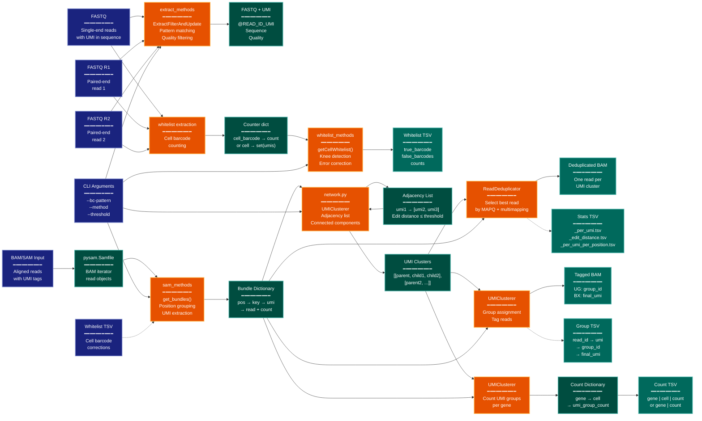

> **Example Note:** This is a whole-codebase example for demonstration purposes.
> In typical usage, arch lens diagrams are scoped to the subsystem being
> modified/added/removed by a plan — not the entire project. The result is
> normally much simpler and more focused than what you see here.

# Data Lineage Diagram: UMI-tools

**Lens:** Data Lineage (Data-Centric)
**Question:** Where is the data?
**Date:** 2026-02-14
**Scope:** Full UMI-tools data flow across extract, dedup, group, count, and whitelist commands

## Data Flow Overview

| Stage | Format | Key Transformation |
|-------|--------|-------------------|
| Input | FASTQ (SE/PE), BAM/SAM | Raw sequencing reads with UMIs in sequence or tags |
| Extraction | FASTQ + UMI in read name | UMI/cell barcode extracted to read identifier |
| Alignment | BAM/SAM with UMI tags | Reads aligned with UMI metadata preserved |
| Bundling | Python dict (position → UMI → reads) | Reads grouped by genomic position and UMI |
| Network Construction | Adjacency list (UMI graph) | UMI similarity network for error correction |
| Deduplication | BAM + stats TSV | Duplicate reads removed, representative selected |
| Grouping | BAM + group TSV | Reads tagged with UMI group IDs |
| Counting | TSV (gene × count) | Per-gene UMI counts aggregated |
| Whitelist | TSV (cell barcode → corrections) | Cell barcode whitelist with error mapping |

## Lineage Diagram

**Color Legend:**
| Color | Category | Description |
|-------|----------|-------------|
| Dark Blue | Input | Data origins (user files, CLI arguments) |
| Orange | Transform | Processing engines (pattern matching, clustering, deduplication) |
| Teal | Storage | Intermediate data structures (dictionaries, graphs, counters) |
| Dark Teal | Artifacts | Output files (BAM, TSV, stats) |

## Data Transformation Summary

| Stage | Input Format | Output Format | Key Conversion |
|-------|-------------|---------------|----------------|
| **extract** | FASTQ (UMI in sequence) | FASTQ (UMI in read ID) | Regex/string pattern → `@READ_ID_CELL_UMI` format |
| **whitelist** | FASTQ (raw cell barcodes) | TSV (barcode → corrections) | Counter → knee detection → error correction map |
| **BAM → Bundles** | BAM (aligned reads) | Python dict (pos → umi → reads) | Pysam objects → grouped by (position, strand, splice, tlen, cell) |
| **Bundle → Network** | Bundle dict (umis + counts) | Adjacency list (UMI graph) | Edit distance calculation → graph edges (threshold filtering) |
| **Network → Clusters** | Adjacency list | Cluster lists | Breadth-first search → connected components → sorted by count |
| **dedup** | Clusters + bundles | BAM (deduplicated) | Select representative read (highest MAPQ, lowest multimap) |
| **group** | Clusters + bundles | BAM (tagged) + TSV | Assign group_id, tag reads with UG/BX tags |
| **count** | Clusters + bundles | TSV (gene × count) | Aggregate UMI groups per gene (optionally per cell) |

## Storage Destinations

| Entity | Primary Storage | Secondary | Access Pattern |
|--------|-----------------|-----------|----------------|
| **UMI Sequence** | Read name (extract) → BAM tag (alignment) | Never stored separately | Extracted via `barcode_getter()` from RX/cell tag or read ID |
| **Cell Barcode** | Read name (extract) → BAM tag (CB) | Whitelist TSV (canonical list) | Filtered/corrected during bundling if whitelist provided |
| **Read Bundles** | In-memory dict (ephemeral) | Never persisted | Built incrementally, yielded by position, then deleted |
| **UMI Network** | Adjacency list (ephemeral) | Never persisted | Constructed per bundle, used for clustering, discarded |
| **UMI Clusters** | List of lists (ephemeral) | Group TSV (read → group mapping) | Computed per bundle, used for dedup/group/count |
| **Deduplicated Reads** | Output BAM (primary) | Stats TSV (metadata only) | Written once per representative read, sorted if requested |
| **UMI Groups** | Output BAM tags (UG/BX) | Group TSV (full mapping) | Tagged on every read in BAM, flat file for analysis |
| **Gene Counts** | Output TSV (final aggregation) | Temp file (intermediate) | Sorted and optionally pivoted to wide format |

## Critical Design Principles

> **Source of Truth**: The BAM file is the source of truth for aligned reads with UMI metadata. All commands (dedup/group/count) read from BAM using pysam, extract UMI/cell barcodes from tags or read names via configurable `barcode_getter()` functions, and write results back to BAM (with tags) or TSV (with stats).

> **Ephemeral Bundling**: Read bundles are never persisted to disk. The `get_bundles()` iterator constructs in-memory dictionaries keyed by (position, strand, splice, tlen, cell), yields them when the genomic window advances ≥1000bp or chromosome changes, then deletes them. This streaming approach keeps memory bounded for large BAMs.

> **Network-Based Error Correction**: UMI deduplication is not naive count-based. Instead, UMIs at each position are treated as nodes in a graph with edges where edit distance ≤ threshold. Connected components identify error-related UMIs. The clustering method (directional/adjacency/cluster) determines how to select representative UMIs within each component.

> **Read Selection Hierarchy**: When collapsing duplicate reads, the representative is chosen by: (1) lowest number of mapping locations (NH/X0/XT tag), (2) highest MAPQ, (3) random selection with uniform probability among ties. This ensures biological signal (unique mappers) is prioritized over noise (multimappers).

> **Cell Barcode Lifecycle**: Cell barcodes flow through three stages: (1) extraction from FASTQ to read name, (2) whitelisting to identify true cells and error corrections, (3) filtering during BAM processing where non-whitelisted barcodes are discarded or corrected before bundling. The whitelist TSV maps canonical barcodes to their error variants.

> **Position Abstraction**: For per-gene counting (single-cell RNA-seq), genomic position is abstracted to the gene name. Reads are bundled by (gene, cell) instead of (chr, pos, strand). This reflects the biological reality that for amplified-after-fragmentation protocols, precise mapping coordinates are uninformative—only the gene and UMI matter.
