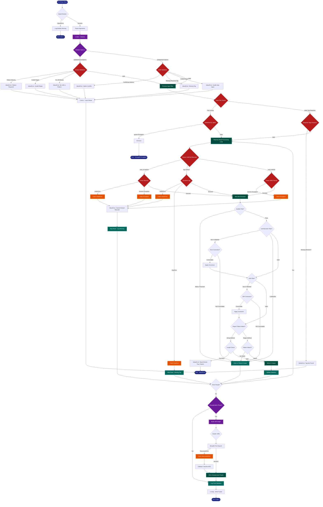

> **Example Note:** This is a whole-codebase example for demonstration purposes.
> In typical usage, arch lens diagrams are scoped to the subsystem being
> modified/added/removed by a plan — not the entire project. The result is
> normally much simpler and more focused than what you see here.

# Error/Resilience Diagram: UMI-tools

**Lens:** Error/Resilience (Diagnostic)
**Question:** How are failures handled?
**Date:** 2026-02-14
**Scope:** Full UMI-tools error handling architecture

---

## Exception Hierarchy

UMI-tools uses Python's built-in exception classes exclusively. No custom exception classes are defined:

```
Exception (Python built-in)
├── ValueError          # Most common - validation failures, option conflicts
├── NotImplementedError # Unsupported operations (e.g., gzip modes)
├── KeyError            # Missing BAM tags, UMI/cell barcode extraction failures
├── IndexError          # Array/string index errors during barcode extraction
├── RecursionError      # Network graph recursion depth exceeded
├── ImportError         # Optional dependency failures (handled gracefully)
└── regex.error         # Invalid regex patterns in barcode specifications
```

**Design Pattern:** Fail-fast validation with immediate termination. No retry mechanisms or graceful degradation.

---

## Resilience Diagram



---

## Color Legend

| Color | Node Type | Description |
|-------|-----------|-------------|
| **Dark Blue** | Terminal | Entry/exit points (start, exit codes 0/1) |
| **Teal** | State | Major processing states (read loop, write output) |
| **Deep Orange** | Handler | Exception catch blocks and error handling |
| **Purple** | Phase | Major processing phases (initialization, validation, dedup) |
| **Red** | Detector | Error detection points (validation gates, pattern matching) |
| **Green** | Output | Output operations (logging, filtered writes, stats) |

---

## Recovery Mechanisms

UMI-tools employs **limited** resilience strategies:

| Mechanism | Location | Trigger | Action | Outcome |
|-----------|----------|---------|--------|---------|
| **Graceful Import Fallback** | `__init__.py`, `extract.py`, `whitelist.py` | `ImportError` on optional deps (network, izip) | Silent pass, continue without feature | Partial functionality |
| **Recursion Fallback** | `network.py:breadth_first_search_recursive()` | `RecursionError` in graph clustering | Switch from recursive to iterative BFS | Full recovery |
| **Skip-and-Log** | `sam_methods.py:get_bundles()` | `KeyError` on missing UMI/cell tag | Log warning once, skip read, increment counter | Lossy recovery |
| **Error Correction** | `extract_methods.py`, `whitelist_methods.py` | Barcode not in whitelist | Map to nearest valid barcode (edit distance) | Corrective recovery |
| **Quality Masking** | `extract_methods.py:mask_umi()` | UMI base below quality threshold | Replace base with 'N' instead of discarding | Partial data retention |

**No Retries:** File I/O, network operations, or processing failures are **never** retried.

---

## Validation Gates

UMI-tools validates at **three distinct phases**:

### 1. Argument Validation (Pre-execution)

| Gate | File | Function | Check |
|------|------|----------|-------|
| **Extract Options** | `Utilities.py` | `validateExtractOptions()` | Pattern presence, regex compilation, paired-end consistency, UMI/cell base presence |
| **SAM Options** | `Utilities.py` | `validateSamOptions()` | Per-gene/contig/cell conflicts, tag requirements, paired-end flags, regex validity |
| **Pattern Compilation** | `Utilities.py` | `validateExtractOptions()` | Regex syntax validation via `regex.compile()` |

**Failure Mode:** Immediate `ValueError` → exit code != 0

### 2. Input File Validation (Runtime Init)

| Gate | File | Function | Check |
|------|------|----------|-------|
| **BAM Tag Detection** | `dedup.py` | `detect_bam_features()` | Scan first 1000 reads for NH/X0/XT tags |
| **File Format** | Multiple | pysam library | BAM/SAM header parsing, index availability |
| **stdin Rejection** | `dedup.py`, `group.py` | main() | Reject stdin input (not supported) |

**Failure Mode:** `ValueError` with detailed message about available tags

### 3. Read-Level Validation (Processing Loop)

| Gate | File | Function | Check |
|------|------|----------|-------|
| **Read Length** | `extract_methods.py` | `ExtractFilterAndUpdate.__call__()` | Read length >= pattern length (string method only) |
| **Barcode Extraction** | `sam_methods.py` | `get_barcode_*()` functions | Tag presence, index bounds, format validity |
| **Quality Threshold** | `extract_methods.py` | `umi_below_threshold()` | All UMI bases >= quality threshold |
| **Whitelist Match** | `extract_methods.py` | `filterCellBarcode()`, `filterUMIBarcode()` | Exact or correctable match to whitelist |
| **Regex Match** | `extract_methods.py` | `_getBarcodesRegex()` | Pattern match on read sequence |
| **Gene Tag Presence** | `sam_methods.py` | `get_bundles.__call__()` | Gene/assigned tag present when `--per-gene` |

**Failure Mode:** Skip read, increment failure counter, optionally write to filtered output

---

## Error Propagation Paths

### Fast-Fail Path (Validation Errors)
```
CLI Arguments → Validation Function → ValueError → U.error() → logging.error() → raise ValueError → sys.exit(1)
```

**Key Point:** `U.error()` in `Utilities.py` **always** raises `ValueError` after logging. Cannot be caught by user code.

### Skip-and-Continue Path (Processing Errors)
```
Read Processing → Exception (KeyError/IndexError) → Catch Block → Log Warning (once) → Increment Counter → Continue to Next Read
```

**Key Point:** First occurrence triggers warning log; subsequent occurrences are silent (counter only).

### Silent-Degradation Path (Optional Features)
```
Import Statement → ImportError → except ImportError: pass → Feature Unavailable → Continue Execution
```

**Examples:**
- `umi_tools/__init__.py`: If `network` module fails, clustering unavailable
- `extract.py`: If `izip` unavailable (Python 3), use `zip` instead

### Recoverable-Error Path (Graph Recursion)
```
Recursive BFS → RecursionError → Catch → Log Info Message → Iterative BFS → Normal Continuation
```

**Key Point:** Only known recoverable error in the codebase. All others terminate or skip.

---

## Terminal States

| Exit Code | Condition | Trigger |
|-----------|-----------|---------|
| **0** | Success | All validation passed, all processable reads handled, `U.Stop()` called |
| **1** | Validation Error | Invalid options, missing required arguments, regex syntax error |
| **1** | Missing Input | Required options not provided, usage printed |
| **1** | Module Import Error | Cannot load required UMI-tools command module |
| **Uncaught Exception** | I/O Error | File permission error, disk full, corrupted BAM file |
| **Uncaught Exception** | Unexpected Runtime Error | pysam errors, numpy errors, unexpected data format |

**Error Logging:** All errors written to:
1. Log file (if `--log` specified)
2. stderr (if `--log2stderr` specified)
3. stdout (default, prefixed with `#`)

---

## Diagnostic Features

UMI-tools provides extensive diagnostic output:

| Feature | Flag | Output | Use Case |
|---------|------|--------|----------|
| **Event Counters** | (automatic) | Read-level statistics by category | Debugging filtering/skipping |
| **Stats Output** | `--output-stats` | Edit distance distributions, UMI frequencies | Deduplication QC |
| **Verbose Logging** | `--verbose=N` | Increased log detail (1-10 scale) | Deep debugging |
| **Filtered Reads** | `--filtered-out`, `--filtered-out2` | Rejected reads in separate files | Manual inspection |
| **UMI Correction Log** | `--umi-correct-log` | Error correction events | Whitelist accuracy |
| **Benchmark Footer** | (automatic) | Timing, system info, resource usage | Performance analysis |

**Counters Tracked:**
- Input reads, output reads
- Regex matches/mismatches by read
- Quality filtered, cell barcode filtered
- UMI corrected, not correctable
- Unmapped, chimeric, unpaired
- Missing tags, skipped genes

All counters logged via `U.info()` at completion in `most_common()` order.
