> **Example Note:** This is a whole-codebase example for demonstration purposes.
> In typical usage, arch lens diagrams are scoped to the subsystem being
> modified/added/removed by a plan — not the entire project. The result is
> normally much simpler and more focused than what you see here.

# Module Dependency Diagram: UMI-tools

**Lens:** Module Dependency (Structural)
**Question:** How are modules coupled?
**Date:** 2026-02-14
**Scope:** All umi_tools/ Python modules

## Layer Structure

| Layer | Modules | May Import From |
|-------|---------|-----------------|
| CLI Entry | `umi_tools.py` | All other layers |
| Commands | `extract.py`, `dedup.py`, `group.py`, `count.py`, `count_tab.py`, `whitelist.py`, `prepare-for-rsem.py` | Service, Utilities, External |
| Services | `network.py`, `umi_methods.py`, `sam_methods.py`, `extract_methods.py`, `whitelist_methods.py` | Utilities, External |
| Utilities | `Utilities.py`, `Documentation.py`, `version.py` | External only |
| Package Init | `__init__.py` | version.py, network.py |

## Dependency Diagram

```mermaid
graph TB
    %% CLI Entry Point
    umi_tools["umi_tools.py<br/>━━━━━━━━━━<br/>CLI Router"]

    %% Command Modules
    extract["extract.py<br/>━━━━━━━━━━<br/>Extract UMIs"]
    dedup["dedup.py<br/>━━━━━━━━━━<br/>Deduplicate"]
    group["group.py<br/>━━━━━━━━━━<br/>Group Reads"]
    count["count.py<br/>━━━━━━━━━━<br/>Count Reads"]
    count_tab["count_tab.py<br/>━━━━━━━━━━<br/>Count from TSV"]
    whitelist["whitelist.py<br/>━━━━━━━━━━<br/>ID Cell Barcodes"]
    rsem["prepare-for-rsem.py<br/>━━━━━━━━━━<br/>RSEM Prep"]

    %% Service/Business Logic Modules
    network["network.py<br/>━━━━━━━━━━<br/>UMI Clustering<br/>(Fan-in: 5)"]
    umi_methods["umi_methods.py<br/>━━━━━━━━━━<br/>UMI Processing<br/>(Fan-in: 6)"]
    sam_methods["sam_methods.py<br/>━━━━━━━━━━<br/>SAM/BAM Utils<br/>(Fan-in: 4)"]
    extract_methods["extract_methods.py<br/>━━━━━━━━━━<br/>Barcode Extract"]
    whitelist_methods["whitelist_methods.py<br/>━━━━━━━━━━<br/>Whitelist Logic"]

    %% Utility Modules
    Utilities["Utilities.py<br/>━━━━━━━━━━<br/>Logging/Parsing<br/>(Fan-in: 12)"]
    Documentation["Documentation.py<br/>━━━━━━━━━━<br/>Help Text<br/>(Fan-in: 6)"]
    version["version.py"]
    init["__init__.py"]

    %% External Dependencies
    pysam["pysam"]
    numpy["numpy"]
    scipy["scipy"]
    pandas["pandas"]
    regex_ext["regex"]
    matplotlib_ext["matplotlib"]
    pybktree["pybktree"]

    %% CLI Entry Dependencies
    umi_tools -->|imports| init
    umi_tools -.->|dynamic import| extract
    umi_tools -.->|dynamic import| dedup
    umi_tools -.->|dynamic import| group
    umi_tools -.->|dynamic import| count
    umi_tools -.->|dynamic import| count_tab
    umi_tools -.->|dynamic import| whitelist
    umi_tools -.->|dynamic import| rsem

    %% Extract Dependencies
    extract --> Utilities
    extract --> Documentation
    extract --> umi_methods
    extract --> extract_methods
    extract --> whitelist_methods
    extract --> regex_ext

    %% Dedup Dependencies
    dedup --> Utilities
    dedup --> Documentation
    dedup --> network
    dedup --> umi_methods
    dedup --> sam_methods
    dedup --> pysam
    dedup --> pandas
    dedup --> numpy

    %% Group Dependencies
    group --> Utilities
    group --> Documentation
    group --> network
    group --> sam_methods
    group --> pysam

    %% Count Dependencies
    count --> Utilities
    count --> Documentation
    count --> network
    count --> umi_methods
    count --> sam_methods
    count --> pysam
    count --> numpy

    %% Count_tab Dependencies
    count_tab --> Utilities
    count_tab --> Documentation
    count_tab --> network
    count_tab --> umi_methods
    count_tab --> sam_methods

    %% Whitelist Dependencies
    whitelist --> Utilities
    whitelist --> Documentation
    whitelist --> umi_methods
    whitelist --> extract_methods
    whitelist --> whitelist_methods
    whitelist --> regex_ext

    %% RSEM Dependencies
    rsem --> Utilities
    rsem --> pysam

    %% Network Dependencies
    network --> Utilities
    network --> whitelist_methods
    network --> numpy
    network --> regex_ext

    %% UMI Methods Dependencies
    umi_methods --> Utilities
    umi_methods --> pysam
    umi_methods --> numpy

    %% SAM Methods Dependencies
    sam_methods --> Utilities
    sam_methods --> pysam

    %% Extract Methods Dependencies
    extract_methods --> Utilities
    extract_methods --> umi_methods

    %% Whitelist Methods Dependencies
    whitelist_methods --> Utilities
    whitelist_methods --> numpy
    whitelist_methods --> scipy
    whitelist_methods --> matplotlib_ext
    whitelist_methods --> regex_ext
    whitelist_methods --> pybktree

    %% Utilities Dependencies
    Utilities --> version
    Utilities --> regex_ext

    %% Init Dependencies
    init --> version
    init -.->|optional| network

    %% Styling
    classDef cli fill:#1a237e,stroke:#7986cb,stroke-width:2px,color:#fff;
    classDef phase fill:#6a1b9a,stroke:#ba68c8,stroke-width:2px,color:#fff;
    classDef handler fill:#e65100,stroke:#ffb74d,stroke-width:2px,color:#fff;
    classDef stateNode fill:#004d40,stroke:#4db6ac,stroke-width:2px,color:#fff;
    classDef integration fill:#c62828,stroke:#ef9a9a,stroke-width:2px,color:#fff;

    class umi_tools cli;
    class extract,dedup,group,count,count_tab,whitelist,rsem phase;
    class network,umi_methods,sam_methods,extract_methods,whitelist_methods handler;
    class Utilities,Documentation,version,init stateNode;
    class pysam,numpy,scipy,pandas,regex_ext,matplotlib_ext,pybktree integration;
```



**Color Legend:**
| Color | Category | Description |
|-------|----------|-------------|
| Dark Blue | CLI Entry | Main CLI router that dynamically loads commands |
| Purple | Commands | User-facing command modules (extract, dedup, group, etc.) |
| Orange | Services | Business logic modules (network, umi_methods, sam_methods) |
| Teal | Utilities | Infrastructure utilities (Utilities, Documentation, version) |
| Red | External | Third-party dependencies (pysam, numpy, scipy, etc.) |
| Dashed Lines | Optional/Dynamic | Dynamic imports or optional dependencies |

## Dependency Matrix (DSM)

```
Module Dependencies (rows depend on columns):
                     U  D  v  n  u  s  e  w  E  G  D  C  Ct W  R  ut
Utilities.py         -  .  X  .  .  .  .  .  .  .  .  .  .  .  .  .
Documentation.py     .  -  .  .  .  .  .  .  .  .  .  .  .  .  .  .
version.py           .  .  -  .  .  .  .  .  .  .  .  .  .  .  .  .
network.py           X  .  .  -  .  .  .  X  .  .  .  .  .  .  .  .
umi_methods.py       X  .  .  .  -  .  .  .  .  .  .  .  .  .  .  .
sam_methods.py       X  .  .  .  .  -  .  .  .  .  .  .  .  .  .  .
extract_methods.py   X  .  .  .  X  .  -  .  .  .  .  .  .  .  .  .
whitelist_methods.py X  .  .  .  .  .  .  -  .  .  .  .  .  .  .  .
extract.py           X  X  .  .  X  .  X  X  -  .  .  .  .  .  .  .
group.py             X  X  .  X  .  X  .  .  .  -  .  .  .  .  .  .
dedup.py             X  X  .  X  X  X  .  .  .  .  -  .  .  .  .  .
count.py             X  X  .  X  X  X  .  .  .  .  .  -  .  .  .  .
count_tab.py         X  X  .  X  X  X  .  .  .  .  .  .  -  .  .  .
whitelist.py         X  X  .  .  X  .  X  X  .  .  .  .  .  -  .  .
prepare-for-rsem.py  X  .  .  .  .  .  .  .  .  .  .  .  .  .  -  .
umi_tools.py         .  .  X  .  .  .  .  .  .  .  .  .  .  .  .  -
__init__.py          .  .  X  X  .  .  .  .  .  .  .  .  .  .  .  .

Legend: U=Utilities, D=Documentation, v=version, n=network, u=umi_methods,
        s=sam_methods, e=extract_methods, w=whitelist_methods,
        E=extract, G=group, D=dedup, C=count, Ct=count_tab, W=whitelist,
        R=prepare-for-rsem, ut=umi_tools
        X = direct dependency, . = no dependency
```

## Key Metrics

| Metric | Value | Assessment |
|--------|-------|------------|
| Total Modules | 15 internal modules | Medium-sized codebase |
| Circular Dependencies | 0 | Clean architecture |
| High Fan-In Modules | Utilities.py (12), Documentation.py (6), umi_methods.py (6), network.py (5) | Healthy consolidation of shared functionality |
| Layer Violations | 0 | Strict layering enforced |
| External Dependencies | 7 major libs (pysam, numpy, scipy, pandas, regex, matplotlib, pybktree) | Heavy bioinformatics stack |
| Average Fan-Out | 2.8 imports per module | Moderate coupling |


## Dependency Relationships

### Fan-In Analysis (Most Depended Upon)

| Module | Dependents | Role |
|--------|-----------|------|
| Utilities.py | 12 | Core infrastructure hub |
| Documentation.py | 6 | Help text provider |
| network.py | 5 | UMI clustering engine |
| umi_methods.py | 6 | UMI/FASTQ processing |
| sam_methods.py | 4 | SAM/BAM utilities |
| version.py | 3 | Version metadata |
| extract_methods.py | 2 | Barcode extraction |
| whitelist_methods.py | 3 | Cell barcode logic |

### Fan-Out Analysis (Most Dependencies)

| Module | Dependencies | Imports |
|--------|-------------|---------|
| dedup.py | 9 | Utilities, Documentation, network, umi_methods, sam_methods, pysam, pandas, numpy, umi_tools |
| count.py | 8 | Utilities, Documentation, network, umi_methods, sam_methods, pysam, numpy |
| whitelist_methods.py | 8 | Utilities, numpy, scipy, matplotlib, regex, pybktree, edit_distance |
| whitelist.py | 7 | Utilities, Documentation, umi_methods, extract_methods, whitelist_methods, regex |
| extract.py | 7 | Utilities, Documentation, umi_methods, extract_methods, whitelist_methods, regex |

### Critical Path

The most common dependency path for command execution:

```
Command Module (extract/dedup/group/count/whitelist)
    ↓
Utilities.py + Documentation.py (CLI infrastructure)
    ↓
Service Modules (network.py, umi_methods.py, sam_methods.py)
    ↓
External Libraries (pysam, numpy, scipy, regex)
```

### Module Coupling Strength

| Module Pair | Coupling Strength | Type |
|-------------|------------------|------|
| Commands → Utilities | Very High (12 modules) | Infrastructure |
| Commands → Documentation | High (6 modules) | Documentation |
| Commands → network | High (6 modules) | Business Logic |
| Commands → umi_methods | High (6 modules) | Business Logic |
| Commands → sam_methods | Medium (5 modules) | Business Logic |
| network → whitelist_methods | Low (1 module) | Cross-service |
| extract_methods → umi_methods | Low (1 module) | Service-to-service |

## Violations Identified

| Source | Target | Type | Severity |
|--------|--------|------|----------|
| None | None | None | None |

**Result**: Zero architectural violations detected. All dependencies respect the layering model.

## Command Module Dependency Patterns

Each command module follows this standard pattern:

```python
# 1. Standard Library
import sys, collections, os, re

# 2. Third-Party Compatibility
from builtins import dict
from future.utils import iteritems

# 3. External Dependencies
import pysam
import numpy/pandas (if needed)

# 4. Internal Utilities
import umi_tools.Utilities as U
import umi_tools.Documentation as Documentation

# 5. Service Modules
import umi_tools.network as network          # if UMI clustering needed
import umi_tools.umi_methods as umi_methods  # if FASTQ processing needed
import umi_tools.sam_methods as sam_methods  # if SAM/BAM processing needed
```

This consistent pattern makes the codebase highly maintainable.

## External Dependency Graph

```
Commands
    ├── pysam (SAM/BAM I/O)
    │   └── Used by: dedup, group, count, prepare-for-rsem, umi_methods, sam_methods
    ├── numpy (Numerical arrays)
    │   └── Used by: dedup, count, umi_methods, network, whitelist_methods
    ├── regex (Pattern matching)
    │   └── Used by: extract, whitelist, network, Utilities, whitelist_methods
    ├── pandas (DataFrames - stats only)
    │   └── Used by: dedup
    ├── scipy (Statistical functions)
    │   └── Used by: whitelist_methods
    ├── matplotlib (Plotting)
    │   └── Used by: whitelist_methods
    └── pybktree (BK-tree for efficient edit distance queries)
        └── Used by: whitelist_methods
```

