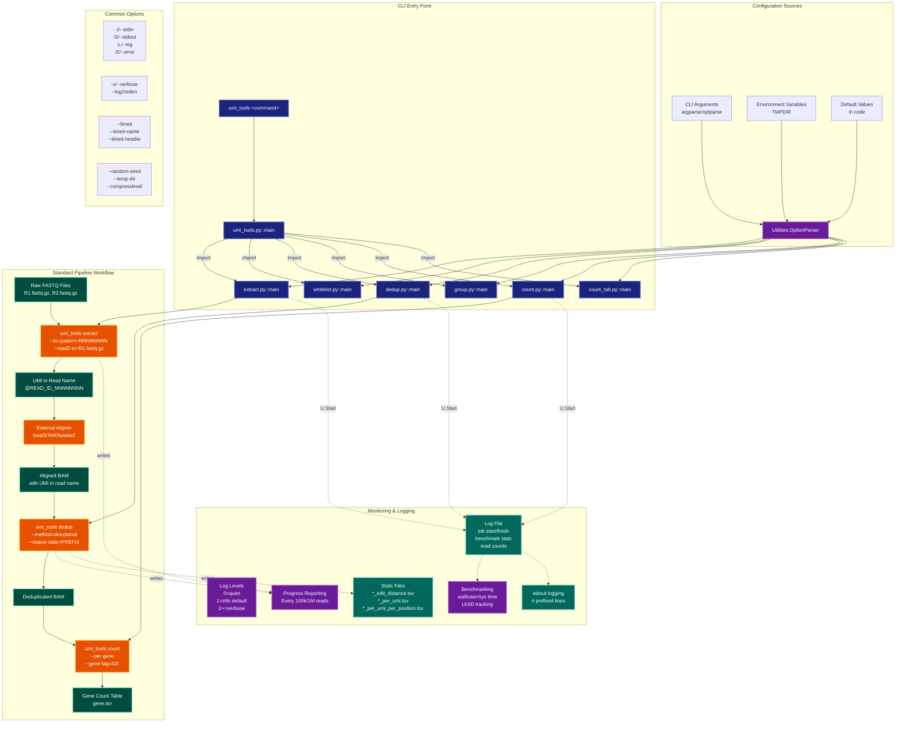

> **Example Note:** This is a whole-codebase example for demonstration purposes.
> In typical usage, arch lens diagrams are scoped to the subsystem being
> modified/added/removed by a plan — not the entire project. The result is
> normally much simpler and more focused than what you see here.

# Operational Diagram: UMI-tools

**Lens:** Operational (Administration)
**Question:** How is it run and monitored?
**Date:** 2026-02-14
**Scope:** Full UMI-tools operational architecture

## CLI Commands Quick Reference

| Command | Purpose | Input | Output |
|---------|---------|-------|--------|
| `extract` | Extract UMI from FASTQ reads | FASTQ (SE/PE) | FASTQ with UMI in read name |
| `whitelist` | Identify true cell barcodes | FASTQ (SE/PE) | TSV whitelist |
| `dedup` | Deduplicate reads by UMI | BAM/SAM | BAM/SAM (deduplicated) |
| `group` | Group reads by UMI | BAM/SAM | BAM with tags or TSV groups |
| `count` | Count reads per gene | BAM/SAM | TSV count table |
| `count_tab` | Count reads from flatfile | TSV | TSV count table |

## Operational Flow Diagram



## Color Legend

| Color | Purpose | Example Nodes |
|-------|---------|---------------|
| Dark Blue | CLI Commands | `extract.py::main`, `dedup.py::main` |
| Teal | Data States | Raw FASTQ, Aligned BAM, Counts |
| Orange | Processing Steps | Extract, Dedup, Count |
| Purple | Configuration/Monitoring | Parser, Benchmark, Progress |
| Green | Output Artifacts | Stats files, Log file |

## Configuration Hierarchy

UMI-tools configuration follows this precedence (highest to lowest):

1. **Command-line arguments** - Explicit flags like `--method=directional`
2. **Environment variables** - `TMPDIR` for temporary file location
3. **Default values** - Hard-coded in each command module

### Key Configuration Categories

#### I/O Redirection (`-I`, `-S`, `-L`, `-E`)
- All commands support stdin/stdout piping
- Transparent gzip compression when filenames end in `.gz`
- Separate log output via `--log` or stdout with `#` prefix
- Example: `umi_tools dedup -I in.bam -S out.bam -L dedup.log`

#### Logging Control (`-v`, `--log2stderr`)
- **Loglevel 0**: Quiet mode, no logging
- **Loglevel 1** (default): Info messages, progress updates
- **Loglevel 2+**: Verbose debugging information
- Use `--log2stderr` to send log to stderr instead of stdout

#### Performance Options
- `--random-seed`: Reproducible random number generation
- `--temp-dir`: Override default temp directory (fallback: `$TMPDIR`)
- `--compresslevel`: Gzip compression level (default: 6)
- `--timeit`: Output benchmarking to file
- `--timeit-name`, `--timeit-header`: Customize timing output

#### Command-Specific Options

**Extract:**
- `--bc-pattern`: UMI/cell barcode pattern (e.g., `NNNNNNNN`)
- `--extract-method`: `string` or `regex`
- `--quality-filter-threshold`: Filter reads by UMI base quality
- `--whitelist`: Cell barcode whitelist for filtering/correction
- `--subset-reads`: Process only first N reads

**Dedup:**
- `--method`: Clustering method (`unique`, `percentile`, `cluster`, `adjacency`, `directional`)
- `--output-stats`: Generate detailed UMI statistics
- `--edit-dist`: Edit distance threshold for clustering
- `--per-gene`, `--per-cell`: Deduplication scope
- `--gene-tag`, `--cell-tag`: BAM tags for gene/cell identification

**Group:**
- `--output-bam`: Output tagged BAM instead of flatfile
- `--group-out`: TSV file mapping read ID to group
- `--umi-group-tag`: BAM tag for final UMI (default: `BX`)

**Count:**
- `--per-gene` (hardcoded on)
- `--per-cell`: Per-cell counting for scRNA-seq
- `--wide-format-cell-counts`: Output wide format (genes × cells)

**Whitelist:**
- `--method`: `reads` or `umis` counting
- `--knee-method`: `distance` or `density` for threshold detection
- `--set-cell-number`: Explicitly set number of cells
- `--expect-cells`: Upper limit estimate for cells
- `--plot-prefix`: Generate diagnostic plots

## Operator Workflows

### Workflow 1: Bulk RNA-seq UMI Deduplication

```bash
# Step 1: Extract UMIs from FASTQ
umi_tools extract \
  --bc-pattern=NNNNNNNN \
  --stdin=reads.fastq.gz \
  --stdout=extracted.fastq.gz \
  --log=extract.log

# Step 2: Align with external tool (user-managed)
STAR --readFilesIn extracted.fastq.gz \
     --genomeDir /path/to/genome \
     --outSAMtype BAM SortedByCoordinate \
     --outFileNamePrefix aligned_

# Step 3: Deduplicate with UMI
umi_tools dedup \
  --method=directional \
  --stdin=aligned_Aligned.sortedByCoord.out.bam \
  --stdout=deduped.bam \
  --output-stats=stats \
  --log=dedup.log

# Step 4: Count with external tool
featureCounts -a genes.gtf -o counts.txt deduped.bam
```

### Workflow 2: Single-cell RNA-seq (10x-like)

```bash
# Step 1: Generate cell barcode whitelist
umi_tools whitelist \
  --bc-pattern=CCCCCCCCCCCCCCCCNNNNNNNN \
  --stdin=R1.fastq.gz \
  --stdout=whitelist.txt \
  --plot-prefix=whitelist \
  --knee-method=distance \
  --log=whitelist.log

# Step 2: Extract cell barcodes and UMIs
umi_tools extract \
  --bc-pattern=CCCCCCCCCCCCCCCCNNNNNNNN \
  --stdin=R1.fastq.gz \
  --read2-in=R2.fastq.gz \
  --stdout=extracted_R1.fastq.gz \
  --read2-out=extracted_R2.fastq.gz \
  --whitelist=whitelist.txt \
  --error-correct-cell \
  --log=extract.log

# Step 3: Align (user-managed)
STAR --readFilesIn extracted_R2.fastq.gz ...

# Step 4: Count per cell and gene
umi_tools count \
  --per-gene \
  --per-cell \
  --gene-tag=GX \
  --cell-tag=CB \
  --stdin=aligned.bam \
  --stdout=counts.tsv \
  --log=count.log
```

### Workflow 3: Paired-end UMI extraction

```bash
# Extract UMIs from both read pairs
umi_tools extract \
  --bc-pattern=NNNNNNNN \
  --bc-pattern2=NNNNNNNN \
  --stdin=R1.fastq.gz \
  --read2-in=R2.fastq.gz \
  --stdout=extracted_R1.fastq.gz \
  --read2-out=extracted_R2.fastq.gz \
  --log=extract.log
```

## Monitoring and Observability

### Progress Reporting

UMI-tools provides real-time progress updates via the logging system:

```
# extract progress (every 100k reads)
Parsed 100000 reads
Parsed 200000 reads
...

# dedup progress (every 1M input / 100k output)
Parsed 1000000 input reads
Written out 100000 reads
...
```

### Log File Structure

Each job creates a comprehensive log with:

1. **Header Section:**
   - Full command invocation
   - Timestamp and hostname
   - Unique UUID for job tracking
   - Process ID
   - System information (OS, kernel)
   - All option values

2. **Runtime Section:**
   - Progress updates (read counts)
   - Warning/error messages
   - Summary statistics

3. **Footer Section:**
   - Job completion status
   - Total execution time
   - Benchmarking: user time, system time, child times
   - UUID (matching header for log aggregation)

Example log snippet:
```
# output generated by umi_tools dedup --method=directional --stdin=in.bam
# job started at Fri Feb 14 10:30:15 2026 on server.example.com -- a1b2c3d4-e5f6-7890-abcd-ef1234567890
# pid: 12345, system: Linux 6.6.87.2-microsoft-standard-WSL2
# method: directional
# stdin: in.bam
# stdout: <stdout>
# loglevel: 1
...
Parsed 1000000 input reads
Written out 250000 reads
...
# job finished in 45 seconds at Fri Feb 14 10:31:00 2026 -- 42.36 2.45 0.00 0.01 -- a1b2c3d4-e5f6-7890-abcd-ef1234567890
```

### Stats Output (dedup --output-stats)

When `--output-stats=PREFIX` is provided, dedup generates:

1. **`PREFIX_edit_distance.tsv`**
   - Average edit distance between UMIs at each position
   - Pre- and post-deduplication values
   - Null expectation from random sampling
   - Quality control for deduplication effectiveness

2. **`PREFIX_per_umi_per_position.tsv`**
   - Distribution of UMI observation counts
   - Instances pre/post deduplication
   - Useful for method optimization

3. **`PREFIX_per_umi.tsv`**
   - Per-UMI summary statistics
   - Times observed, total counts, median counts
   - Helps identify problematic UMIs

### Benchmarking and Performance

The `--timeit` family of options enables systematic performance tracking:

```bash
umi_tools dedup \
  --timeit=benchmark.tsv \
  --timeit-name=sample1_dedup \
  --timeit-header \
  -I in.bam -S out.bam
```

Output includes: wall time, user/sys time, hostname, full command, timestamps

### Error Handling

UMI-tools uses the `Utilities.error()` function which:
1. Logs the error message
2. Raises a ValueError with standard error text
3. Directs user to check the log file

Common error scenarios:
- Invalid barcode patterns
- Missing required options
- Incompatible option combinations
- Input file format issues

## Typical Pipeline

The standard UMI-tools workflow for bulk RNA-seq:

```
Raw FASTQ → [extract] → FASTQ+UMI → [align] → BAM → [dedup] → Deduplicated BAM → [downstream]
```

For single-cell RNA-seq:

```
Raw FASTQ → [whitelist] → Cell Barcode List
              ↓
Raw FASTQ → [extract+whitelist] → FASTQ+CB+UMI → [align] → BAM → [count --per-cell] → Count Matrix
```

### Temporary File Management

- Controlled via `--temp-dir` or `$TMPDIR` environment variable
- Used for intermediate sorted BAM files (dedup/group commands)
- Auto-cleanup after successful completion
- Files use random UUIDs to prevent collisions

### Installation and Dependencies

From `setup.py`:

**Required dependencies:**
- Python 3+
- numpy >= 1.7
- pandas >= 0.12.0
- pysam >= 0.16.0.1
- scipy, matplotlib
- regex, future, pybktree

**Installation:**
```bash
pip install umi_tools
# or
conda install -c bioconda umi-tools
```

**Entry point:** `umi_tools` command via console_scripts

## Summary

UMI-tools provides a comprehensive operational environment with:

1. **Flexible I/O**: stdin/stdout piping, gzip support, file redirection
2. **Robust logging**: Multi-level logging, progress tracking, detailed job records
3. **Rich monitoring**: Stats outputs, benchmarking, UUID-based job tracking
4. **Standard pipelines**: Extract → Align → Dedup → Count workflow
5. **Extensive configuration**: CLI args, environment vars, sensible defaults
6. **Production-ready**: Error handling, temp file management, reproducibility (random seeds)

The operational design emphasizes:
- **Transparency**: Comprehensive logging with unique job IDs
- **Composability**: Unix-style piping and modular commands
- **Observability**: Progress updates, stats files, benchmarking
- **Reproducibility**: Random seed control, complete option logging
