> **Example Note:** This is a whole-codebase example for demonstration purposes.
> In typical usage, arch lens diagrams are scoped to the subsystem being
> modified/added/removed by a plan — not the entire project. The result is
> normally much simpler and more focused than what you see here.

# Process Flow Diagram: UMI-tools (dedup command)

**Lens:** Process Flow (Physiological)
**Question:** How does it behave?
**Date:** 2026-02-14
**Scope:** UMI-tools dedup command workflow

## Workflow Overview

| Phase | Nodes | Key Decision Points | Loop Mechanism |
|-------|-------|---------------------|----------------|
| Initialization | CLI Entry, Parse Args, Setup | Input format (SAM/BAM), Output format, Stats generation, Paired-end mode | N/A |
| BAM Feature Detection | Detect Tags | Multimapping detection method (NH/X0/XT) | Iterate first 1000 reads |
| Bundle Construction | Read BAM, Extract UMI, Group Reads | Per-gene vs per-position, Paired vs single-end, Cell barcoding | Iterate all reads, output bundles when position/gene changes |
| Deduplication | ReadDeduplicator (network + clustering + selection) | Dedup method (directional/adjacency/cluster/unique/percentile), Whitelist filtering | Iterate over bundles |
| Output | Write BAM, Generate Stats, Sort | Sort output, Stats computation | Write all deduplicated reads |

## Flow Diagram

```mermaid
flowchart TB
    classDef terminal fill:#1a237e,stroke:#7986cb,stroke-width:2px,color:#fff;
    classDef stateNode fill:#004d40,stroke:#4db6ac,stroke-width:2px,color:#fff;
    classDef handler fill:#e65100,stroke:#ffb74d,stroke-width:2px,color:#fff;
    classDef phase fill:#6a1b9a,stroke:#ba68c8,stroke-width:2px,color:#fff;
    classDef detector fill:#b71c1c,stroke:#ef5350,stroke-width:2px,color:#fff;

    Start([Start:<br/>umi_tools dedup]):::terminal
    Complete([Complete]):::terminal
    Error([Error:<br/>Validation Failed]):::terminal

    %% === INITIALIZATION === %%
    subgraph Init ["Initialization"]
        direction TB
        ParseArgs[Parse CLI<br/>Arguments]:::phase
        ValidateOpts{Validate<br/>Options}:::stateNode
        SetupIO[Setup Input/Output<br/>Files & Modes]:::handler
        DetectFeatures{--detection-method<br/>specified?}:::stateNode
        ScanBAM[Scan First 1000 Reads<br/>━━━━━━━━━━<br/>reads tags → detect method]:::handler
        ValidateTags{Required tags<br/>present?}:::detector
        InitProcessor[Initialize<br/>ReadDeduplicator<br/>━━━━━━━━━━<br/>contains UMIClusterer]:::handler
        InitBundler[Initialize<br/>get_bundles generator]:::handler
        SetupStats{--output-stats<br/>specified?}:::stateNode
        InitStatsArrays[Initialize Stats<br/>Data Structures]:::handler
    end

    %% === READ FILTER PIPELINE (inside get_bundles generator) === %%
    subgraph BundleGen ["get_bundles() Generator — yields bundles"]
        direction TB
        ReadLoop{More reads<br/>in BAM?}:::stateNode
        ReadNext[Read Next Record<br/>━━━━━━━━━━<br/>reads BAM via pysam]:::handler

        CheckRead2{Is read2?}:::stateNode
        ReturnRead2{return_read2<br/>mode?}:::stateNode
        YieldRead2[Write Read2<br/>Directly to Output]:::handler

        CheckPaired{Paired-end<br/>mode?}:::stateNode
        ValidatePair{Read is<br/>paired?}:::stateNode
        HandleUnpaired{unpaired_reads<br/>setting?}:::stateNode
        DiscardUnpaired[Discard Read]:::handler
        OutputUnpaired[Write Unpaired<br/>to Output]:::handler

        CheckUnmapped{Read<br/>unmapped?}:::stateNode
        CheckReturnUnmapped{return_unmapped<br/>mode?}:::stateNode
        YieldUnmapped[Write Unmapped<br/>to Output]:::handler

        CheckMateUnmapped{Mate<br/>unmapped?}:::stateNode
        CheckUnmappedMode{unmapped_reads<br/>== 'use'?}:::stateNode

        CheckChimeric{Read pair<br/>chimeric?}:::stateNode
        HandleChimeric{chimeric_pairs<br/>setting?}:::stateNode
        DiscardChimeric[Discard Read]:::handler
        OutputChimeric[Write Chimeric<br/>to Output]:::handler

        CheckSubset{--subset<br/>filter?}:::stateNode
        RandomExclude[Randomly<br/>Exclude Read]:::handler

        CheckMAPQ{Below MAPQ<br/>threshold?}:::stateNode
        FilterMAPQ[Filter Low<br/>MAPQ Read]:::handler

        ExtractUMI[barcode_getter<br/>━━━━━━━━━━<br/>read → UMI string]:::handler
        CheckUMITag{Has UMI<br/>tag?}:::detector
        SkipNoTag[Skip Read<br/>No Tag]:::handler

        DeterminePos{--per-gene<br/>mode?}:::stateNode
        GetGenePos[Get Gene/Transcript<br/>━━━━━━━━━━<br/>read tag → position key]:::handler
        GetReadPos[get_read_position<br/>━━━━━━━━━━<br/>read → pos, splice, strand]:::handler

        CheckOutput{Position/Gene<br/>changed?}:::stateNode
        YieldBundle[Generator yield<br/>━━━━━━━━━━<br/>yields bundle dict]:::handler
        UpdateDict[Accumulate Read<br/>into Bundle Dict]:::handler
    end

    %% === DEDUPLICATION (ReadDeduplicator.__call__) === %%
    subgraph Dedup ["ReadDeduplicator.__call__() — per bundle"]
        direction TB
        BundleLoop{More bundles<br/>to process?}:::stateNode

        CheckIgnoreUMI{--ignore-umi<br/>mode?}:::stateNode
        WriteAll[Write All Reads<br/>from Bundle]:::handler

        DedupCall[ReadDeduplicator.__call__<br/>━━━━━━━━━━<br/>bundle dict → reads list]:::handler

        BuildAdjList{UMIClusterer:<br/>Build Adjacency List<br/>━━━━━━━━━━<br/>method-specific}:::stateNode

        DirectionalAdj[Directional:<br/>edit_dist ≤ threshold<br/>count1 ≥ 2*count2-1]:::handler
        AdjacencyAdj[Adjacency:<br/>edit_dist ≤ threshold]:::handler
        ClusterAdj[Cluster:<br/>edit_dist ≤ threshold]:::handler
        NullAdj[Unique/Percentile:<br/>No adjacency list]:::handler

        FindComponents{Find Connected<br/>Components<br/>━━━━━━━━━━<br/>adj_list → components}:::stateNode

        BFS[Breadth-First Search<br/>━━━━━━━━━━<br/>reads adj_list → components]:::handler
        PassThrough[Return All UMIs<br/>as-is]:::handler

        GroupClusters{Group UMIs<br/>━━━━━━━━━━<br/>components → groups}:::stateNode

        GroupDirectional[Directional:<br/>reads adj_list + counts<br/>→ deduplicated groups]:::handler
        GroupAdjacency[Adjacency:<br/>reads adj_list<br/>→ min account set]:::handler
        GroupCluster[Cluster:<br/>Sort by count<br/>within cluster]:::handler
        GroupUnique[Unique:<br/>Each UMI separate]:::handler
        GroupPercentile[Percentile:<br/>Keep > 1% median]:::handler

        CheckWhitelist{--filter-umi<br/>specified?}:::stateNode
        FilterWhitelist[Filter Clusters<br/>by Whitelist]:::handler

        SelectReads[Select Representative<br/>━━━━━━━━━━<br/>reads bundle → best read<br/>by MAPQ, multimap]:::handler

        CheckEmpty{Reads list<br/>empty?}:::detector
        SkipEmpty[Skip Empty<br/>Bundle]:::handler
    end

    %% === OUTPUT === %%
    subgraph Output ["Output & Stats"]
        direction TB
        WriteReads[Write Deduplicated<br/>Reads to Output BAM]:::handler

        CollectStats{Stats mode<br/>active?}:::stateNode
        CalcPreStats[Calculate Pre-Dedup<br/>Edit Distances]:::handler
        CalcPostStats[Calculate Post-Dedup<br/>Edit Distances]:::handler
        UpdateStats[Update Stats<br/>DataFrames]:::handler

        IncrementCounters[Increment Input/<br/>Output Counters]:::handler

        CheckSort{--no-sort-output<br/>flag?}:::stateNode
        SortBAM[Sort Output BAM<br/>━━━━━━━━━━<br/>reads temp → writes sorted]:::handler

        GenerateStats{Stats mode<br/>active?}:::stateNode
        WritePerUMI[Write per_umi.tsv]:::handler
        WritePerPos[Write per_umi_per_position.tsv]:::handler
        WriteEditDist[Write edit_distance.tsv]:::handler
        LogSummary[Log Summary<br/>Statistics]:::handler
    end

    %% === CONNECTIONS === %%
    Start --> ParseArgs
    ParseArgs --> ValidateOpts
    ValidateOpts -->|"Valid"| SetupIO
    ValidateOpts -->|"Invalid"| Error

    SetupIO --> DetectFeatures
    DetectFeatures -->|"Yes"| ScanBAM
    DetectFeatures -->|"No"| InitProcessor
    ScanBAM --> ValidateTags
    ValidateTags -->|"Valid"| InitProcessor
    ValidateTags -->|"Invalid"| Error

    InitProcessor --> InitBundler
    InitBundler --> SetupStats
    SetupStats -->|"Yes"| InitStatsArrays
    SetupStats -->|"No"| ReadLoop
    InitStatsArrays --> ReadLoop

    ReadLoop -->|"Yes"| ReadNext
    ReadLoop -->|"No: flush final bundle"| BundleLoop

    ReadNext --> CheckRead2
    CheckRead2 -->|"Yes"| ReturnRead2
    CheckRead2 -->|"No"| CheckPaired
    ReturnRead2 -->|"Yes"| YieldRead2
    ReturnRead2 -->|"No"| ReadLoop
    YieldRead2 --> ReadLoop

    CheckPaired -->|"Yes"| ValidatePair
    CheckPaired -->|"No"| CheckUnmapped
    ValidatePair -->|"Yes"| CheckUnmapped
    ValidatePair -->|"No"| HandleUnpaired
    HandleUnpaired -->|"discard"| DiscardUnpaired
    HandleUnpaired -->|"output"| OutputUnpaired
    HandleUnpaired -->|"use"| CheckUnmapped
    DiscardUnpaired --> ReadLoop
    OutputUnpaired --> ReadLoop

    CheckUnmapped -->|"Yes"| CheckReturnUnmapped
    CheckUnmapped -->|"No"| CheckMateUnmapped
    CheckReturnUnmapped -->|"Yes"| YieldUnmapped
    CheckReturnUnmapped -->|"No"| ReadLoop
    YieldUnmapped --> ReadLoop

    CheckMateUnmapped -->|"Yes"| CheckUnmappedMode
    CheckMateUnmapped -->|"No"| CheckChimeric
    CheckUnmappedMode -->|"Yes"| CheckChimeric
    CheckUnmappedMode -->|"No"| ReadLoop

    CheckChimeric -->|"Yes"| HandleChimeric
    CheckChimeric -->|"No"| CheckSubset
    HandleChimeric -->|"discard"| DiscardChimeric
    HandleChimeric -->|"output"| OutputChimeric
    HandleChimeric -->|"use"| CheckSubset
    DiscardChimeric --> ReadLoop
    OutputChimeric --> ReadLoop

    CheckSubset -->|"Active"| RandomExclude
    CheckSubset -->|"Inactive"| CheckMAPQ
    RandomExclude --> ReadLoop

    CheckMAPQ -->|"Yes"| FilterMAPQ
    CheckMAPQ -->|"No"| ExtractUMI
    FilterMAPQ --> ReadLoop

    ExtractUMI --> CheckUMITag
    CheckUMITag -->|"Yes"| DeterminePos
    CheckUMITag -->|"No"| SkipNoTag
    SkipNoTag --> ReadLoop

    DeterminePos -->|"Yes"| GetGenePos
    DeterminePos -->|"No"| GetReadPos
    GetGenePos --> CheckOutput
    GetReadPos --> CheckOutput

    CheckOutput -->|"Yes: window moved"| YieldBundle
    CheckOutput -->|"No"| UpdateDict
    YieldBundle --> UpdateDict
    UpdateDict --> ReadLoop

    BundleLoop -->|"Yes"| CheckIgnoreUMI
    BundleLoop -->|"No"| CheckSort

    CheckIgnoreUMI -->|"Yes"| WriteAll
    CheckIgnoreUMI -->|"No"| DedupCall
    WriteAll --> IncrementCounters

    DedupCall -->|"reads UMI counts"| BuildAdjList

    BuildAdjList -->|"directional"| DirectionalAdj
    BuildAdjList -->|"adjacency"| AdjacencyAdj
    BuildAdjList -->|"cluster"| ClusterAdj
    BuildAdjList -->|"unique/percentile"| NullAdj

    DirectionalAdj --> FindComponents
    AdjacencyAdj --> FindComponents
    ClusterAdj --> FindComponents
    NullAdj --> FindComponents

    FindComponents -->|"adjacency/directional/cluster"| BFS
    FindComponents -->|"unique/percentile"| PassThrough

    BFS --> GroupClusters
    PassThrough --> GroupClusters

    GroupClusters -->|"directional"| GroupDirectional
    GroupClusters -->|"adjacency"| GroupAdjacency
    GroupClusters -->|"cluster"| GroupCluster
    GroupClusters -->|"unique"| GroupUnique
    GroupClusters -->|"percentile"| GroupPercentile

    GroupDirectional --> CheckWhitelist
    GroupAdjacency --> CheckWhitelist
    GroupCluster --> CheckWhitelist
    GroupUnique --> CheckWhitelist
    GroupPercentile --> CheckWhitelist

    CheckWhitelist -->|"Yes"| FilterWhitelist
    CheckWhitelist -->|"No"| SelectReads
    FilterWhitelist --> SelectReads

    SelectReads --> CheckEmpty
    CheckEmpty -->|"Yes"| SkipEmpty
    CheckEmpty -->|"No"| WriteReads
    SkipEmpty --> BundleLoop

    WriteReads --> CollectStats
    CollectStats -->|"Yes"| CalcPreStats
    CollectStats -->|"No"| IncrementCounters
    CalcPreStats --> CalcPostStats
    CalcPostStats --> UpdateStats
    UpdateStats --> IncrementCounters

    IncrementCounters --> BundleLoop

    CheckSort -->|"Sorted already"| GenerateStats
    CheckSort -->|"Needs sort"| SortBAM
    SortBAM --> GenerateStats

    GenerateStats -->|"Yes"| WritePerUMI
    GenerateStats -->|"No"| LogSummary
    WritePerUMI --> WritePerPos
    WritePerPos --> WriteEditDist
    WriteEditDist --> LogSummary

    LogSummary --> Complete

    class Start,Complete,Error terminal;
```

**Color Legend:**
| Color | Category | Description |
|-------|----------|-------------|
| Dark Blue | Terminal | Start, complete, and error states |
| Purple | Phase | Control flow and analysis nodes |
| Orange | Handler | Processing and execution nodes |
| Teal | State | Selection and routing decisions |
| Red | Detector | Validation gates and failure handling |

## State Machine Characteristics

| Aspect | Value | Notes |
|--------|-------|-------|
| **State Type** | Streaming pipeline with nested loops | Main read loop + bundle processing loop |
| **Entry Point** | CLI argument parsing | `umi_tools dedup` command |
| **Primary Loop** | Read iteration (get_bundles generator) | Iterate over all BAM records, yield bundles when window moves |
| **Secondary Loop** | Bundle processing | Process yielded bundles through ReadDeduplicator |
| **Exit Condition** | All reads processed + stats generated | No explicit error recovery loops |
| **State Persistence** | In-memory dictionaries | Bundle dictionary keyed by position/gene |
| **Checkpointing** | None | Single-pass algorithm, no resume capability |
| **Parallelization** | None | Sequential processing required for correct bundling |
| **Memory Strategy** | Windowed output | Yield bundles when position moves >1000bp |

## Critical Routing Logic

### Bundle Grouping Strategy
- **Per-Gene Mode** (`--per-gene`): Groups reads by gene tag or contig
  - With `--per-contig`: Use transcript/contig as gene identifier
  - With `--gene-tag`: Extract gene from BAM tag
  - Output bundles when gene changes
- **Per-Position Mode** (default): Groups reads by genomic position
  - Position determined from alignment start (forward) or end (reverse)
  - Splice-aware positioning with CIGAR string parsing
  - Output bundles when position moves >1000bp or chromosome changes
  - Bundle key includes: `(strand, is_spliced, tlen, read_length)`

### UMI Clustering Method Selection
The `--method` parameter determines three aspects of clustering:

1. **Adjacency List Construction**:
   - `directional`: Edge if edit_distance <= threshold AND count1 >= (2*count2)-1
   - `adjacency`: Edge if edit_distance <= threshold
   - `cluster`: Same as adjacency
   - `unique`/`percentile`: No adjacency list built

2. **Connected Components**:
   - `directional`/`adjacency`/`cluster`: Breadth-first search to find components
   - `unique`/`percentile`: Each UMI is separate component

3. **Group Selection**:
   - `directional`: Sort by count, mark as observed, avoid re-using UMIs across clusters
   - `adjacency`: Select minimum UMIs needed to account for cluster (min-account set)
   - `cluster`: Sort all UMIs in cluster by count, keep all
   - `unique`: Keep all UMIs separately
   - `percentile`: Keep UMIs with counts > 1% of median cluster count

### Read Filtering Pipeline
Reads are filtered in this order (each filter is optional based on flags):

1. **Read2 handling**: Return immediately if `return_read2=True`
2. **Pairing validation**: Check paired-end consistency
3. **Unmapped filtering**: Skip or yield unmapped reads
4. **Chimeric pair handling**: Reads mapping to different contigs
5. **Random subsetting**: `--subset` percentage
6. **MAPQ filtering**: `--mapping-quality` threshold
7. **UMI tag validation**: Must have valid UMI tag
8. **Gene tag validation**: If `--per-gene`, must have valid gene tag

### Representative Read Selection
From each cluster, select representative by:

1. **Lowest multimapping count** (via NH/X0/XT tag)
2. **Highest mapping quality** (MAPQ score)
3. **Random selection** if tied

### Edit Distance Optimization
- For UMI sets < 25: Use pairwise combinations (O(n²))
- For UMI sets >= 25: Use substring indexing
  - Split UMIs into `threshold+1` substrings
  - Build index mapping substring → UMIs
  - Only compare UMIs sharing at least one substring
  - Reduces comparisons significantly for large clusters

### Stats Collection Strategy
When `--output-stats` enabled:

1. **Per-bundle stats**: Calculate average edit distance pre/post dedup
2. **Null distribution**: Sample random UMIs with same frequency distribution
3. **Per-UMI aggregation**: Track median counts, times observed, total counts
4. **Three output files**:
   - `edit_distance.tsv`: Binned edit distances vs null expectation
   - `per_umi.tsv`: Aggregated statistics per unique UMI sequence
   - `per_umi_per_position.tsv`: Distribution of UMI counts at positions

### Paired-End Output Strategy
For paired-end BAM:
- Use `TwoPassPairWriter` wrapper
- Write read1s immediately
- Buffer read1 identities
- When chromosome changes, scan for mate reads
- On close, perform final mate search
- Ensures both mates are output if read1 is kept

### Memory Management
- **Windowed output**: Bundles yielded when position moves >1000bp (prevents memory overflow)
- **Per-contig processing**: For `--per-gene` with `--gene-transcript-map`
- **Dictionary cleanup**: Delete processed position dictionaries after yielding
- **Temp file for sorting**: Output to temp file first, then sort to final destination
