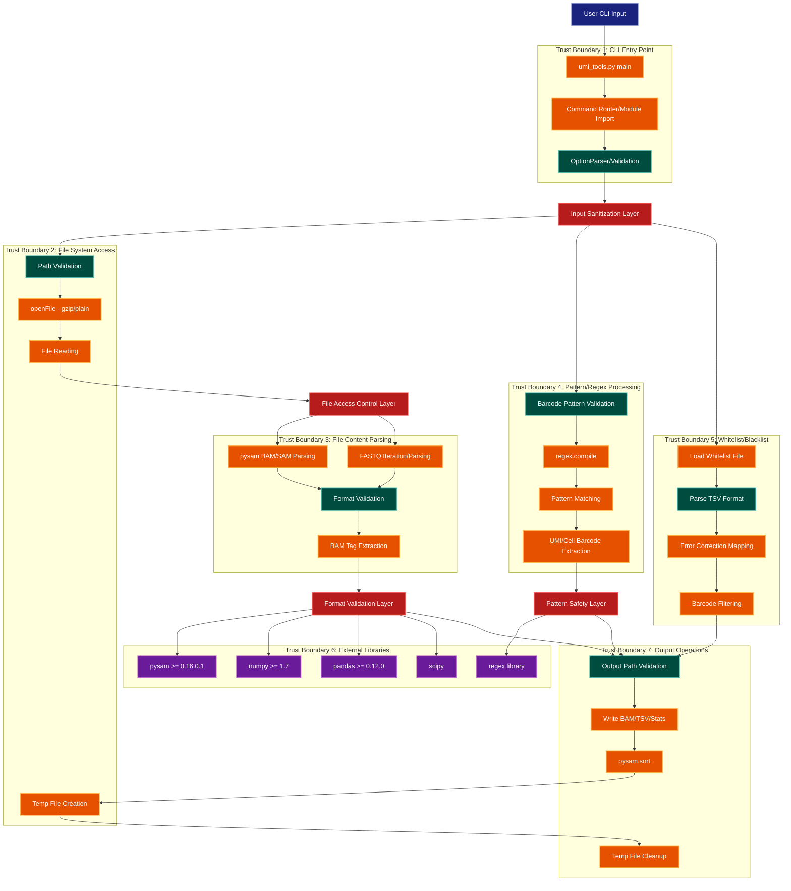

> **Example Note:** This is a whole-codebase example for demonstration purposes.
> In typical usage, arch lens diagrams are scoped to the subsystem being
> modified/added/removed by a plan — not the entire project. The result is
> normally much simpler and more focused than what you see here.

# Security Diagram: UMI-tools

**Lens:** Security (Trust Boundaries)
**Question:** Where are the trust boundaries?
**Date:** 2026-02-14
**Scope:** Full UMI-tools security architecture

## Trust Boundaries Overview

| Boundary | Risk Level | Validation Layer | Impact |
|----------|-----------|------------------|---------|
| CLI Arguments | High | Argument parsing + validation | Code execution, path traversal |
| File Path Input | High | Path validation, existence checks | Arbitrary file access |
| BAM/SAM/FASTQ File Content | Medium | Format validation (pysam) | Memory exhaustion, parsing errors |
| UMI/Barcode Patterns | Medium | Regex compilation, pattern validation | ReDoS attacks |
| External Libraries | Medium | Version pinning | Supply chain vulnerabilities |
| Temporary Files | Low | Secure temp directories | Information disclosure |
| User Whitelist Files | Medium | Format validation, encoding checks | Malformed input processing |

## Security Architecture Diagram



## Color Legend

| Color | Component Type | Description |
|-------|---------------|-------------|
| Dark Blue | Terminal | User entry points |
| Teal | State/Validation | Validation and state management |
| Orange | Handler | Processing and transformation |
| Purple | Phase | External library dependencies |
| Red | Detector | Security validation layers |

## Security Validation Layers

### Layer 1: Input Sanitization (CLI Arguments)

**Location:** `Utilities.py:Start()`, command-specific `main()` functions

**Validation Performed:**
- Command name validation via `importlib.import_module()` with try/except
- Option parsing with `OptionParser` (derived from optparse)
- Type validation for all command-line arguments
- File path sanitization for `--stdin`, `--stdout`, `--log` options
- Pattern validation for barcode extraction (`--bc-pattern`, `--bc-pattern2`)
- Choice validation for enumerated options (e.g., `--method`, `--knee-method`)

**Security Features:**
```python
# Command validation in umi_tools.py
try:
    module = importlib.import_module("umi_tools." + command, "umi_tools")
except ImportError:
    print("'%s' is not a UMI-tools command. See 'umi_tools -h'.\n" % command)
    return 1

# Pattern validation in extract.py
if options.extract_method == "regex":
    try:
        options.pattern = regex.compile(options.pattern)
    except regex.error:
        raise ValueError("--bc-pattern '%s' is not a valid regex" % options.pattern)
```

**Weaknesses:**
- No explicit sanitization of file paths for path traversal
- Regex patterns can cause ReDoS if maliciously crafted
- No length limits on command-line arguments

### Layer 2: File Access Control

**Location:** `Utilities.py:openFile()`, individual command implementations

**Validation Performed:**
- File existence checks before opening
- Automatic gzip detection via extension (`.gz`, `.z`)
- Directory creation with `create_dir` parameter
- Temporary file creation in user-specified or system temp directory
- Validation that stdin is not used for BAM/SAM input

**Security Features:**
```python
# File opening with gzip support
def openFile(filename, mode="r", create_dir=False):
    _, ext = os.path.splitext(filename)

    if create_dir:
        dirname = os.path.dirname(filename)
        if dirname and not os.path.exists(dirname):
            os.makedirs(dirname)

    if ext.lower() in (".gz", ".z"):
        if sys.version_info.major >= 3:
            if mode == "r":
                return gzip.open(filename, 'rt', encoding="ascii")
            elif mode == "w":
                return gzip.open(filename, 'wt',
                                 compresslevel=global_options.compresslevel,
                                 encoding="ascii")
```

**Weaknesses:**
- No validation against symlink attacks
- No checks for world-writable directories
- Automatic directory creation can be exploited
- No file size limits before opening
- Temp files use predictable naming (`ctmp` prefix)

### Layer 3: Format Validation

**Location:** `pysam` library, `umi_methods.py:fastqIterate()`, `sam_methods.py`

**Validation Performed:**

**BAM/SAM Files:**
- Header validation by pysam
- Record structure validation
- Tag type checking (`has_tag()`, `get_tag()`)
- Mapping quality validation
- CIGAR string parsing
- Reference sequence validation

**FASTQ Files:**
- Four-line format validation
- Quality string length matching sequence length
- Quality encoding detection (`phred33`, `phred64`, `solexa`)
- Read ID format validation

**Security Features:**
```python
# FASTQ format validation
def fastqIterate(infile, remove_suffix=False):
    while 1:
        line1 = convert2string(infile.readline()).strip()
        if not line1:
            break
        if not line1.startswith('@'):
            U.error("parsing error: expected '@' in line %s" % line1)
        line2 = convert2string(infile.readline())
        line3 = convert2string(infile.readline())
        if not line3.startswith('+'):
            U.error("parsing error: expected '+' in line %s" % line3)
        line4 = convert2string(infile.readline())
        if not line4:
            U.error("incomplete entry for %s" % line1)
```

**Weaknesses:**
- No memory limits on record parsing
- Large files can cause memory exhaustion
- No timeout mechanisms for slow parsing
- Trusts pysam for all BAM/SAM validation

### Layer 4: Pattern Safety

**Location:** `Utilities.py:validateExtractOptions()`, `extract_methods.py`

**Validation Performed:**
- Regex pattern compilation testing
- Pattern group name validation (`cell_*`, `umi_*`)
- String pattern character validation (`C` for cell, `N` for UMI)
- Skip-regex compilation validation

**Security Features:**
```python
# Regex validation in validateExtractOptions
if options.extract_method == "regex":
    if options.pattern:
        try:
            options.pattern = regex.compile(options.pattern)
        except regex.error:
            raise ValueError("--bc-pattern '%s' is not a valid regex" % options.pattern)

# Skip regex validation in validateSamOptions
if options.skip_regex:
    try:
        re.compile(options.skip_regex)
    except re.error:
        raise ValueError("skip-regex '%s' is not a valid regex" % options.skip_regex)
```

**Weaknesses:**
- No ReDoS protection (catastrophic backtracking)
- No complexity limits on regex patterns
- Regex library (not stdlib `re`) has different performance characteristics
- No timeout on pattern matching operations

## Detailed Security Analysis

### 1. Command Injection Risks: **LOW**

**Analysis:** No subprocess calls with user-controlled input except:
- `pysam.sort()` which uses controlled arguments
- Temp file operations use library functions

**Mitigation:** Commands use library APIs rather than shell execution.

### 2. Path Traversal Risks: **MEDIUM**

**Analysis:**
- User can specify arbitrary paths for `--stdin`, `--stdout`, `--log`
- No canonicalization or chroot-style restrictions
- Symlink following is not prevented
- `--tmpdir` allows user-specified temp directories

**Attack Vector:**
```bash
umi_tools extract --stdin=../../../../etc/passwd --bc-pattern=NNNN
umi_tools dedup --log=/var/log/important.log  # Overwrite system logs
```

**Mitigation:** File permissions are respected by OS. No privilege escalation.

### 3. Memory Exhaustion Risks: **MEDIUM-HIGH**

**Analysis:**
- Large BAM/FASTQ files loaded without size limits
- `--buffer-whole-contig` loads entire chromosomes into memory
- Statistics collection builds large dictionaries
- No configurable memory limits

**Attack Vector:**
- Process extremely large BAM files
- Use `--buffer-whole-contig` on large genomes
- Enable `--output-stats` on high-diversity datasets

**Mitigation:** Operating system memory limits only.

### 4. Regular Expression DoS (ReDoS): **MEDIUM**

**Analysis:**
- User-provided regex patterns for barcode extraction
- Uses `regex` library (more vulnerable than `re`)
- No timeout on pattern matching
- Patterns applied to every read

**Attack Vector:**
```bash
# Catastrophic backtracking pattern
umi_tools extract --bc-pattern='(?P<umi_1>(A+)+B)' --extract-method=regex
```

**Mitigation:** None implemented. Relies on user to provide safe patterns.

### 5. External Library Vulnerabilities: **MEDIUM**

**Analysis:**
- Heavy reliance on pysam, numpy, pandas, scipy
- Version pinning is minimal (>= not ==)
- No integrity checks on dependencies
- C extension module (`_dedup_umi.c`) compiled at install

**Dependencies:**
```
pysam >= 0.16.0.1
numpy >= 1.7
pandas >= 0.12.0
regex (unpinned)
scipy (unpinned)
matplotlib (unpinned)
```

**Mitigation:** Standard pip/conda dependency management.

### 6. Whitelist/Blacklist Processing: **LOW-MEDIUM**

**Analysis:**
- Whitelist files are TSV format from user
- No size limits on whitelist files
- Error correction creates mappings in memory
- Hamming distance calculations on all barcodes

**Security Features:**
- Simple TSV parsing (split on tabs)
- No code execution risks
- Memory usage proportional to whitelist size

### 7. Temporary File Security: **LOW**

**Analysis:**
- Temp files use `tempfile.NamedTemporaryFile()`
- Prefix `ctmp` is predictable
- Files created in user-specified or system temp dir
- Cleanup on completion but not on error

**Security Features:**
```python
def getTempFile(dir=None, shared=False, suffix=""):
    return tempfile.NamedTemporaryFile(dir=dir, delete=False, prefix="ctmp",
                                       suffix=suffix)
```

**Weaknesses:**
- Files not automatically deleted
- Predictable naming
- No secure permissions set

### 8. Output Validation: **LOW**

**Analysis:**
- Output paths user-controlled
- `--force-output` can overwrite existing files
- No validation of output directory permissions
- Sorted output creates additional temp files

**Security Features:**
- Respects file system permissions
- No automatic privileged operations

## Input Validation Patterns

### CLI Argument Validation

**Pattern:** Type-checked enumeration with error messages

```python
# Method choices validation (dedup.py)
group.add_option("--method", dest="method", type="choice",
                 choices=("adjacency", "directional", "percentile", "unique", "cluster"),
                 default="directional",
                 help="method to use for umi grouping [default=%default]")

# Quality encoding validation (extract.py)
group.add_option("--quality-encoding",
                 dest="quality_encoding", type="choice",
                 choices=["phred33", "phred64", "solexa"],
                 help=("Quality score encoding."))
```

### File Format Validation

**Pattern:** Progressive validation with early exit

```python
# FASTQ validation (umi_methods.py)
def fastqIterate(infile, remove_suffix=False):
    while 1:
        line1 = convert2string(infile.readline()).strip()
        if not line1:
            break
        if not line1.startswith('@'):
            U.error("parsing error: expected '@' in line %s" % line1)
        # ... continue validation
```

### BAM Tag Validation

**Pattern:** Try/except with informative errors

```python
# Tag extraction with validation (whitelist_methods.py)
def get_barcode_tag(read, cell_barcode=False, umi_tag='RX', cell_tag=None):
    try:
        if cell_barcode:
            umi = read.get_tag(umi_tag)
            cell = read.get_tag(cell_tag)
        else:
            umi = read.get_tag(umi_tag)
            cell = None
        return umi.encode('utf-8'), cell
    except IndexError:
        raise ValueError("Could not extract UMI +/- cell barcode from the read tag")
```

### Cross-Option Validation

**Pattern:** Comprehensive option compatibility checking

```python
# validateSamOptions in Utilities.py
def validateSamOptions(options, group=False):
    if options.per_gene:
        if options.gene_tag and options.per_contig:
            raise ValueError("need to use either --per-contig OR --gene-tag, "
                           "please do not provide both")
        if not options.per_contig and not options.gene_tag:
            raise ValueError("for per-gene applications, must supply "
                           "--per-contig or --gene-tag")
```

## File Access Patterns

### Safe File Opening Pattern

```python
# openFile with encoding specification (Utilities.py)
if ext.lower() in (".gz", ".z"):
    if sys.version_info.major >= 3:
        if mode == "r":
            return gzip.open(filename, 'rt', encoding="ascii")
        elif mode == "w":
            return gzip.open(filename, 'wt',
                           compresslevel=global_options.compresslevel,
                           encoding="ascii")
```

**Benefits:**
- Explicit encoding prevents encoding attacks
- Automatic compression handling
- Mode validation

### Temporary File Pattern

```python
# Temp file with cleanup (dedup.py)
out_name = U.getTempFilename(dir=options.tmpdir)
# ... use file
pysam.sort("-o", sorted_out_name, "-O", sort_format, "--no-PG", out_name)
os.unlink(out_name)  # delete the tempfile
```

**Benefits:**
- User-controlled temp directory
- Explicit cleanup
- No automatic deletion on error

## External Library Boundaries

### Pysam Integration

**Trust Level:** High - Core functionality

**Usage:**
- BAM/SAM reading and writing
- File sorting
- Reference sequence access
- Tag manipulation

**Validation:**
- Version check in setup.py (>= 0.16.0.1)
- All BAM format validation delegated to pysam
- No input sanitization before pysam calls

### Regex Library Integration

**Trust Level:** Medium - User pattern execution

**Usage:**
- Barcode pattern compilation
- Pattern matching on every read
- Group extraction

**Validation:**
- Compilation test catches syntax errors
- No ReDoS protection
- No pattern complexity limits

### Numpy/Pandas/Scipy Integration

**Trust Level:** Medium - Data processing

**Usage:**
- Statistical calculations
- Array operations
- Distance metrics
- Clustering algorithms

**Validation:**
- Version requirements minimal
- No input sanitization for numerical operations
- Trust library bounds checking

## Recommendations

### High Priority

1. **Add Path Canonicalization**
   - Resolve symlinks before file operations
   - Validate paths are within expected directories
   - Prevent directory traversal attacks

2. **Implement ReDoS Protection**
   - Add timeout to regex matching operations
   - Validate pattern complexity before compilation
   - Use `re` instead of `regex` for user patterns, or add timeout wrapper

3. **Add Memory Limits**
   - Configurable maximum memory usage
   - Stream processing for large files
   - Warn users about memory-intensive options

### Medium Priority

4. **Improve Temp File Security**
   - Use secure temp file creation (mode 0600)
   - Ensure cleanup on all exit paths (try/finally)
   - Add option for secure temp directory

5. **Add File Size Validation**
   - Check file sizes before loading
   - Warn on extremely large files
   - Stream processing where possible

6. **Pin Dependency Versions**
   - Use exact versions or narrow ranges
   - Regular security updates for dependencies
   - Automated vulnerability scanning

### Low Priority

7. **Add Input Sanitization Logging**
   - Log rejected inputs for security monitoring
   - Rate limiting for malformed input detection
   - Audit trail for file access

8. **Implement Resource Limits**
   - Maximum processing time per file
   - Maximum output file size
   - Configurable thread/process limits

## Conclusion

UMI-tools has a well-structured security architecture with clear trust boundaries at the CLI entry point, file I/O layer, and format validation layer. The primary security mechanisms are:

1. **Type-safe argument parsing** with optparse-based validation
2. **Delegation to trusted libraries** (pysam) for format parsing
3. **File system permission respect** without privilege escalation
4. **Explicit encoding** specification for text operations

The main security concerns are:
- **Path traversal** through unrestricted file path options
- **ReDoS attacks** through user-provided regex patterns
- **Memory exhaustion** through large input files without limits
- **Dependency vulnerabilities** through minimal version pinning

These risks are acceptable for a bioinformatics research tool operating on trusted data within secure computing environments. For deployment in untrusted environments, implement the high-priority recommendations above.
