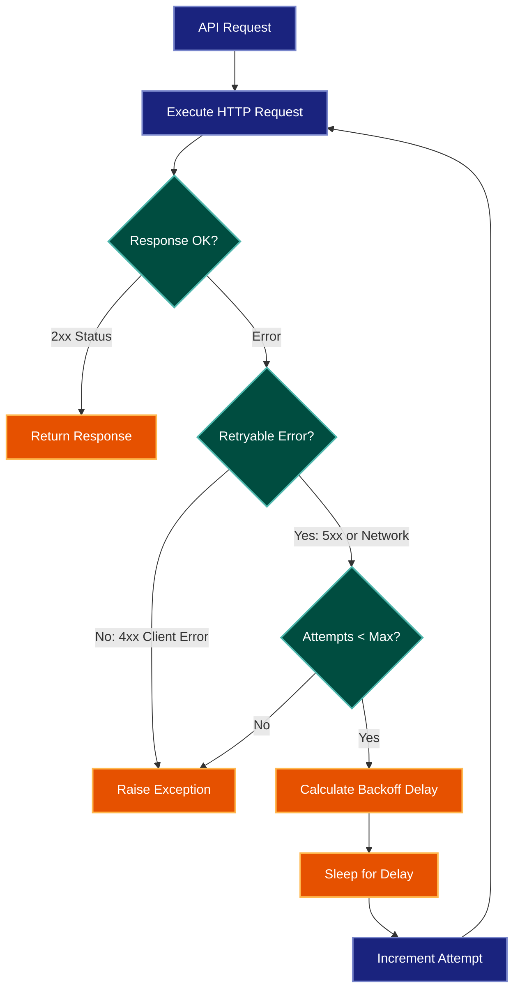

# Implementation Plan: API Client Retry Logic with Exponential Backoff

> **Example Note:** This is a sample output for demonstration purposes.
> Actual outputs will reflect your specific codebase and issues.

## Summary

Add retry logic with exponential backoff to the API client (`src/client/api_client.py`) to handle transient failures gracefully. The implementation will retry failed requests up to 3 times with exponentially increasing delays (1s, 2s, 4s), only for retryable HTTP status codes (429, 500, 502, 503, 504) and network errors. This follows industry-standard practices and aligns with the existing error handling architecture in the codebase.

## Proposed Architecture

### Retry Flow Diagram

### Key Components

1. **RetryConfig:** Dataclass holding retry parameters (max_attempts, base_delay, max_delay, retryable_status_codes)
2. **BackoffCalculator:** Calculates delay with exponential backoff and optional jitter
3. **RetryableError:** Custom exception type for errors that should trigger retries
4. **APIClient.request():** Enhanced to use retry logic via decorator or wrapper

### Configuration

- Default max attempts: 3
- Base delay: 1.0 seconds
- Max delay: 30.0 seconds
- Retryable status codes: [429, 500, 502, 503, 504]
- Jitter: ±20% randomization to avoid thundering herd

## Tests

### Test-Driven Development Order

**Phase 1: Backoff Calculation**
1. `test_backoff_calculator_exponential_growth()` - Verify 1s, 2s, 4s, 8s progression
2. `test_backoff_calculator_respects_max_delay()` - Ensure cap at max_delay
3. `test_backoff_calculator_with_jitter()` - Verify jitter adds randomization within bounds

**Phase 2: Retry Logic**
4. `test_retry_on_500_error()` - Mock 500 response, verify 3 retries then failure
5. `test_retry_on_503_error()` - Mock 503 response, verify retries
6. `test_no_retry_on_404_error()` - Mock 404 response, verify immediate failure
7. `test_success_after_two_failures()` - Mock fail, fail, success sequence
8. `test_network_error_triggers_retry()` - Mock ConnectionError, verify retries

**Phase 3: Integration**
9. `test_retry_respects_max_attempts()` - Verify stops after configured max
10. `test_retry_delays_between_attempts()` - Verify actual sleep() calls
11. `test_successful_first_attempt_no_retry()` - Verify no overhead on success path
12. `test_custom_retry_config()` - Verify configuration override works

**Phase 4: Edge Cases**
13. `test_timeout_during_retry()` - Verify timeout respected across retries
14. `test_429_rate_limit_with_retry_after_header()` - Use Retry-After if present
15. `test_concurrent_requests_with_retry()` - Verify thread-safety

## Implementation Steps

**Step 1: Create retry configuration**
- Add `src/client/retry_config.py` with `RetryConfig` dataclass
- Define default configuration constants
- Add validation for config parameters (max_attempts > 0, delays > 0)

**Step 2: Implement backoff calculator**
- Add `src/client/backoff.py` with `BackoffCalculator` class
- Implement exponential calculation: `base_delay * (2 ** attempt)`
- Add jitter: `delay * (1 + random.uniform(-jitter, jitter))`
- Ensure max_delay cap is enforced

**Step 3: Define retryable error detection**
- Add `src/client/exceptions.py` with `RetryableError` exception
- Add `is_retryable()` helper function checking status codes and error types
- Handle both HTTP errors and network errors (ConnectionError, Timeout)

**Step 4: Implement retry decorator**
- Add `src/client/retry_decorator.py` with `@with_retry` decorator
- Accept retry_config as parameter
- Wrap function execution in retry loop
- Log each retry attempt with attempt number and delay

**Step 5: Integrate with APIClient**
- Update `src/client/api_client.py` to accept optional retry_config in constructor
- Apply `@with_retry` to `request()` method
- Ensure existing error handling remains intact
- Add retry metrics (attempt count, total delay)

**Step 6: Add observability**
- Log retry attempts at INFO level: "Retrying request (attempt 2/3) after 2.0s delay"
- Log final failure at ERROR level with all attempt details
- Emit metrics: retry_count, total_delay, final_status

**Step 7: Update documentation**
- Add docstrings explaining retry behavior
- Update README with retry configuration examples
- Document when retries are triggered vs. immediate failures

## Verification

**Unit Test Verification:**
- Run `pytest tests/client/test_retry*.py -v`
- Verify 15 tests pass
- Check code coverage: `pytest --cov=src/client --cov-report=html`
- Ensure 95%+ coverage for retry components

**Integration Testing:**
- Test against mock server returning 503 errors
- Verify actual delays occur (use time assertions)
- Test with real API in staging environment
- Simulate network issues with chaos engineering tool

**Manual Testing:**
- Temporarily reduce max_attempts to 2 and base_delay to 0.5s for faster testing
- Trigger 500 errors from staging API
- Observe logs showing retry sequence
- Verify metrics in monitoring dashboard

**Performance Testing:**
- Benchmark request latency with retry disabled vs. enabled (success path)
- Verify no significant overhead on successful first attempts
- Test behavior under high concurrency (100+ parallel requests)

**Acceptance Criteria:**
- Failed requests with 5xx errors automatically retry up to 3 times
- Delays follow exponential backoff pattern (1s, 2s, 4s)
- Client errors (4xx) do not trigger retries
- Successful responses on first attempt have no added latency
- Retry behavior is configurable per API client instance
- All retry attempts are logged with timestamps and delay values
- Existing API client functionality remains unchanged
