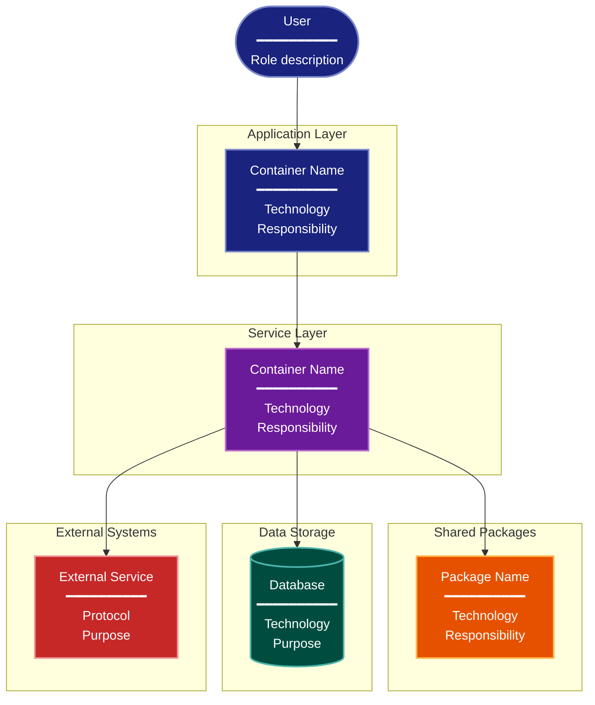

# C4 Container Architecture Lens

**Cognitive Mode:** Anatomical
**Primary Question:** "How is it built?"
**Focus:** Static Structure, Containers, Technology Choices, External Integrations

## When to Use

- Need to understand the high-level technical building blocks
- Documenting container boundaries and communication
- Onboarding new team members to system architecture
- User invokes `/arch-lens-c4-container` or `/make-arch-diag c4`

## Critical Constraints

**NEVER:**
- Modify any source code files
- Include internal implementation details (that's for other lenses)
- Show runtime behavior or state transitions

**ALWAYS:**
- Focus on CONTAINERS (deployable units, not classes)
- Show technology choices for each container
- Identify external systems and integrations
- BEFORE creating any diagram, LOAD the `/mermaid` skill using the Skill tool - this is MANDATORY

---

## Analysis Workflow

### Step 1: Launch Parallel Exploration Subagents

Spawn Explore subagents to investigate:

**Application Layer**
- Find CLI entry points and commands
- Identify web applications and APIs
- Determine frontend technologies
- Look for: entry points, main files, CLI commands, app servers

**Service/Business Logic Layer**
- Find core business logic containers
- Identify processing engines or workflows
- Look for: services, core modules, domain logic, handlers

**Package/Library Layer**
- Find shared packages and utilities
- Identify internal libraries
- Look for: shared modules, utilities, common code, SDKs

**Data Storage Layer**
- Find database connections and storage
- Identify caching layers
- Look for: database configs, ORM models, repositories, cache clients

**External Integrations**
- Find API clients and external calls
- Identify third-party services
- Look for: HTTP clients, SDK imports, external API calls

### Step 2: Identify Containers

For each container discovered, document:
- **Name**: Short descriptive name
- **Technology**: Primary technology/framework
- **Responsibility**: 2-3 word description
- **Communication**: How it talks to other containers

### Step 3: Map Relationships

Identify connections between containers:
- Which containers call which?
- What protocols are used (HTTP, subprocess, import)?
- Which are synchronous vs asynchronous?

**CRITICAL - Analyze Read/Write Direction:**
For EVERY component and connection, determine:
- **Read sources**: Where does this component READ data FROM?
- **Write destinations**: Where does this component WRITE data TO?
- **Bidirectional**: Does data flow both ways?

Label connections with direction:
- `-->` with "reads" or "queries" for read operations
- `-->` with "writes" or "saves" for write operations
- `<-->` for bidirectional

Do NOT place write-only artifacts under "state tracking" or "source of truth" categories.

### Step 4: Create the Diagram

Use the mermaid skill conventions to create a diagram with:

**Direction:** `TB` (top-to-bottom) for hierarchical container layout

**Subgraphs for Layers:**
- Application Layer (user-facing)
- Service Layer (business logic)
- Package Layer (shared utilities)
- Storage Layer (persistence)
- External Systems (third-party)

**Node Styling:**
- `cli` class: CLI, user interfaces, entry points
- `phase` class: Services, core processing
- `handler` class: Packages, shared utilities
- `stateNode` class: Databases, storage
- `integration` class: External APIs, third-party services

**Connections:**
- Solid arrows for primary data flow
- Label connections with action verbs

### Step 5: Write Output

Write the diagram to: `temp/arch-lens-c4-container/arch_diag_c4_container_{YYYY-MM-DD}.md`

---

## Output Template

```markdown
# C4 Container Diagram: {Project Name}

**Lens:** C4 Container (Anatomical)
**Question:** How is it built?
**Date:** {YYYY-MM-DD}
**Scope:** {What was analyzed}

## Container Overview

| Container | Technology | Responsibility |
|-----------|------------|----------------|
| {name} | {tech} | {responsibility} |

## Architecture Diagram



**Color Legend:**
| Color | Category | Description |
|-------|----------|-------------|
| Dark Blue | CLI/Apps | User-facing applications and entry points |
| Purple | Services | Core business logic and services |
| Orange | Packages | Shared utilities and libraries |
| Teal | Storage | Database persistence layers |
| Red | External | External integrations and APIs |

## Key Architectural Insights

| Container | Responsibility | Technology |
|-----------|---------------|------------|
| {container} | {what it does} | {tech stack} |

## Communication Patterns

- {Description of key communication patterns}
```

---

## Pre-Diagram Checklist

Before creating the diagram, verify:

- [ ] LOADED `/mermaid` skill using the Skill tool
- [ ] Using ONLY classDef styles from the mermaid skill (no invented colors)
- [ ] Diagram will include a color legend table

---

## Related Skills

- `/make-arch-diag` - Parent skill for lens selection
- `/mermaid` - MUST BE LOADED before creating diagram
- `/arch-lens-module-dependency` - For detailed coupling analysis
- `/arch-lens-deployment` - For physical deployment topology
