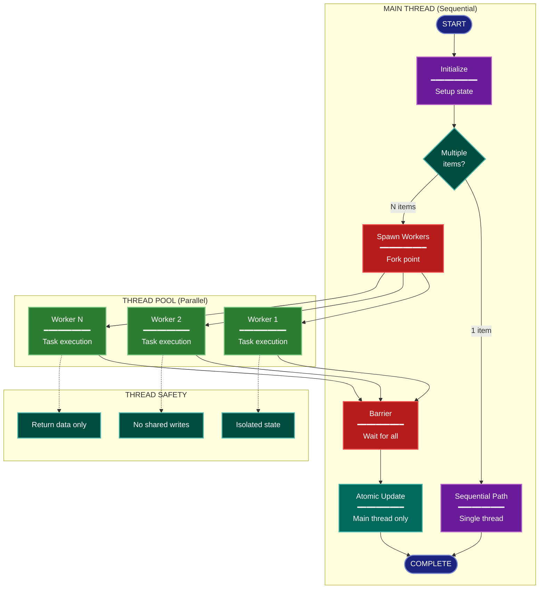

# Concurrency Architecture Lens

**Cognitive Mode:** Physiological
**Primary Question:** "How does parallelism work?"
**Focus:** Parallel Execution, Thread Pools, Synchronization, Barriers

## When to Use

- Need to understand concurrent execution patterns
- Documenting thread pools and worker management
- Analyzing synchronization and thread safety
- User invokes `/arch-lens-concurrency` or `/make-arch-diag concurrency`

## Critical Constraints

**NEVER:**
- Modify any source code files
- Conflate with general process flow (that's a different lens)
- Ignore thread safety implications

**ALWAYS:**
- Focus on PARALLEL execution specifically
- Show synchronization barriers and coordination
- Identify thread safety guarantees
- Document the concurrency MODEL used
- BEFORE creating any diagram, LOAD the `/mermaid` skill using the Skill tool - this is MANDATORY

---

## Analysis Workflow

### Step 1: Launch Parallel Exploration Subagents

Spawn Explore subagents to investigate:

**Concurrency Model**
- Find the primary concurrency approach
- Is it threading, asyncio, multiprocessing, coroutines?
- Look for: ThreadPoolExecutor, asyncio, ProcessPoolExecutor, async/await, goroutines, threads

**Worker Pools**
- Find thread/process pool configurations
- Identify max_workers settings
- Look for: Executor, Pool, workers, max_*, thread pool, worker pool

**Parallel Operations**
- Find what work is parallelized
- Identify parallel patterns (map, submit, gather)
- Look for: executor.submit, asyncio.gather, pool.map, parallel processing

**Synchronization Points**
- Find barriers and coordination
- Identify how parallel work is collected
- Look for: as_completed, wait, gather, Lock, Semaphore, barriers, sync points

**State Access**
- Find shared state access
- Identify thread safety mechanisms
- Look for: Lock, RLock, Queue, thread-local, immutable, atomic, mutex

**Sequential Boundaries**
- Find what MUST run sequentially
- Identify the main thread/process responsibilities
- Look for: main(), single-threaded, atomic updates

### Step 2: Map Concurrency Boundaries

Document:
- **Main Thread**: What runs sequentially
- **Worker Pool**: What runs in parallel
- **Barriers**: Where parallel work converges
- **Atomic Operations**: What requires exclusive access

**CRITICAL - Analyze Read/Write Direction:**
For EVERY concurrent component and shared resource:
- **Reads from shared state**: What data do workers READ?
- **Writes to shared state**: What data do workers WRITE?
- **Return values**: Do workers return data (read by main thread)?
- **Side effects**: Do workers write to storage directly?

Identify:
- Read-only access (safe for parallelism)
- Write access (needs synchronization)
- Worker isolation (no shared state during execution)

### Step 3: Identify Thread Safety

For each shared resource:
- How is it protected?
- Who can read/write?
- Are there race conditions?

### Step 4: Create the Diagram

Use flowchart with:

**Direction:** `TB` for spawn-barrier-collect pattern

**Subgraphs:**
- Main Thread (sequential operations)
- Thread/Process Pool (parallel workers)
- Subprocess/External (if spawned processes)
- Isolation (thread safety guarantees)

**Node Styling:**
- `terminal` class: Start/end points
- `phase` class: Sequential nodes
- `newComponent` class: Parallel workers (green)
- `detector` class: Spawn and barrier points
- `handler` class: Processing within workers
- `output` class: Atomic state updates
- `stateNode` class: Thread safety mechanisms

**Special Elements:**
- Show fork/join points clearly
- Use edge labels for conditions
- Group parallel workers visually

### Step 5: Write Output

Write the diagram to: `temp/arch-lens-concurrency/arch_diag_concurrency_{YYYY-MM-DD}.md`

---

## Output Template

```markdown
# Concurrency Diagram: {System Name}

**Lens:** Concurrency (Physiological)
**Question:** How does parallelism work?
**Date:** {YYYY-MM-DD}
**Scope:** {What was analyzed}

## Concurrency Model

| Aspect | Value | Notes |
|--------|-------|-------|
| Primary Model | {threading/asyncio/multiprocessing} | |
| Worker Pool Type | {ThreadPoolExecutor/etc} | |
| Max Workers | {count} | |
| Parallel Operations | {what is parallelized} | |

## Concurrency Diagram



**Color Legend:**
| Color | Category | Description |
|-------|----------|-------------|
| Dark Blue | Terminal | Start and end points |
| Purple | Sequential | Single-threaded nodes |
| Green | Workers | Parallel workers |
| Red | Synchronization | Spawn and barrier points |
| Dark Teal | Atomic | Main-thread-only state updates |
| Teal | Isolation | Thread safety guarantees |

## Concurrency Boundaries

| Component | Model | Synchronization |
|-----------|-------|-----------------|
| {component} | {single-threaded/parallel} | {mechanism} |

## Thread Safety Guarantees

- **Isolation**: {how workers are isolated}
- **State Access**: {who can modify shared state}
- **Barrier**: {how results are collected}
```

---

## Pre-Diagram Checklist

Before creating the diagram, verify:

- [ ] LOADED `/mermaid` skill using the Skill tool
- [ ] Using ONLY classDef styles from the mermaid skill (no invented colors)
- [ ] Diagram will include a color legend table

---

## Related Skills

- `/make-arch-diag` - Parent skill for lens selection
- `/mermaid` - MUST BE LOADED before creating diagram
- `/arch-lens-process-flow` - For general workflow view
- `/arch-lens-error-resilience` - For parallel failure handling
