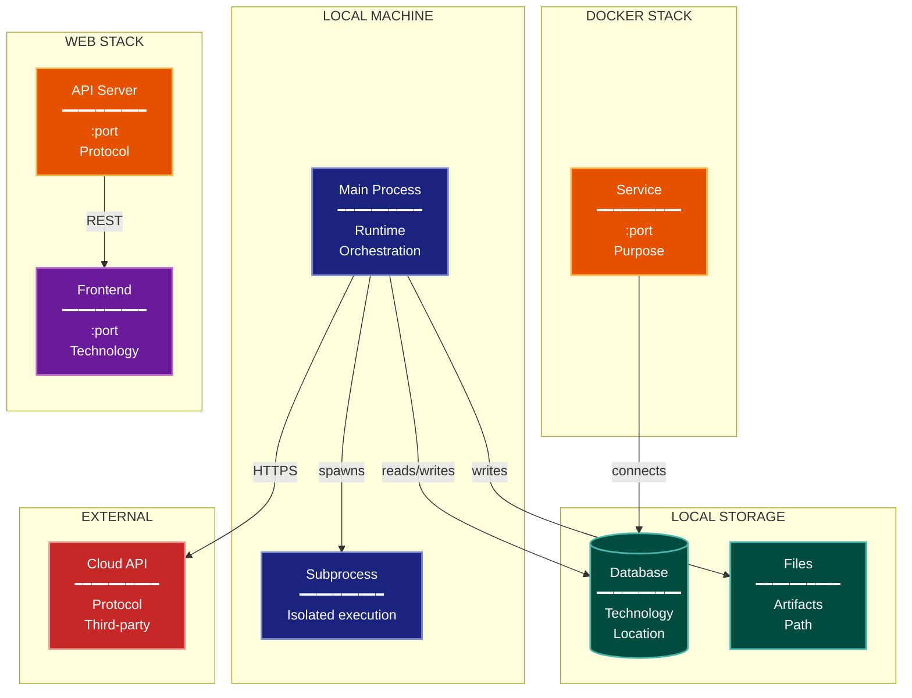

# Deployment/Physical Architecture Lens

**Cognitive Mode:** Physical
**Primary Question:** "Where does it run?"
**Focus:** Infrastructure Topology, Process Boundaries, Data Storage Locations, Network Communication

## When to Use

- Need to understand physical deployment
- Documenting infrastructure and processes
- Analyzing where components execute
- User invokes `/arch-lens-deployment` or `/make-arch-diag deployment`

## Critical Constraints

**NEVER:**
- Modify any source code files
- Include code-level details
- Show internal logic

**ALWAYS:**
- Focus on PHYSICAL deployment
- Show process boundaries
- Include network/communication protocols
- Document storage locations
- BEFORE creating any diagram, LOAD the `/mermaid` skill using the Skill tool - this is MANDATORY

---

## Analysis Workflow

### Step 1: Launch Parallel Exploration Subagents

Spawn Explore subagents to investigate:

**Process Boundaries**
- Find main process entry points
- Identify subprocess spawning
- Look for: main, entry_points, subprocess, process spawning, daemon processes

**Container/Docker**
- Find containerization config
- Identify services
- Look for: Dockerfile, docker-compose.yml, container definitions, Kubernetes configs

**Local Storage**
- Find file storage locations
- Identify database paths
- Look for: data directories, database files, storage volumes, persistent storage

**Network Services**
- Find service definitions
- Identify ports and protocols
- Look for: port, bind, listen, server, API, endpoint, network services

**External Services**
- Find external API calls
- Identify cloud services
- Look for: external APIs, cloud services, third-party integrations

**Web/Frontend**
- Find frontend deployment
- Identify static file serving
- Look for: web servers, frontend builds, static assets, CDN

### Step 2: Map Physical Topology

| Component | Location | Technology | Port/Protocol |
|-----------|----------|------------|---------------|
| {name} | {where} | {tech} | {port/protocol} |

**CRITICAL - Analyze Read/Write Direction:**
For EVERY process and storage location:
- **Reads from**: What does this process READ? (files, databases, APIs)
- **Writes to**: What does this process WRITE? (files, databases, APIs)
- **Network direction**: Client->Server or bidirectional?

For storage locations:
- **Read/write storage**: Process both reads and writes (databases, state files)
- **Write-only storage**: Process writes, humans or other systems read (logs, artifacts)
- **Read-only sources**: Process reads, doesn't modify (config, external APIs)

Label all connections with direction (reads, writes, or both)

### Step 3: Identify Communication Paths

- Process-to-process (IPC, subprocess)
- Network (HTTP, WebSocket, gRPC)
- File system (shared files)
- Database (connections)

### Step 4: Create the Diagram

Use flowchart with:

**Direction:** `TB` for infrastructure layers

**Subgraphs by Physical Location:**
- Developer Machine (local processes)
- Local Storage (files, DBs)
- Docker Stack (if containerized)
- Web Stack (if applicable)
- External Services (cloud, APIs)

**Node Styling:**
- `cli` class: Main processes
- `stateNode` class: Local storage, databases
- `output` class: File artifacts
- `handler` class: Services, APIs
- `phase` class: Frontend, web UI
- `integration` class: External services

**Connection Labels:**
- Show protocols (HTTP, subprocess, file)
- Show ports where relevant

### Step 5: Write Output

Write the diagram to: `temp/arch-lens-deployment/arch_diag_deployment_{YYYY-MM-DD}.md`

---

## Output Template

```markdown
# Deployment Diagram: {System Name}

**Lens:** Deployment/Physical
**Question:** Where does it run?
**Date:** {YYYY-MM-DD}
**Scope:** {What was analyzed}

## Deployment Topology

| Component | Port | Technology | Purpose |
|-----------|------|------------|---------|
| {name} | {port} | {tech} | {purpose} |

## Deployment Diagram



**Color Legend:**
| Color | Category | Description |
|-------|----------|-------------|
| Dark Blue | Processes | Local CLI and subprocess |
| Teal | Storage | Databases and file storage |
| Orange | Services | Backend services and APIs |
| Purple | Frontend | Web UI |
| Red | External | External/cloud services |

## Communication Protocols

| From | To | Protocol | Purpose |
|------|-----|----------|---------|
| {source} | {target} | {protocol} | {purpose} |

## Storage Locations

| Data | Location | Technology |
|------|----------|------------|
| {data} | {path} | {tech} |
```

---

## Pre-Diagram Checklist

Before creating the diagram, verify:

- [ ] LOADED `/mermaid` skill using the Skill tool
- [ ] Using ONLY classDef styles from the mermaid skill (no invented colors)
- [ ] Diagram will include a color legend table

---

## Related Skills

- `/make-arch-diag` - Parent skill for lens selection
- `/mermaid` - MUST BE LOADED before creating diagram
- `/arch-lens-c4-container` - For container-level view
