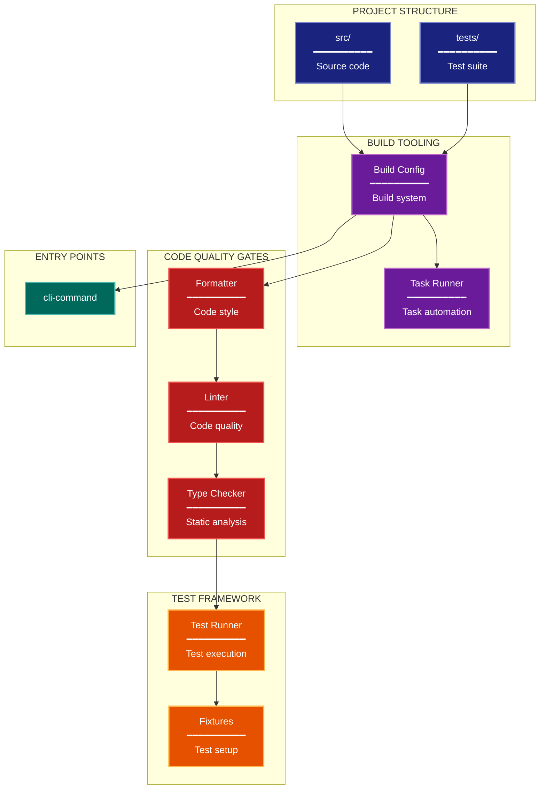

# Development Architecture Lens

**Cognitive Mode:** Development
**Primary Question:** "How is it built and tested?"
**Focus:** Project Structure, Build Tools, Quality Gates, Test Framework

## When to Use

- Need to understand developer experience
- Documenting build and test infrastructure
- Analyzing code quality gates
- User invokes `/arch-lens-development` or `/make-arch-diag development`

## Critical Constraints

**NEVER:**
- Modify any source code files
- Include runtime architecture details
- Show business logic

**ALWAYS:**
- Focus on BUILD and TEST infrastructure
- Show quality gate pipeline
- Document test framework setup
- Include entry points
- BEFORE creating any diagram, LOAD the `/mermaid` skill using the Skill tool - this is MANDATORY

---

## Analysis Workflow

### Step 1: Launch Parallel Exploration Subagents

Spawn Explore subagents to investigate:

**Project Structure**
- Find top-level directory organization
- Identify module/package boundaries
- Look for: build configs, package definitions, project layout

**Build Tooling**
- Find build configuration
- Identify package manager and build backend
- Look for: build config files, makefiles, task runners, package managers

**Linting & Formatting**
- Find code quality tools
- Identify pre-commit hooks
- Look for: linter configs, formatter configs, pre-commit hooks, code quality tools

**Type Checking**
- Find type checking configuration
- Identify strictness level
- Look for: type checker configs, static analysis tools

**Test Framework**
- Find test configuration
- Identify test patterns and fixtures
- Look for: test configs, test directories, test runners, test fixtures

**CI/CD (if present)**
- Find CI configuration
- Identify workflow stages
- Look for: CI/CD configs, workflow definitions, pipeline configs

**Entry Points**
- Find CLI entry points
- Identify console scripts
- Look for: entry point definitions, command definitions, binary files

### Step 2: Map Quality Pipeline

Document the code quality pipeline:
```
Code -> Format -> Lint -> Type Check -> Test -> Commit
```

**CRITICAL - Analyze Read/Write Direction:**
For EVERY build/test component:
- **Inputs (reads)**: What files/config does this tool READ?
- **Outputs (writes)**: What does this tool WRITE (reports, modified files)?
- **Side effects**: Does it modify source files or just report?

Distinguish:
- Tools that READ and MODIFY code (formatters)
- Tools that READ and REPORT only (linters, type checkers)
- Tools that READ code and WRITE artifacts (test output files)
- Config files (READ by tools, not written by build process)

### Step 3: Count Project Metrics

| Metric | Value |
|--------|-------|
| Source Files | N |
| Test Files | N |
| Dependencies | N |
| Entry Points | N |

### Step 4: Create the Diagram

Use flowchart with:

**Direction:** `TB` for pipeline flow

**Subgraphs:**
- Project Structure (directories)
- Build Tools (packaging)
- Quality Gates (linting, types)
- Test Framework (test runner, etc)
- Entry Points (CLI commands)

**Node Styling:**
- `cli` class: Project structure, directories
- `phase` class: Build configuration
- `detector` class: Quality gates (linting, typing)
- `handler` class: Test framework
- `output` class: Entry points, outputs

**Show Pipeline Flow:**
- Code through quality gates
- Build to entry points

### Step 5: Write Output

Write the diagram to: `temp/arch-lens-development/arch_diag_development_{YYYY-MM-DD}.md`

---

## Output Template

```markdown
# Development Diagram: {Project Name}

**Lens:** Development (Build & Test)
**Question:** How is it built and tested?
**Date:** {YYYY-MM-DD}
**Scope:** {What was analyzed}

## Project Metrics

| Metric | Value |
|--------|-------|
| Source Directories | {count} |
| Test Files | {count} |
| Dependencies | {count} |
| Entry Points | {count} |

## Development Diagram



**Color Legend:**
| Color | Category | Description |
|-------|----------|-------------|
| Dark Blue | Structure | Project directories |
| Purple | Build | Configuration and automation |
| Red | Quality | Linters and type checkers |
| Orange | Testing | Test framework and fixtures |
| Dark Teal | Entry Points | CLI commands |

## Development Workflow

```
Code -> format -> lint -> type-check -> test -> commit
```

## Pre-commit Hooks

| Hook | Purpose |
|------|---------|
| {hook} | {purpose} |

## Entry Points

| Command | Module | Purpose |
|---------|--------|---------|
| {command} | {module} | {purpose} |
```

---

## Pre-Diagram Checklist

Before creating the diagram, verify:

- [ ] LOADED `/mermaid` skill using the Skill tool
- [ ] Using ONLY classDef styles from the mermaid skill (no invented colors)
- [ ] Diagram will include a color legend table

---

## Related Skills

- `/make-arch-diag` - Parent skill for lens selection
- `/mermaid` - MUST BE LOADED before creating diagram
