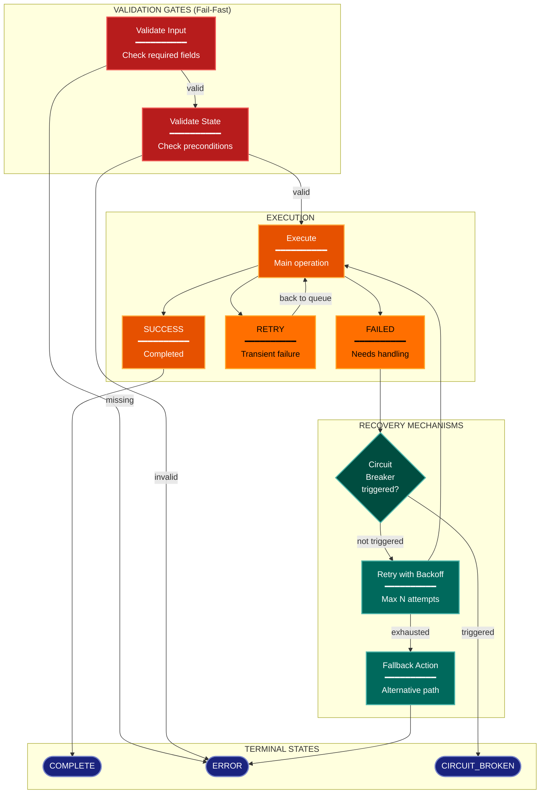

# Error/Resilience Architecture Lens

**Cognitive Mode:** Diagnostic
**Primary Question:** "How are failures handled?"
**Focus:** Error Propagation, Recovery Mechanisms, Circuit Breakers, Validation Gates

## When to Use

- Need to understand error handling architecture
- Documenting recovery and retry mechanisms
- Analyzing validation gates and circuit breakers
- User invokes `/arch-lens-error-resilience` or `/make-arch-diag error`

## Critical Constraints

**NEVER:**
- Modify any source code files
- Show happy path details (that's process flow lens)
- Ignore validation and fail-fast patterns

**ALWAYS:**
- Focus on FAILURE paths and recovery
- Show validation gates and their failure modes
- Document retry limits and circuit breakers
- Include exception hierarchy if present
- BEFORE creating any diagram, LOAD the `/mermaid` skill using the Skill tool - this is MANDATORY

---

## Analysis Workflow

### Step 1: Launch Parallel Exploration Subagents

Spawn Explore subagents to investigate:

**Exception Hierarchy**
- Find custom exception classes
- Map inheritance relationships
- Look for: Exception, Error, raise, error classes, custom exceptions

**Validation Gates**
- Find validation/guard functions
- Identify fail-fast patterns
- Look for: validate_*, check_*, assert, guard, gate, precondition checks

**Error Detection**
- Find error detection points
- Identify how failures are recognized
- Look for: try/except, catch, on_error, handle_error, error handling

**Recovery Mechanisms**
- Find retry logic
- Identify fallback strategies
- Look for: retry, backoff, attempt, max_retries, retry policies

**Circuit Breakers**
- Find patterns that prevent infinite retries
- Identify failure thresholds
- Look for: circuit, breaker, max_failures, trip, failure thresholds

**Error Routing**
- Find how errors are propagated
- Identify error terminal states
- Look for: raise, return Error, error node, ERROR state

### Step 2: Map Error Paths

For each major operation, document:
- **Success Path**: Normal completion
- **Retry Path**: Transient failure recovery
- **Failure Path**: Permanent failure handling
- **Circuit Break Path**: Threshold exceeded

**CRITICAL - Analyze Read/Write Direction:**
For EVERY error handling component:
- **Error context capture**: What data is READ to build error context?
- **Error logging**: Where are errors WRITTEN (logs, database, files)?
- **State updates**: What state is WRITTEN on failure?
- **Recovery reads**: What data is READ during recovery?

Distinguish:
- Error logs (write-only, never read back for logic)
- Failure context in database (may be read for retry/debugging)
- Debug artifacts (write-only diagnostics)

### Step 3: Document Recovery Mechanisms

| Mechanism | Trigger | Action | Limit |
|-----------|---------|--------|-------|
| Retry | Transient error | Repeat operation | max N |
| Fallback | Specific error | Alternative action | - |
| Circuit Breaker | Too many failures | Stop retrying | threshold |

### Step 4: Create the Diagram

Use flowchart with:

**Direction:** `TB` for error flow hierarchy

**Subgraphs:**
- Execution (normal operation)
- Validation Gates (fail-fast checks)
- Error Handling (detection and routing)
- Recovery (retry, fallback)
- Terminals (success, failure states)

**Node Styling:**
- `handler` class: Execution nodes
- `detector` class: Validation gates, error detection
- `gap` class: Failed/error state (yellow warning)
- `stateNode` class: Decision points, circuit breaker
- `output` class: Recovery actions
- `terminal` class: Final states (success, error)

**Connection Types:**
- Solid: Normal flow
- Edge labels: Conditions, error types
- Show loops for retry mechanisms

### Step 5: Write Output

Write the diagram to: `temp/arch-lens-error-resilience/arch_diag_error_resilience_{YYYY-MM-DD}.md`

---

## Output Template

```markdown
# Error/Resilience Diagram: {System Name}

**Lens:** Error/Resilience (Diagnostic)
**Question:** How are failures handled?
**Date:** {YYYY-MM-DD}
**Scope:** {What was analyzed}

## Exception Hierarchy

```
BaseError
├── ValidationError
├── ProcessingError
│   └── RetryableError
└── FatalError
```

## Resilience Diagram



**Color Legend:**
| Color | Category | Description |
|-------|----------|-------------|
| Orange | Execution | Normal operation and success |
| Yellow | Failed | Failure states requiring handling |
| Red | Gates | Validation gates (fail-fast) |
| Dark Teal | Recovery | Retry and fallback mechanisms |
| Teal | Circuit | Circuit breaker decisions |
| Dark Blue | Terminal | Final states |

## Recovery Mechanisms

| Mechanism | Trigger | Action | Max Attempts |
|-----------|---------|--------|--------------|
| {name} | {condition} | {what happens} | {limit} |

## Validation Gates

| Gate | Checks | Failure Mode |
|------|--------|--------------|
| {name} | {what validated} | {error raised} |
```

---

## Pre-Diagram Checklist

Before creating the diagram, verify:

- [ ] LOADED `/mermaid` skill using the Skill tool
- [ ] Using ONLY classDef styles from the mermaid skill (no invented colors)
- [ ] Diagram will include a color legend table

---

## Related Skills

- `/make-arch-diag` - Parent skill for lens selection
- `/mermaid` - MUST BE LOADED before creating diagram
- `/arch-lens-process-flow` - For normal flow view
- `/arch-lens-concurrency` - For parallel failure handling
