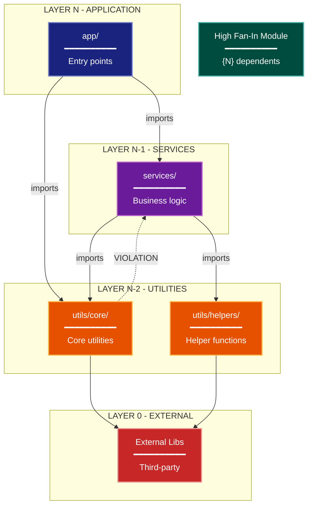

# Module Dependency Architecture Lens

**Cognitive Mode:** Structural
**Primary Question:** "How are modules coupled?"
**Focus:** Package Dependencies, Layering, Coupling Patterns, Fan-In/Fan-Out

## When to Use

- Need to understand module coupling and dependencies
- Analyzing architectural layering violations
- Identifying high fan-in modules (stability concerns)
- User invokes `/arch-lens-module-dependency` or `/make-arch-diag dependency`

## Critical Constraints

**NEVER:**
- Modify any source code files
- Include runtime behavior details
- Show external system integrations in detail

**ALWAYS:**
- Focus on IMPORT relationships between modules
- Identify layering and valid dependency directions
- Flag circular dependencies and violations
- Calculate fan-in for key modules
- BEFORE creating any diagram, LOAD the `/mermaid` skill using the Skill tool - this is MANDATORY

---

## Analysis Workflow

### Step 1: Launch Parallel Exploration Subagents

Spawn Explore subagents to investigate:

**Layer Identification**
- Find top-level directories and their purposes
- Identify the intended layering structure
- Look for: build configs, project structure, architectural boundaries

**Import Analysis by Layer**
- For each top-level module, find its imports
- Categorize: internal vs external, layer violations
- Look for: import statements, dependencies, module references

**Circular Dependency Detection**
- Find modules that import each other
- Identify deferred imports (often indicate issues)
- Look for: conditional imports, late imports, circular references

**High Fan-In Modules**
- Count how many modules import each module
- Identify the most depended-upon modules
- These require stable interfaces

**Cross-Domain Imports**
- Check for forbidden cross-domain imports
- Document violations with file paths

### Step 2: Build Dependency Matrix

Create a matrix showing:
```
              layer3  layer2  layer1
  layer3        -       X       X
  layer2        -       -       X
  layer1        ?       ?       -
```

Where:
- `X` = valid imports (downward)
- `?` = potential violations to investigate
- `-` = no imports

**CRITICAL - Analyze Read/Write Direction:**
For EVERY dependency relationship:
- **Import direction**: Which module imports which?
- **Data flow direction**: Does data flow with or against the import?
- **Call direction**: Who calls whom?

Note: Import direction (A imports B) doesn't always equal data flow direction (B may return data to A). Document both.

### Step 3: Calculate Metrics

For key modules:
- **Fan-In**: How many modules depend on this one
- **Fan-Out**: How many modules does this depend on
- **Instability**: Fan-Out / (Fan-In + Fan-Out)

### Step 4: Create the Diagram

Use graph with:

**Direction:** `TB` for layer hierarchy

**Subgraphs for Layers:**
- Layer N: Application (highest)
- Layer N-1: Services/Business Logic
- Layer N-2: Infrastructure/Utilities
- Layer 0: External (lowest)

**Node Styling:**
- `cli` class: Application layer modules
- `phase` class: Service/business logic layer modules
- `handler` class: Infrastructure/utility modules
- `stateNode` class: High fan-in modules (highlight)
- `integration` class: External dependencies

**Connection Types:**
- Solid arrows: Valid downward dependencies
- Dashed arrows: Violations or concerns (with notes)
- Label with import counts where significant

### Step 5: Write Output

Write the diagram to: `temp/arch-lens-module-dependency/arch_diag_module_dependency_{YYYY-MM-DD}.md`

---

## Output Template

```markdown
# Module Dependency Diagram: {Project Name}

**Lens:** Module Dependency (Structural)
**Question:** How are modules coupled?
**Date:** {YYYY-MM-DD}
**Scope:** {What was analyzed}

## Layer Structure

| Layer | Modules | May Import From |
|-------|---------|-----------------|
| N - Application | app/ | services/, utils/ |
| N-1 - Services | services/ | utils/ |
| N-2 - Utilities | utils/ | (internal only) |
| 0 - External | stdlib, packages | N/A |

## Dependency Diagram



**Color Legend:**
| Color | Category | Description |
|-------|----------|-------------|
| Dark Blue | Apps | Application layer entry points |
| Purple | Services | Service/business logic layer |
| Orange | Utilities | Shared utilities and infrastructure |
| Teal | High Fan-In | Core modules with many dependents |
| Red | External | External dependencies |
| Dashed Lines | Violation | Architectural violations |

## Dependency Matrix (DSM)

```
              app   services  utils
  app          -       X        X
  services     -       -        X
  utils        -       ?*       -

  Legend: X = valid imports, ?* = violation (investigate)
```

## Key Metrics

| Metric | Value | Assessment |
|--------|-------|------------|
| Circular Dependencies | {count} | {risk level} |
| High Fan-In Modules | {count} | {list them} |
| Layer Violations | {count} | {severity} |

## Violations Identified

| Source | Target | Type | Severity |
|--------|--------|------|----------|
| {module} | {module} | {violation type} | {HIGH/MEDIUM/LOW} |
```

---

## Pre-Diagram Checklist

Before creating the diagram, verify:

- [ ] LOADED `/mermaid` skill using the Skill tool
- [ ] Using ONLY classDef styles from the mermaid skill (no invented colors)
- [ ] Diagram will include a color legend table

---

## Related Skills

- `/make-arch-diag` - Parent skill for lens selection
- `/mermaid` - MUST BE LOADED before creating diagram
- `/arch-lens-c4-container` - For container-level view
