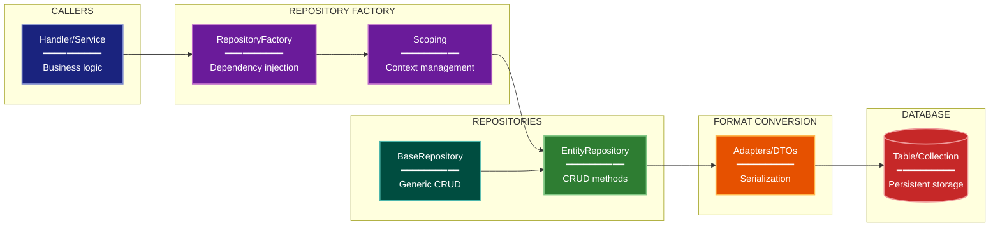

# Repository/Data Access Architecture Lens

**Cognitive Mode:** Data-Centric
**Primary Question:** "How is data accessed?"
**Focus:** Repository Pattern, Entity Relationships, Query Patterns, Format Conversion

## When to Use

- Need to understand data access layer architecture
- Documenting repository pattern implementation
- Analyzing entity relationships and query patterns
- User invokes `/arch-lens-repository-access` or `/make-arch-diag repository`

## Critical Constraints

**NEVER:**
- Modify any source code files
- Focus on data flow (that's data lineage lens)
- Include business logic details

**ALWAYS:**
- Focus on REPOSITORIES and their methods
- Show entity relationships (1:1, 1:N, N:N)
- Document key query patterns
- Identify format conversion boundaries
- BEFORE creating any diagram, LOAD the `/mermaid` skill using the Skill tool - this is MANDATORY

---

## Analysis Workflow

### Step 1: Launch Parallel Exploration Subagents

Spawn Explore subagents to investigate:

**Repository Classes**
- Find all repository implementations
- Identify base repository patterns
- Look for: Repository classes, DAO (Data Access Object) patterns, base repository abstractions

**Entity Models**
- Find entity/model classes
- Identify table/collection definitions
- Look for: ORM models (ActiveRecord, Entity Framework, TypeORM, etc.), data models, entity classes

**CRUD Operations**
- Find standard CRUD methods
- Identify specialized query methods
- Look for: create, get, update, delete, save, find_*, get_by_*, query methods

**Query Patterns**
- Find complex queries and joins
- Identify index usage patterns
- Look for: filter, where, join, order_by, group_by, query builders

**Factory/Scoping**
- Find repository factory patterns
- Identify scope management
- Look for: Factory patterns, dependency injection, session/context management

**Format Conversion**
- Find adapter/converter patterns
- Identify boundary conversions
- Look for: Adapters, DTOs, to_*/from_* methods, serializers, mappers

### Step 2: Map Entity Relationships

Document:
- **Entities**: All model classes
- **Relationships**: Foreign key relationships, cardinality
- **Key Fields**: Primary keys, business keys
- **Repositories**: Which repo manages which entity

**CRITICAL - Analyze Read/Write Direction:**
For EVERY repository method and data access:
- **Read methods**: `get_*`, `find_*`, `query_*` - data flows OUT of storage
- **Write methods**: `save_*`, `create_*`, `update_*`, `delete_*` - data flows INTO storage
- **Bulk operations**: Direction of each operation in batch

For EVERY caller-to-repository relationship:
- Does the caller READ from this repository?
- Does the caller WRITE to this repository?
- Or both?

Label connections accordingly (reads, writes, reads/writes)

### Step 3: Document Access Patterns

| Pattern | Repository Method | Use Case |
|---------|------------------|----------|
| By ID | get_by_id() | Single entity lookup |
| By Business Key | get_by_* | Domain-specific lookup |
| List | get_all(), get_for_* | Collection queries |
| Bulk | save_many() | Batch operations |

### Step 4: Create the Diagram

Use flowchart with:

**Direction:** `LR` (left-to-right) for caller-to-storage flow

**Subgraphs:**
- Callers (who uses repositories)
- Factory (repository construction)
- Repositories by Category
- Conversion (format boundaries)
- Storage (database tables)

**Node Styling:**
- `cli` class: Callers (nodes, handlers)
- `phase` class: Factory, scoping
- `newComponent` class: Repositories (green to highlight)
- `handler` class: Conversion adapters
- `integration` class: Database storage

**Show Relationships:**
- Entity relationships with cardinality (1:N)
- Repository-to-table mapping
- Conversion flow

### Step 5: Write Output

Write the diagram to: `temp/arch-lens-repository-access/arch_diag_repository_access_{YYYY-MM-DD}.md`

---

## Output Template

```markdown
# Repository/Data Access Diagram: {System Name}

**Lens:** Repository/Data Access (Data-Centric)
**Question:** How is data accessed?
**Date:** {YYYY-MM-DD}
**Scope:** {What was analyzed}

## Repository Overview

| Category | Count | Key Repositories |
|----------|-------|------------------|
| {category} | {N} | {names} |

## Data Access Diagram



**Color Legend:**
| Color | Category | Description |
|-------|----------|-------------|
| Dark Blue | Callers | Services/handlers that use repositories |
| Purple | Factory | Repository construction and scoping |
| Green | Repositories | Repository implementations |
| Teal | Base | Generic base repository |
| Orange | Conversion | Format adapters/DTOs |
| Red | Storage | Database tables/collections |

## Repository Categories

| Category | Count | Key Repositories |
|----------|-------|------------------|
| {category} | {N} | {list} |

## Key Query Patterns

| Pattern | Repository Method | Use Case |
|---------|------------------|----------|
| {pattern} | {method} | {use case} |

## Entity Relationships

| Parent | Child | Cardinality | FK |
|--------|-------|-------------|-----|
| {parent} | {child} | {1:N/1:1} | {fk field} |
```

---

## Pre-Diagram Checklist

Before creating the diagram, verify:

- [ ] LOADED `/mermaid` skill using the Skill tool
- [ ] Using ONLY classDef styles from the mermaid skill (no invented colors)
- [ ] Diagram will include a color legend table

---

## Related Skills

- `/make-arch-diag` - Parent skill for lens selection
- `/mermaid` - MUST BE LOADED before creating diagram
- `/arch-lens-data-lineage` - For data flow view
- `/arch-lens-c4-container` - For storage container view
