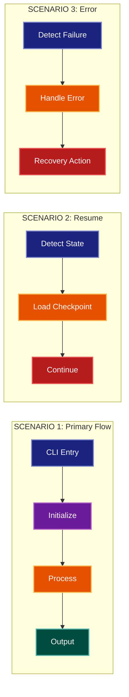

# Scenarios Architecture Lens

**Cognitive Mode:** Validation (+1 Validator)
**Primary Question:** "Do the components work together?"
**Focus:** End-to-End User Journeys, Component Cooperation, Scenario Validation

## When to Use

- Need to validate component cooperation
- Documenting key user scenarios
- Analyzing end-to-end flows through architecture
- User invokes `/arch-lens-scenarios` or `/make-arch-diag scenarios`

## Critical Constraints

**NEVER:**
- Modify any source code files
- Show internal component details
- Include all possible scenarios (pick key ones)

**ALWAYS:**
- Focus on END-TO-END journeys
- Show component touchpoints in sequence
- Select 3-5 representative scenarios
- Validate components work together
- BEFORE creating any diagram, LOAD the `/mermaid` skill using the Skill tool - this is MANDATORY

---

## Analysis Workflow

### Step 1: Launch Parallel Exploration Subagents

Spawn Explore subagents to investigate:

**Primary Use Cases**
- Find the main user-facing operations
- Identify CLI commands or API endpoints
- Look for: main commands, primary workflows, user stories

**Happy Path Flows**
- Trace successful execution paths
- Identify component touchpoints
- Look for: success paths, normal flow, expected behavior

**Error/Recovery Flows**
- Trace error handling paths
- Identify recovery mechanisms
- Look for: error handling, retry, recovery, fallback

**Resume/Restart Flows**
- Find state persistence and resume
- Identify checkpoint mechanisms
- Look for: resume, checkpoint, restore, continue

**Integration Points**
- Find external system interactions
- Identify cross-component calls
- Look for: API calls, subprocess, external, integration

### Step 2: Select Key Scenarios

Choose 3-5 representative scenarios:
1. **Primary Happy Path**: The main use case
2. **Secondary Use Case**: Another important flow
3. **Resume/Recovery**: How to continue after interruption
4. **Error Handling**: How failures are managed
5. **Integration**: External system interaction

### Step 3: Map Component Touchpoints

For each scenario:
- Entry point (CLI, API, trigger)
- Processing components (in order)
- State changes
- Output/artifacts
- Exit point

**CRITICAL - Analyze Read/Write Direction:**
For EVERY component in each scenario:
- **What does it READ?** (inputs, state, config)
- **What does it WRITE?** (outputs, state changes, artifacts)
- **What does it PASS THROUGH?** (data transformed and forwarded)

For scenario flows, annotate each arrow:
- "reads from" / "loads" for input operations
- "writes to" / "saves" for output operations
- "transforms" for data that passes through

This reveals the actual data dependencies between scenario steps.

### Step 4: Create the Diagram

Use flowchart with:

**Direction:** `LR` (left-to-right) for sequential scenario flow

**Subgraphs per Scenario:**
- Each scenario gets its own subgraph
- Show components touched in sequence

**Node Styling:**
- `cli` class: Entry points (CLI, triggers)
- `phase` class: Initialization, setup
- `handler` class: Processing components
- `stateNode` class: Data/state components
- `output` class: Outputs, artifacts
- `detector` class: Recovery, continue paths

**Show Sequential Flow:**
- Each scenario flows left to right
- Components connected in order of execution

### Step 5: Write Output

Write the diagram to: `temp/arch-lens-scenarios/arch_diag_scenarios_{YYYY-MM-DD}.md`

---

## Output Template

```markdown
# Scenarios Diagram: {System Name}

**Lens:** Scenarios (Validation)
**Question:** Do the components work together?
**Date:** {YYYY-MM-DD}
**Scope:** {What was analyzed}

## Scenario Overview

| Scenario | Purpose | Key Components |
|----------|---------|----------------|
| {name} | {validates what} | {components} |

## Scenarios Diagram



**Color Legend:**
| Color | Category | Description |
|-------|----------|-------------|
| Dark Blue | Entry | CLI/trigger entry points |
| Purple | Init | Initialization and detection |
| Orange | Process | Core processing components |
| Teal | State | Data and state components |
| Red | Continue | Resumption and recovery |

## Scenario Validation Summary

| Scenario | Validates | Key Components |
|----------|-----------|----------------|
| {name} | {what it validates} | {component list} |

## Detailed Scenarios

### Scenario 1: {Name}

**Purpose:** {What this validates}

**Flow:**
1. {Step 1}
2. {Step 2}
3. {Step 3}

### Scenario 2: {Name}

**Purpose:** {What this validates}

**Flow:**
1. {Step 1}
2. {Step 2}
```

---

## Pre-Diagram Checklist

Before creating the diagram, verify:

- [ ] LOADED `/mermaid` skill using the Skill tool
- [ ] Using ONLY classDef styles from the mermaid skill (no invented colors)
- [ ] Diagram will include a color legend table

---

## Related Skills

- `/make-arch-diag` - Parent skill for lens selection
- `/mermaid` - MUST BE LOADED before creating diagram
- `/arch-lens-process-flow` - For detailed workflow view
- `/arch-lens-error-resilience` - For failure handling details
