# Security Architecture Lens

**Cognitive Mode:** Security
**Primary Question:** "Where are the trust boundaries?"
**Focus:** Trust Boundaries, Validation Layers, Path Contracts, Process Isolation

## When to Use

- Need to understand security architecture
- Documenting trust boundaries and validation
- Analyzing path contracts and isolation
- User invokes `/arch-lens-security` or `/make-arch-diag security`

## Critical Constraints

**NEVER:**
- Modify any source code files
- Expose actual secrets or credentials
- Show implementation details that could aid attacks

**ALWAYS:**
- Focus on TRUST BOUNDARIES
- Show validation layers in order
- Document path contracts and restrictions
- Include process isolation mechanisms
- BEFORE creating any diagram, LOAD the `/mermaid` skill using the Skill tool - this is MANDATORY

---

## Analysis Workflow

### Step 1: Launch Parallel Exploration Subagents

Spawn Explore subagents to investigate:

**Input Validation**
- Find input validation code
- Identify sanitization patterns
- Look for: validate, sanitize, clean, escape, input validation

**Path Security**
- Find path validation/restriction code
- Identify forbidden patterns
- Look for: path, traversal, .., forbidden, whitelist, blacklist

**Process Boundaries**
- Find subprocess/isolation code
- Identify timeouts and guards
- Look for: subprocess, Popen, timeout, isolation, sandbox

**Authentication/Authorization**
- Find auth-related code
- Identify permission checks
- Look for: auth, permission, token, API key, credential

**Secret Management**
- Find secret handling
- Identify env var usage
- Look for: secret, API_KEY, credential, .env, gitignore

**File System Security**
- Find file access controls
- Identify write zone restrictions
- Look for: write_zone, allowed_paths, snapshot, file_change

**Database Isolation**
- Find database access controls
- Identify per-user/per-tenant isolation
- Look for: isolation, tenant, scope, multi-tenancy

### Step 2: Map Trust Boundaries

Identify boundaries where trust changes:
1. **External -> Application** (user input)
2. **Application -> Subprocess** (code execution)
3. **Application -> FileSystem** (file access)
4. **Application -> Database** (data access)
5. **Application -> External API** (outbound)

**CRITICAL - Analyze Read/Write Direction:**
For EVERY trust boundary crossing:
- **Inbound (reads)**: Data entering from less trusted to more trusted
- **Outbound (writes)**: Data leaving from more trusted to less trusted
- **Validation point**: Where is data validated and in which direction?

Security implications by direction:
- **Reads from untrusted**: Requires input validation
- **Writes to untrusted**: Requires output encoding/sanitization
- **Reads from trusted storage**: Generally safe
- **Writes to trusted storage**: Requires authorization check

### Step 3: Document Validation Layers

For each trust boundary:
- What is validated?
- How are violations handled?
- What's the defense-in-depth strategy?

### Step 4: Create the Diagram

Use flowchart with:

**Direction:** `TB` for layered security view

**Subgraphs per Trust Boundary:**
- Entry (CLI/API input)
- Subprocess Boundary
- FileSystem Boundary
- Path Contract
- Write Zone Enforcement
- Database Isolation

**Node Styling:**
- `cli` class: Entry points, user input
- `detector` class: Validation gates, guards
- `phase` class: Processing after validation
- `gap` class: Forbidden/restricted (yellow warning)
- `stateNode` class: Enforcement points
- `output` class: Isolated resources

**Show Flow Through Boundaries:**
- Sequential validation layers
- What passes vs what's blocked

### Step 5: Write Output

Write the diagram to: `temp/arch-lens-security/arch_diag_security_{YYYY-MM-DD}.md`

---

## Output Template

```markdown
# Security Diagram: {System Name}

**Lens:** Security (Trust Boundaries)
**Question:** Where are the trust boundaries?
**Date:** {YYYY-MM-DD}
**Scope:** {What was analyzed}

## Trust Boundaries Overview

| Boundary | Validation | Threat Mitigated |
|----------|------------|------------------|
| {boundary} | {validation} | {threat} |

## Security Diagram

```mermaid
%%{init: {'flowchart': {'nodeSpacing': 40, 'rankSpacing': 50, 'curve': 'basis'}}}%%
flowchart TB
    %% CLASS DEFINITIONS %%
    classDef cli fill:#1a237e,stroke:#7986cb,stroke-width:2px,color:#fff;
    classDef stateNode fill:#004d40,stroke:#4db6ac,stroke-width:2px,color:#fff;
    classDef handler fill:#e65100,stroke:#ffb74d,stroke-width:2px,color:#fff;
    classDef phase fill:#6a1b9a,stroke:#ba68c8,stroke-width:2px,color:#fff;
    classDef detector fill:#b71c1c,stroke:#ef5350,stroke-width:2px,color:#fff;
    classDef output fill:#00695c,stroke:#4db6ac,stroke-width:2px,color:#fff;
    classDef gap fill:#ff6f00,stroke:#ffa726,stroke-width:2px,color:#000;

    subgraph Boundary1 ["TRUST BOUNDARY 1: Entry"]
        INPUT["User Input<br/>━━━━━━━━━━<br/>Untrusted"]
        VALIDATE["Validation<br/>━━━━━━━━━━<br/>Check input"]
    end

    subgraph Boundary2 ["TRUST BOUNDARY 2: Subprocess"]
        PRECHECK["Pre-flight Check<br/>━━━━━━━━━━<br/>Limits check"]
        SUBPROCESS["Subprocess<br/>━━━━━━━━━━<br/>Isolated execution"]
        GUARD["Process Guard<br/>━━━━━━━━━━<br/>Timeout, cleanup"]
    end

    subgraph PathContract ["PATH CONTRACT"]
        FORBIDDEN["Forbidden Patterns<br/>━━━━━━━━━━<br/>credentials, .pem"]
        TRAVERSAL["Traversal Check<br/>━━━━━━━━━━<br/>No '..' allowed"]
        WHITELIST["Directory Whitelist<br/>━━━━━━━━━━<br/>Allowed paths"]
    end

    subgraph WriteZone ["WRITE ZONE ENFORCEMENT"]
        ZONE["Write Zone<br/>━━━━━━━━━━<br/>Restricted area"]
    end

    %% FLOW %%
    INPUT --> VALIDATE
    VALIDATE --> PRECHECK
    PRECHECK --> SUBPROCESS
    SUBPROCESS --> GUARD

    GUARD --> FORBIDDEN
    FORBIDDEN --> TRAVERSAL
    TRAVERSAL --> WHITELIST

    WHITELIST --> ZONE

    %% CLASS ASSIGNMENTS %%
    class INPUT cli;
    class VALIDATE,PRECHECK,GUARD detector;
    class SUBPROCESS phase;
    class FORBIDDEN,TRAVERSAL gap;
    class WHITELIST stateNode;
    class ZONE output;
```



**Color Legend:**
| Color | Category | Description |
|-------|----------|-------------|
| Dark Blue | Entry | Untrusted input |
| Red | Validation | Validation gates and guards |
| Purple | Process | Isolated execution |
| Yellow | Restricted | Forbidden patterns |
| Teal | Enforcement | Whitelist, allowed |
| Dark Teal | Zone | Protected resources |

## Security Validation Layers

| Layer | Component | Threat Mitigated |
|-------|-----------|------------------|
| 1 | {component} | {threat} |
| 2 | {component} | {threat} |

## Path Contract Rules

| Rule | Description |
|------|-------------|
| Forbidden Patterns | {patterns} |
| Traversal Prevention | {how} |
| Whitelist | {allowed dirs} |
```

---

## Pre-Diagram Checklist

Before creating the diagram, verify:

- [ ] LOADED `/mermaid` skill using the Skill tool
- [ ] Using ONLY classDef styles from the mermaid skill (no invented colors)
- [ ] Diagram will include a color legend table

---

## Related Skills

- `/make-arch-diag` - Parent skill for lens selection
- `/mermaid` - MUST BE LOADED before creating diagram
- `/arch-lens-error-resilience` - For error handling view
- `/audit-arch` - For security violation detection
