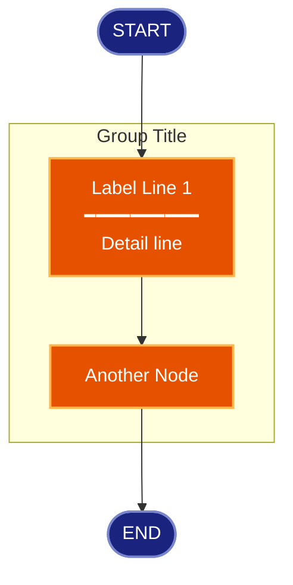
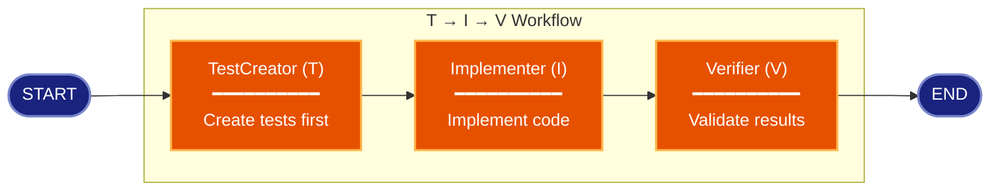
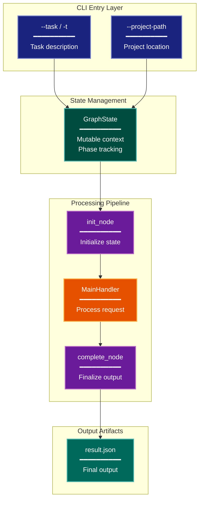

# Mermaid Diagram Creation

Create professional, color-coded mermaid diagrams with consistent styling for architecture documentation.

## When to Use

- Creating flowcharts, sequence diagrams, or state diagrams
- Documenting architecture or component relationships
- Visualizing workflows or data flows

## Critical Constraints

**ALWAYS:**
- Use the standard color palette defined below
- Include a color legend table after the diagram
- Use `%%{init: {...}}%%` for diagram configuration
- Group related nodes in subgraphs
- Apply class styling to all nodes

**NEVER:**
- Use inline styles (use classDef instead)
- Create diagrams without color coding
- Omit the color legend

---

## Instructions

1. **Identify all nodes**: List every distinct state, action, or decision point

2. **Categorize each node** by type:
   - Input/CLI elements
   - State/Data nodes
   - Handlers/Processors
   - Phase/Control nodes
   - New/Proposed components
   - Output/Artifacts
   - Gaps/Warnings (optional)

3. **Choose direction**: Pick `TB` for hierarchical flows, `LR` for sequential/parallel flows

4. **Assess grouping**: Look for distinct logical phases or stages
   - If phases exist, use subgraphs with descriptive names
   - Keep start/end/error nodes outside subgraphs

5. **Draft the diagram** using the template below

6. **Add color legend table** after the diagram

7. **Review**: Verify all connections and class assignments

---

## Standard Color Palette

| Category | Fill | Stroke | Text | Use For |
|----------|------|--------|------|---------|
| cli | #1a237e | #7986cb | #fff | CLI options, inputs, entry points |
| stateNode | #004d40 | #4db6ac | #fff | State fields, data storage, context |
| handler | #e65100 | #ffb74d | #fff | Handlers, processors, business logic |
| phase | #6a1b9a | #ba68c8 | #fff | Phase nodes, control flow, analysis |
| newComponent | #2e7d32 | #81c784 | #fff | New/proposed components |
| output | #00695c | #4db6ac | #fff | Output artifacts, files, results |
| detector | #b71c1c | #ef5350 | #fff | Detection, validation, guards |
| gap | #ff6f00 | #ffa726 | #000 | Gaps, warnings, missing items |
| integration | #c62828 | #ef9a9a | #fff | Integration points, external systems |
| terminal | #1a237e | #7986cb | #fff | Start/End/Error terminals |

---

## Diagram Template

````markdown


**Color Legend:**
| Color | Category | Description |
|-------|----------|-------------|
| Dark Blue | Terminal | Start and end points |
| Orange | Handler | Processing components |
````

---

## Node Shape Reference

```
A([Label])     # Rounded: Start/End terminals
A{Label}       # Diamond: Decision points
A[Label]       # Rectangle: Standard nodes
A[(Label)]     # Cylinder: Database/storage
A[[Label]]     # Subroutine: Subgraph call
A{{Label}}     # Hexagon: Preparation step
```

---

## Multiline Labels

Use `<br/>` for line breaks and `━━━━━━━━━━` as visual separator:

```
Node["Title<br/>━━━━━━━━━━<br/>Description line 1<br/>Description line 2"]
```

---

## Status Symbols

Use symbols to indicate component status:

| Symbol | Meaning |
|--------|---------|
| ★ | New component to implement |
| ● | Existing component with modifications |
| _(none)_ | Existing, unchanged component |

Example:
```
Node["★ NewHandler<br/>━━━━━━━━━━<br/>Proposed feature"]
```

---

## Example: Simple Workflow



**Color Legend:**
| Color | Category | Description |
|-------|----------|-------------|
| Dark Blue | Terminal | Start and end points |
| Orange | Handler | Role-based execution nodes |

---

## Example: Complex Architecture



**Color Legend:**
| Color | Category | Description |
|-------|----------|-------------|
| Dark Blue | CLI | Command-line interface options |
| Teal | State | State management and context |
| Purple | Phase | Control flow and phase nodes |
| Orange | Handler | Processing and business logic |
| Dark Teal | Output | Generated artifacts and results |
